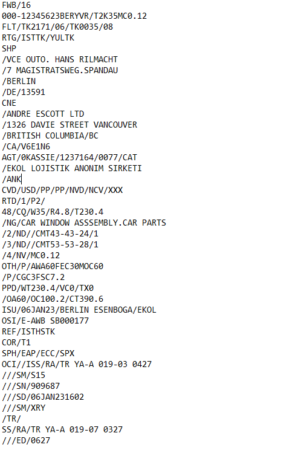

GUIDE De mise en œuvre TECHNIQUE DU PROGRAMME DE CIBLAGE du fret AÉRIEN PRÉALABLE  
AU CHARGEMENT

Table des matières

[1 Aperçu [10](#aperçu)](#aperçu)

[1.1 Contexte [10](#contexte)](#contexte)

[1.2 Portée [10](#portée)](#portée)

[1.3 Public visé [11](#public-visé)](#public-visé)

[1.4 Participants nécessaires et admissibles [11](#participants-nécessaires-et-admissibles)](#participants-nécessaires-et-admissibles)

[1.4.1 Participants nécessaires (transporteurs aériens) [11](#participants-nécessaires-transporteurs-aériens)](#participants-nécessaires-transporteurs-aériens)

[1.4.2 Participants admissibles (autres présentateurs de données) [11](#participants-admissibles-autres-présentateurs-de-données)](#participants-admissibles-autres-présentateurs-de-données)

[1.5 Points de contact réglementaires [11](#points-de-contact-réglementaires)](#points-de-contact-réglementaires)

[1.6 Date d’entrée en vigueur [12](#date-dentrée-en-vigueur)](#date-dentrée-en-vigueur)

[2 Connexion au programme CFAPC [13](#connexion-au-programme-cfapc)](#connexion-au-programme-cfapc)

[2.1 Diagramme de ciblage du CFAPC [13](#diagramme-de-ciblage-du-cfapc)](#diagramme-de-ciblage-du-cfapc)

[2.2 Inscription au CFAPC [13](#inscription-au-cfapc)](#inscription-au-cfapc)

[2.2.1 Inscription [13](#inscription)](#inscription)

[2.2.2 Configuration initiale et connexion [14](#configuration-initiale-et-connexion)](#configuration-initiale-et-connexion)

[2.2.3 Messages bidirectionnels [14](#messages-bidirectionnels)](#messages-bidirectionnels)

[2.2.4 Configuration des webhook [15](#configuration-des-webhook)](#configuration-des-webhook)

[2.2.5 Exigences de présentation et réponses [15](#exigences-de-présentation-et-réponses)](#exigences-de-présentation-et-réponses)

[2.2.5.1 Éléments de données du CFAPC [16](#éléments-de-données-du-cfapc)](#éléments-de-données-du-cfapc)

[2.2.5.1.1 Manifeste de vol (FFM) [17](#manifeste-de-vol-ffm)](#manifeste-de-vol-ffm)

[2.2.5.1.2 Règles opérationnelles et de mise en œuvre [17](#règles-opérationnelles-et-de-mise-en-œuvre)](#règles-opérationnelles-et-de-mise-en-œuvre)

[2.2.5.2 Données d’en‑tête à transmettre [18](#données-dentête-à-transmettre)](#données-dentête-à-transmettre)

[2.2.5.3 Partie responsable [19](#partie-responsable)](#partie-responsable)

[2.2.5.4 Types de réponses [20](#types-de-réponses)](#types-de-réponses)

[2.2.5.5 Soumissions mises à jour, en double, ou annulées [21](#soumissions-mises-à-jour-en-double-ou-annulées)](#soumissions-mises-à-jour-en-double-ou-annulées)

[2.3 Environnements d’essai et de production du CFAPC [21](#environnements-dessai-et-de-production-du-cfapc)](#environnements-dessai-et-de-production-du-cfapc)

[2.3.1 Environnement d’essai du CFAPC [22](#environnement-dessai-du-cfapc)](#environnement-dessai-du-cfapc)

[2.3.1.1 Mise à l’essai de la présentation des données [22](#mise-à-lessai-de-la-présentation-des-données)](#mise-à-lessai-de-la-présentation-des-données)

[2.3.1.2 Tester automatiquement les procédures d’atténuation des risques (RFI, RFS et DNL) pour les implémentations bidirectionnelles [23](#tester-automatiquement-les-procédures-datténuation-des-risques-rfi-rfs-et-dnl-pour-les-implémentations-bidirectionnelles)](#tester-automatiquement-les-procédures-datténuation-des-risques-rfi-rfs-et-dnl-pour-les-implémentations-bidirectionnelles)

[Code d’essai dans les messages FWB [25](#code-dessai-dans-les-messages-fwb)](#code-dessai-dans-les-messages-fwb)

[Code d’essai dans les messages XFWB [25](#code-dessai-dans-les-messages-xfwb)](#code-dessai-dans-les-messages-xfwb)

[2.3.1.3 Mise à l’essai en direct des procédures d’atténuation des risques (RFI, RFS et DNL) [26](#mise-à-lessai-en-direct-des-procédures-datténuation-des-risques-rfi-rfs-et-dnl)](#mise-à-lessai-en-direct-des-procédures-datténuation-des-risques-rfi-rfs-et-dnl)

[2.3.2 Environnement de production du CFAPC [27](#environnement-de-production-du-cfapc)](#environnement-de-production-du-cfapc)

[2.3.2.1 Soutien du CFAPC lors d’une panne [27](#soutien-du-cfapc-lors-dune-panne)](#soutien-du-cfapc-lors-dune-panne)

[2.3.2.2 Procédures d’atténuation des risques (RFI, RFS et DNL) [29](#procédures-datténuation-des-risques-rfi-rfs-et-dnl)](#procédures-datténuation-des-risques-rfi-rfs-et-dnl)

[3 Caractéristiques des messages du CFAPC [30](#caractéristiques-des-messages-du-cfapc)](#caractéristiques-des-messages-du-cfapc)

[3.1 Formats des messages [30](#formats-des-messages)](#formats-des-messages)

[3.2 Versions prises en charge des messages du CFAPC [31](#versions-prises-en-charge-des-messages-du-cfapc)](#versions-prises-en-charge-des-messages-du-cfapc)

[3.2.1 Versions Cargo-XML prises en charge [31](#versions-cargo-xml-prises-en-charge)](#versions-cargo-xml-prises-en-charge)

[3.2.2 Versions C-IMP prises en charge [31](#versions-c-imp-prises-en-charge)](#versions-c-imp-prises-en-charge)

[3.2.3 Versions CAMIR prises en charge [32](#versions-camir-prises-en-charge)](#versions-camir-prises-en-charge)

[3.3 Réponses aux messages Cargo-XML [32](#réponses-aux-messages-cargo-xml)](#réponses-aux-messages-cargo-xml)

[3.3.1 Réponses aux messages XFNM [32](#réponses-aux-messages-xfnm)](#réponses-aux-messages-xfnm)

[Exemple XFNM—Message de réponse (erreur) [36](#exemple-xfnmmessage-de-réponse-erreur)](#exemple-xfnmmessage-de-réponse-erreur)

[Exemple XFNM — Message de réponse (accusé de réception) [37](#exemple-xfnm-message-de-réponse-accusé-de-réception)](#exemple-xfnm-message-de-réponse-accusé-de-réception)

[3.3.2 Messages d’avis de statut XCSN [38](#messages-davis-de-statut-xcsn)](#messages-davis-de-statut-xcsn)

[Exemple XCSN — Réponse CSN (évaluation terminée) [40](#exemple-xcsn-réponse-csn-évaluation-terminée)](#exemple-xcsn-réponse-csn-évaluation-terminée)

[Exemple XCSN - Réponse CSN (RFI) [42](#_Toc194063960)](#_Toc194063960)

[Exemple XCSN - Réponse CSN (RFI du connaissement interne) [43](#exemple-xcsn---réponse-csn-rfi-du-connaissement-interne)](#exemple-xcsn---réponse-csn-rfi-du-connaissement-interne)

[3.4 Réponses aux messages CAMIR [44](#réponses-aux-messages-camir)](#réponses-aux-messages-camir)

[3.4.1 Messages de rapport d’erreur préliminaire (PER) [44](#messages-de-rapport-derreur-préliminaire-per)](#messages-de-rapport-derreur-préliminaire-per)

[Exemple PER – Message de réponse (erreur) [47](#exemple-per-message-de-réponse-erreur)](#exemple-per-message-de-réponse-erreur)

[3.4.2 Messages d’avis de statut préliminaire (PSN) [47](#messages-davis-de-statut-préliminaire-psn)](#messages-davis-de-statut-préliminaire-psn)

[3.4.3 Codes de réponse HTTP [48](#codes-de-réponse-http)](#codes-de-réponse-http)

[3.5 Exemples de messages du CFAPC [49](#exemples-de-messages-du-cfapc)](#exemples-de-messages-du-cfapc)

[3.5.1 Exemples de présentation d’un message Cargo-XML [49](#exemples-de-présentation-dun-message-cargo-xml)](#exemples-de-présentation-dun-message-cargo-xml)

[Exemple de présentation d’un connaissement aérien principal [50](#exemple-de-présentation-dun-connaissement-aérien-principal)](#exemple-de-présentation-dun-connaissement-aérien-principal)

[Réponse (accusé de réception – pas d’erreurs) [53](#réponse-accusé-de-réception-pas-derreurs)](#réponse-accusé-de-réception-pas-derreurs)

[Exemple du manifeste de vol (FFM) [54](#exemple-du-manifeste-de-vol-ffm)](#exemple-du-manifeste-de-vol-ffm)

[3.5.2 Exemples de présentation d’un message C-IMP [54](#exemples-de-présentation-dun-message-c-imp)](#exemples-de-présentation-dun-message-c-imp)

[Exemple de présentation d’un connaissement principal [55](#exemple-de-présentation-dun-connaissement-principal)](#exemple-de-présentation-dun-connaissement-principal)

[Exemple de réponse d’accusé de réception [55](#exemple-de-réponse-daccusé-de-réception)](#exemple-de-réponse-daccusé-de-réception)

[Exemple de présentation d’un connaissement interne comportant des erreurs [56](#exemple-de-présentation-dun-connaissement-interne-comportant-des-erreurs)](#exemple-de-présentation-dun-connaissement-interne-comportant-des-erreurs)

[Exemple de réponse d’erreur [56](#exemple-de-réponse-derreur)](#exemple-de-réponse-derreur)

[Exemple de manifeste de vol (FFM) [57](#exemple-de-manifeste-de-vol-ffm)](#exemple-de-manifeste-de-vol-ffm)

[4 Diagramme du ciblage du CFAPC [58](#diagramme-du-ciblage-du-cfapc)](#diagramme-du-ciblage-du-cfapc)

[5 Glossaire [59](#glossaire)](#glossaire)

[6 Caractères et descriptions inacceptables [60](#caractères-et-descriptions-inacceptables)](#caractères-et-descriptions-inacceptables)

[6.1 Caractères inacceptables dans le nom ou l’adresse de l’expéditeur/du destinataire ou dans la description des marchandises [60](#caractères-inacceptables-dans-le-nom-ou-ladresse-de-lexpéditeurdu-destinataire-ou-dans-la-description-des-marchandises)](#caractères-inacceptables-dans-le-nom-ou-ladresse-de-lexpéditeurdu-destinataire-ou-dans-la-description-des-marchandises)

[6.2 Descriptions de marchandises inacceptables [61](#descriptions-de-marchandises-inacceptables)](#descriptions-de-marchandises-inacceptables)

[6.3 Données insuffisantes/de mauvaise qualité (constaté lors de l’évaluation) [62](#données-insuffisantesde-mauvaise-qualité-constaté-lors-de-lévaluation)](#données-insuffisantesde-mauvaise-qualité-constaté-lors-de-lévaluation)

[7 Modèles de courriels [64](#modèles-de-courriels)](#modèles-de-courriels)

[7.1 Demande de renseignements [64](#demande-de-renseignements)](#demande-de-renseignements)

[7.2 Demande de vérification [65](#demande-de-vérification)](#demande-de-vérification)

[7.3 Ne pas charger [66](#ne-pas-charger)](#ne-pas-charger)

[7.4 Données insuffisantes/de mauvaise qualité [67](#données-insuffisantesde-mauvaise-qualité)](#données-insuffisantesde-mauvaise-qualité)

[7.5 Pannes du système [67](#pannes-du-système)](#pannes-du-système)

Historique des modifications

<table>
<colgroup>
<col style="width: 16%" />
<col style="width: 11%" />
<col style="width: 28%" />
<col style="width: 44%" />
</colgroup>
<thead>
<tr>
<th>Date</th>
<th>Version</th>
<th>Section(s)</th>
<th>Description/motif</th>
</tr>
</thead>
<tbody>
<tr>
<td>26 jan. 2024</td>
<td>1</td>
<td></td>
<td>Diffusion initiale</td>
</tr>
<tr>
<td rowspan="5">10 avril 2024</td>
<td rowspan="5">1.1</td>
<td>2.2.5.1 Éléments de données du CFAPC</td>
<td>Remarque sur l’heure de départ</td>
</tr>
<tr>
<td>2.3.1 Environnements d’essai et de production du CFAPC</td>
<td>Clarifications sur les mises à l’essai</td>
</tr>
<tr>
<td>3.3.1 Réponses aux messages XFNM</td>
<td>Mise à jour de la définition du INVALID_HOUSE_BILL_NBR</td>
</tr>
<tr>
<td>3.4.1 Messages de rapport d’erreur préliminaire (PER)</td>
<td>Mise à jour de la définition du INVALID_HOUSE_BILL_NBR et des messages d’erreur CAMIR PER</td>
</tr>
<tr>
<td>*Nouvelle section* 6 sur les descriptions des marchandises</td>
<td>Exemples de descriptions de marchandises acceptables et inacceptables afin d’éviter des erreurs de données insuffisantes </td>
</tr>
<tr>
<td>6 mai 2024        </td>
<td>1.2</td>
<td>2.3.1.1 Mise à l’essai de la présentation des données</td>
<td>Mise à jour de la section afin de fournir des paramètres sur l'analyse des données soumises</td>
</tr>
<tr>
<td rowspan="11">27 juin 2024</td>
<td rowspan="11">1.3</td>
<td>2.2.5.1 Éléments de données du CFAPC</td>
<td>Remarque : Les transitaires doivent mettre à jour le connaissement interne avec le numéro de référence du connaissement principal une fois que celui-ci est connu</td>
</tr>
<tr>
<td>*Nouvelle section* 2.2.5.1.1 Règles opérationnelles et de mise en œuvre</td>
<td>Décrit les règles opérationnelles et les règles de mise en œuvre concernant les éléments de données du CFAPC</td>
</tr>
<tr>
<td>2.2.5.3 Partie responsable</td>
<td>Changement à l’en-tête de partie responsable lorsque ce champ ne s’applique pas</td>
</tr>
<tr>
<td>Nouvelle section 2.3.1.2 Tester automatiquement les procédures d’atténuation des risques (RFI, RFS et DNL) pour les implémentations bidirectionnelles</td>
<td>Tester automatiquement les messages d’atténuation des risques pour les implémentations bidirectionnelles</td>
</tr>
<tr>
<td>3.3.1 Réponses aux messages XFNM</td>
<td>Nouveaux codes de message d’erreur pour routage non valide et synchronisation non valide</td>
</tr>
<tr>
<td>3.3.2 Messages d’avis de statut XCSN</td>
<td>Nouvel exemple XCSN pour un message d’évaluation terminée du CFAPC</td>
</tr>
<tr>
<td>3.3.2 Messages d’avis de statut XCSN</td>
<td>Nouvel exemple XCSN pour un RFI d’un connaissement interne</td>
</tr>
<tr>
<td>3.4.1 Messages de rapport d’erreur préliminaire (PER)</td>
<td>Nouveaux codes de message d’erreur pour routage non valide et synchronisation non valide</td>
</tr>
<tr>
<td>6. Caractères et descriptions inacceptables</td>
<td>Ajout de messages d’erreur générés manuellement</td>
</tr>
<tr>
<td>
*Nouvelle section*

6.3 Données insuffisantes/de mauvaise qualité
</td>
<td>Réponses d’erreur générés manuellement</td>
</tr>
<tr>
<td>
*Nouvelle section*

7 Modèles de courriels
</td>
<td>Modèles de courriels pour RFI/RFS/DNL et Données insuffisantes/de mauvaise qualité</td>
</tr>
<tr>
<td rowspan="9">17 octobre 2024</td>
<td rowspan="9">1.4</td>
<td>2.2.5.1.1 Règles opérationnelles et de mise en œuvre</td>
<td>
Définitions pour courrier et valise diplomatique

Format des champs d’adresses et des numéros MAWB spécifié

Champs de données non-obligatoires acceptés
</td>
</tr>
<tr>
<td>2.2.5.4 Types de réponses</td>
<td>Clarification que les messages FFM recevront des réponses aux messages</td>
</tr>
<tr>
<td>
*nouvelle section*

2.2.5.5 Soumissions mises à jour, en double, ou annulées
</td>
<td>Explication du fonctionnement du système de CFAPC lorsque des messages mis à jour ou en double sont envoyés</td>
</tr>
<tr>
<td>2.3.2.1 Soutien du CFAPC lors d’une panne</td>
<td>Section renommée; ajout de directives sur la continuité des opérations en cas de panne de système</td>
</tr>
<tr>
<td>3.3.1 Réponses aux messages XFNM</td>
<td>
Ajout d’une référence au FFM dans le tableau d’exemples, sous accusé de réception et « BAD_WBL_FORMAT »

Ajout de « l’Image 5 » Réponse au message de FFM (accusé de réception)
</td>
</tr>
<tr>
<td>3.4.1 Messages de rapport d’erreur préliminaire (PER)</td>
<td>Ajout d’une référence au FFM dans le tableau d’exemples PER, sous « BAD_WBL _FORMAT »</td>
</tr>
<tr>
<td>3.4.2 Messages d’avis de statut préliminaire (PSN)</td>
<td>Ajout d’un exemple de réponse au message FFM dans le tableau d’exemples PSN</td>
</tr>
<tr>
<td>3.5.2 Exemple de présentation d’un message C-IMP</td>
<td>Ajout d’un exemple d’accusé de réception au message FFM (« Image 15 »)</td>
</tr>
<tr>
<td>7 Modèles de courriels</td>
<td>Ajout d’un exemple de courriel pour une panne imprévue du système de CFAPC *Section 7.5*</td>
</tr>
<tr>
<td rowspan="7">14 février 2025</td>
<td rowspan="7">1.5</td>
<td>1.6 Date d’entrée en vigueur</td>
<td>Changement du texte : « lors de la publication » pour « le 1er avril 2025 »</td>
</tr>
<tr>
<td>2.2.5.1.1 Manifeste de vol (FFM)</td>
<td>Ajout de l’en-tête de section</td>
</tr>
<tr>
<td>2.2.5.2 Données d’entête à transmettre</td>
<td>
Changement aux instructions concernant l’ajout d’une partie responsable : « ne doit être appliqué que selon les directives d’un membre de l’équipe du CFAPC »

Ajout d’instructions pour les transporteurs aériens n’ayant pas de code de l’IATA
</td>
</tr>
<tr>
<td>2.2.5.3 Partie responsable</td>
<td>Changement aux instructions concernant l’ajout d’une partie responsable : « ne doit être appliqué que selon les directives d’un membre de l’équipe du CFAPC »</td>
</tr>
<tr>
<td>2.3 Environnements d’essai et de production du CFAPC</td>
<td>Ajout de l’attente du CFAPC que tous les participants soient intégrés dans l’environnement de production avant le 1er avril 2025</td>
</tr>
<tr>
<td>2.3.2 Environnement de production du CFAPC</td>
<td>Ajout de l’attente du CFAPC que tous les participants soient intégrés dans l’environnement de production avant le 1er avril 2025</td>
</tr>
<tr>
<td>
3.3.1-3.3.2

3.4.1

3.5.1-3.5.2
</td>
<td>Ajout d’en-tête pour chaque exemple</td>
</tr>
<tr>
<td rowspan="8">12 mars 2025</td>
<td rowspan="8">1.6</td>
<td>2.2.5 Exigences de présentation et réponses</td>
<td>Clarification que l’avis « d’évaluation terminée » n’est pas exigé par le Règlement</td>
</tr>
<tr>
<td>2.2.5.4 Types de réponses</td>
<td>Clarification que l’avis « d’évaluation terminée » n’est pas requis avant le transport</td>
</tr>
<tr>
<td>2.3.2.1 Soutien du CFAPC lors d’une panne</td>
<td>Révision au temps écoulé avant que le CFAPC avise d’une panne, et aux procédures du CFAPC lors d’une panne</td>
</tr>
<tr>
<td>3.3.1 Réponses aux messages XFNM</td>
<td>Ajout d’une référence aux données insuffisantes/de mauvaise qualité sous les définitions des messages d’erreurs</td>
</tr>
<tr>
<td>3.3.2 Messages d’avis de statut XCSN</td>
<td>Mise à jour à l’exemple (l’image) de réponse CSN à un RFI</td>
</tr>
<tr>
<td>3.4.1 Messages de rapport d’erreur préliminaire (PER)</td>
<td>Ajout d’une référence aux données insuffisantes/de mauvaise qualité sous les définitions des messages d’erreurs</td>
</tr>
<tr>
<td>6.3 Données insuffisantes/de mauvaise qualité</td>
<td>Clarification entre les messages d’erreurs générés par le système et ceux envoyés par courriel</td>
</tr>
<tr>
<td>7.5 Pannes du système</td>
<td>
Entête renommé;

Mises à jour et ajouts d’exemples (d’images) d’avis par courriel du CFAPC
</td>
</tr>
<tr>
<td rowspan="3">1er avril 2025</td>
<td rowspan="3">1.7</td>
<td>2.3.2.1 Soutien du CFAPC lors d’une panne</td>
<td>
Suppression du paragraphe s’appliquant uniquement avant l'entrée en vigueur;

Ajout d’un numéro de téléphone à contacter (seulement en cas de problèmes après les heures d’ouverture lorsque le départ d’une expédition est imminent)
</td>
</tr>
<tr>
<td>7 Modèles de courriels</td>
<td>
Ajout d’un compte courriel en CC et de l’instruction « répondre à tous »;

Modifications au texte du courriel pour les pannes prévues du système de CFAPC
</td>
</tr>
<tr>
<td>7.5 Pannes du système</td>
<td>Ajout d’un modèle de courriel pour les interruptions du message « d’évaluation terminée »</td>
</tr>
<tr>
<td rowspan="4">27 juin 2025</td>
<td rowspan="4">1.8</td>
<td>2.2.5.1 Éléments de données du CFAPC</td>
<td>Clarification sur l’utilisation des messages d’accusé de réception du système de CFAPC, concernant les mises à jour reçues après le départ du vol (hors portée)</td>
</tr>
<tr>
<td>2.2.5.5 Soumissions mises à jour, en double, ou annulées</td>
<td>Clarification sur les mises à jour prises en compte jusqu’au départ du vol</td>
</tr>
<tr>
<td>3.3.1 Réponses aux messages XFNM</td>
<td>Suppression du message d’erreur « invalid timing »</td>
</tr>
<tr>
<td>3.4.1 Messages PER</td>
<td>Suppression du message d’erreur « invalid timing »</td>
</tr>
</tbody>
</table>

# Aperçu

Le programme de ciblage du fret aérien préalable au chargement (CFAPC) vise à cerner et à prendre des mesures d’atténuation en ce qui concerne les expéditions de fret aérien à haut risque susceptibles de contenir des engins explosifs improvisés camouflés avant leur chargement et leur départ pour le Canada. Pour ce faire, on procède à l’évaluation des risques des renseignements avancés sur le fret à l’aide de technologies émergentes.

À compter de l’automne 2024, les transporteurs aériens qui transportent du fret au Canada au départ de destinations internationales seront tenus de présenter des données au CFAPC et, dans certains cas, de prendre des mesures d’atténuation des risques à l’égard d’envois particuliers conformément au *Règlement canadien de 2012 sur la sûreté aérienne*.

## Contexte

Transports Canada collabore avec des experts du secteur de l’aéronautique afin de trouver une solution pouvant facilement s’intégrer aux processus opérationnels existants. Ces bénévoles ont collaboré de près avec Transports Canada pour harmoniser au maximum la présentation de données au CFAPC.

Pour plus de renseignements sur le CFAPC, consultez l’adresse <https://tc.canada.ca/fr/programmes/ciblage-fret-aerien-prealable-chargement-CFAPC>.

## Portée

Le *Règlement canadien de 2012 sur la sûreté aérienne* s’applique aux transporteurs aériens qui transportent du fret à bord d’un vol au départ d’un lieu situé à l’extérieur du Canada à destination d’un aérodrome situé au Canada. Cela comprend le fret à bord des vols passagers, d’affrètement, de messageries/express et ne transportant que du fret, ainsi que les vols en transit ou transférant au Canada (y compris le fret restant à bord (FRAB)).

Le règlement et, par conséquent, le programme CFAPC ne s’appliquent **<u>PAS</u>** à ce qui suit :

- Courrier

- Valises diplomatiques ou consulaires

- Bagages enregistrés des passagers

- Bagages à main des passagers

- Fret aérien transporté à bord d’un vol au départ du Canada

- Fret aérien à bord de vols à l’intérieur du Canada

- Fret qui arrive au Canada par un autre moyen de transport, comme la route, la mer ou le rail (y compris lorsque le dernier segment d’un vol est acheminé par mode routier).

## Public visé

Ce guide s’adresse à l’équipe de mise en œuvre ou au technicien chargé de configurer la connexion des données d’un transporteur aérien au programme CFAPC. Ce guide comprend également des exigences concernant le présentateur et la présentation des données, les dates estimatives d’entrée en vigueur des règlements et l’agencement des messageries bidirectionnelles.

## Participants nécessaires et admissibles

### Participants nécessaires (transporteurs aériens)

Les transporteurs aériens qui transportent du fret à bord d’un vol depuis un lieu situé en dehors du Canada jusqu’à un aérodrome situé au Canada sont tenus de présenter les renseignements obligatoires sur le fret au CFAPC. Voir la section [1.2 Portée](#portée).

### Participants admissibles (autres présentateurs de données)

Les entreprises recrutées par les transporteurs aériens pour fournir des services de TI peuvent participer au programme CFAPC en soumettant et en recevant des données sur le fret au nom du transporteur aérien. Cela comprend les fournisseurs de services tiers, comme les agrégateurs de données et les agents généraux des ventes/de manutention (AGV/AGM).

Les transitaires ou les transporteurs aériens qui établissent des lettres de transport ou qui exploitent des vols avant le dernier point de départ pour le Canada (p. ex., les accords de partage de codes) peuvent également participer au CFAPC à titre volontaire, **<u>à la demande d’un transporteur aérien</u>**.

Au moment de leur inscription au CFAPC, les transporteurs aériens doivent préciser leurs fournisseurs de services afin d’autoriser la connexion de leurs partenaires au sein de la chaîne d’approvisionnement au système CFAPC.

**Remarque :** Même si les transporteurs aériens peuvent déléguer l’échange de renseignements à un fournisseur de services, ce sont les transporteurs aériens qui sont en définitive responsables de se conformer au *Règlement canadien de 2012 sur la sûreté aérienne*.

## Points de contact réglementaires

Transports Canada exige que les points de contact suivants inscrivent un transporteur aérien au CFAPC avant d’amorcer le processus de chargement. Voir la section [2.2.1 Inscription](#inscription) pour plus de précisions.

1.  **Principale personne-ressource responsable de la sûreté du fret :** Il s’agit d’un représentant de la compagnie qui est responsable du respect des règles et règlements de Transports Canada.

- Nom :

- Titre :

- No de téléphone :

- Courriel :

2.  **Contact 24 heures sur 24, 7 jours sur 7 :** Une personne-ressource disponible 24 jours sur 24, 7 jours sur 7, qui peut répondre d’urgence aux demandes de renseignements (RFI), aux demandes de contrôle (RFS) et aux avis Ne pas charger (DNL). Cette personne doit avoir accès aux renseignements complémentaires sur l’envoi et être en mesure d’amorcer des procédures de contrôle face à une éventuelle menace planant sur le fret aérien. Cette personne peut être une boîte de réception dans la mesure où celle‑ci fait l’objet d’une surveillance 24 jours sur 24, 7 jours sur 7.

- Nom :

- Titre :

- No de téléphone :

- Courriel :

3.  **Interlocuteur technique :** Interlocuteur qui peut amorcer la connectivité du système entre le transporteur aérien et Transports Canada et apporter une aide technique pour l’échange de données, notamment intervenir en cas de panne du système.

- Nom :

- Entreprise (si elle diffère du transporteur aérien) :

- Titre :

- No de téléphone :

- Courriel :

## Date d’entrée en vigueur

Le *Règlement modifiant le Règlement canadien de 2012 sur la sûreté aérienne* *(fret aérien)* entrera en vigueur le 1er avril 2025. On escompte des transporteurs aériens qu’ils présentent les éléments de données prescrits au CFAPC et qu’ils soient prêts à répondre aux demandes de Transports Canada (RFI, RFS, DNL), à défaut de quoi ils sont susceptibles de faire l’objet de sanctions administratives pécuniaires (SAP).

Depuis l’automne 2023, Transports Canada s’est mis à inscrire certains transporteurs aériens et entend augmenter leur volume progressivement, jusqu’à la date d’entrée en vigueur du Règlement. L’objectif est de s’assurer que les modifications d’ordre technique et opérationnel peuvent être mises à l’épreuve et en œuvre bien avant la date d’entrée en vigueur.

# Connexion au programme CFAPC

Le programme CFAPC utilise une interface de protocole d’application Web (« API Web ») afin d’expédier des messages aux participants et d’en recevoir de leur part en format XML-Cargo, ou C‑IMP/CAMIR. Vous trouverez plus de précisions à la section [3.1 Formats des messages](#formats-des-messages) et à la section [3.2 Versions prises en charge des messages CFAPC](#versions-prises-en-charge-des-messages-du-cfapc).

Cette section donne un aperçu du processus d’inscription technique et fournit les précisions nécessaires à l’agencement, à la connexion et à la mise à l’essai des données présentées au CFAPC.

## Diagramme de ciblage du CFAPC

Le <u>Diagramme du ciblage du CFAPC</u> illustre le flux prévu des informations du système de production.

Les participants doivent apprendre à connaître les avis qu’ils peuvent s’attendre à recevoir via le programme CFAPC plutôt que par courriel. Dans le cas où une mesure d’atténuation des risques s’avère nécessaire, le programme CFAPC est capable d’envoyer des messages bidirectionnels pour transmettre les RFI, RFS et DNL en temps quasi réel. Voir section [2.2.3 Messageries bidirectionnelles](#messages-bidirectionnels) pour plus de précisions.

## Inscription au CFAPC

Avant de présenter des données au CFAPC, les transporteurs aériens doivent s’adresser à Transports Canada pour une procédure unique d’inscription et d’agencement, laquelle consiste à identifier les personnes-ressources et à fournir les autorisations pour toute personne tierce qui doit présenter des données au CFAPC au nom du transporteur aérien, le cas échéant.

Une fois l’inscription terminée, l’équipe du CFAPC entrera en rapport avec le transporteur aérien ou son participant autorisé pour lui fournir les renseignements de connexion suivants :

- Un symbole d’authentification

- L’URL d’extrémité pour l’environnement d’essai du CFAPC

- Les consignes de connexion, notamment les informations d’en‑tête prescrites

### Inscription

Pour amorcer le processus d’inscription, veuillez entrer en rapport avec Transports Canada à l’adresse <pact-information-cfapc@tc.gc.ca> et préciser les personnes-ressources figurant à la section [1.2.2.3 Points de contact réglementaires](#points-de-contact-réglementaires). Un représentant du CFAPC répondra dans les deux (2) jours ouvrables pour obtenir d’autres renseignements et finaliser l’inscription.

**Remarque :** Il est vivement conseillé aux transporteurs aériens de mener à bien ce processus le plus rapidement possible pour qu’ils aient suffisamment de temps pour mettre à l’épreuve avec succès les données qu’ils présentent avant que la conformité ne devienne obligatoire en avril 2025.

### Configuration initiale et connexion

Une fois l’inscription faite, un représentant du CFAPC enverra un courriel à la personne-ressource technique pour lui fournir tous les renseignements nécessaires sur la connexion. Cela comprend un symbole pour l’authentification, l’URL et des renseignements sur la façon d’établir des connexions pour recevoir des messages de l’API Web du CFAPC.

Après s’être branché avec succès au programme CFAPC, un message synchrone standard est immédiatement expédié par le programme CFAPC pour indiquer que la présentation des données a bien été reçue, mais qu’elle n’a pas encore fait l’objet d’une évaluation sur le plan des risques. Ces messages précisent les erreurs d’interprétation et de format et peuvent également indiquer s’il manque un élément de donnée obligatoire. Voir les sections [3.3.1 Réponses aux messages XFNM](#réponses-aux-messages-xfnm) et [3.4.1 Messages de rapport d’erreur préliminaire (PER)](#messages-de-rapport-derreur-préliminaire-per) pour une liste d’erreurs en C-XML et CAMIR, et section [6 Caractères et descriptions inacceptables](#caractères-et-descriptions-inacceptables).

Ces messages d’accusé de réception et d’erreurs synchrones sont distincts des messages bidirectionnels asynchrones que l’on peut activer pour les avis « d’évaluation terminée » et les mesures d’atténuation des risques. Voir la section 2.2.3 Messages bidirectionnels.

### Messages bidirectionnels

Les messages bidirectionnels sont disponibles sur l’API Web pour que les participants reçoivent l’avis « évaluation terminée » et des mises à jour sur l’état d’atténuation des risques de manière asynchrone par le biais de leur solution logicielle. Si une mesure d’atténuation s’avère nécessaire, la mise à jour de la situation est suivie d’un courriel.

**Remarque :** Si les participants ne sont pas en mesure d’établir des messages bidirectionnels, des messages d’accusé de réception synchrones peuvent être renvoyés en guise de réponse aux appels de l’API. Toutes les réponses d’atténuation après l’accusé de réception initial seront ensuite envoyées aux personnes-ressources uniquement par courriel. Voir section [7 Modèles de courriels](#modèles-de-courriels).

Pour se brancher à l’API d’un participant, Transports Canada a besoin des renseignements suivants :

- Des précisions sur la connexion API (le CFAPC peut être connecté à des terminaux multiples).

- Le format de message préféré (Cargo-XML ou C‑IMP) et sa version (voir section [3.2 Versions prises en charge des messages du CFAPC](#versions-prises-en-charge-des-messages-du-cfapc)).

**Remarque :** On peut sélectionner différents formats pour la présentation et la réception.

- Toutes exigences supplémentaires pour la connexion, le cas échéant.

Après avoir confirmé les données sur la connexion, l’équipe du CFAPC envoie aux équipes de mise en œuvre les renseignements prescrits pour recevoir des messages asynchrones du CFAPC. Les messages asynchrones exigent la configuration de webhook pour être reçus du serveur du CFAPC.

### Configuration des webhook

Les messages bidirectionnels exigent la configuration de solutions logicielles intégrées pour recevoir une connexion webhook du serveur du CFAPC à l’aide des éléments suivants :

<table>
<caption>
Tableau 1 : éléments nécessaires pour connexion webhook
</caption>
<colgroup>
<col style="width: 24%" />
<col style="width: 35%" />
<col style="width: 39%" />
</colgroup>
<thead>
<tr>
<th>Élément</th>
<th>Définition</th>
<th>Exemple</th>
</tr>
</thead>
<tbody>
<tr>
<td>URL</td>
<td>Le périphérique du transporteur aérien auquel le CFAPC enverra des messages.</td>
<td><a href="https://myaircarrier.com/api/myendpoint">https://myaircarrier.com/api/myendpoint</a></td>
</tr>
<tr>
<td>Secret</td>
<td>Une chaîne configurée par le transporteur aérien qui sera annexée à chaque message de réponse dans l’en‑tête « X‑PACT-SECRET » pour permettre au transporteur aérien de confirmer que le message a bien été reçu du programme CFAPC.</td>
<td>E6HuaaHIB6knkFyaTuUc934SRz37czVJG 
DM7rBtvKN5AhfWcCP9LRVF0LWx9c17L 
vWADfhXXbFa2iwSSKP8cuDyOnX9NDG6 
4l5icklhXgw3fzQ6IT0suzZSZFrzPfrzfTcSbj 
h3gwlP7FEFF4uJdMrkjLxFDejKUV9kjYNR 
0DOQjWujD7I0K9AW1n 
R314SuCeEoOyIfV..........</td>
</tr>
<tr>
<td>Type de réponse</td>
<td>Le verbe http qui désigne la mesure relative aux données transmises comme la création ou la mise à jour.</td>
<td>POST, PUT</td>
</tr>
<tr>
<td>En‑tête</td>
<td>Une liste des principales paires de clé – valeur ajoutées aux demandes/réponses qui fournissent des renseignements complémentaires.</td>
<td>
« X-MYAIRLINE-REQUIRED-HEADER » : « Custom provided header »

Pour les messages de type texte (FWB, FHL) « Content-Type » : « text/plain »

Pour les messages de type XML (XFMB, XFZB) « Content-Type » : « application/xml »
</td>
</tr>
</tbody>
</table>

Tableau 1 : éléments nécessaires pour connexion webhook

### Exigences de présentation et réponses

Les participants doivent soumettre les données prescrites au CFAPC le plus tôt possible avant le chargement afin de permettre de mener à bien la procédure d’évaluation des risques. Consulter le <u>Diagramme du ciblage du CFAPC</u>.

Les participants reçoivent une série de messages du programme CFAPC qui précisent l’état de l’évaluation de chaque ensemble de données, notamment l’identification des erreurs, la confirmation des messages reçus, les avis « d’évaluation terminée », les demandes de mesures d’atténuation des risques et les avis de résolution des mesures. Tous les avis du système sont transmis en temps quasi réel lorsque les messages bidirectionnels sont activés.

> **Remarque :** Le message « d’évaluation terminée » n’est pas obligatoire : les transporteurs aériens ne sont pas obligés d’attendre le statut « d’évaluation terminée » avant de charger ou de transporter le fret aérien à destination du Canada.

#### Éléments de données du CFAPC

Le CFAPC exige sept (7) éléments de données et un numéro de lettre de transport aérien (+1) afin de procéder à l’évaluation des risques de tout le fret aérien entrant. Ces éléments de données « 7+1 » sont reconnus à l’échelle internationale comme concept d’utilisation des renseignements préalables sur le fret (PLACI), et on les estime utiles à l’évaluation des risques, car il est possible de les obtenir au début du cycle de vie d’expédition du fret et que pris ensemble, ils peuvent révéler des tendances qui fixent des limites pour le fret à faible risque.

Les transporteurs aériens sont tenus de soumettre les données obligatoires suivantes (7+1) au CFAPC pour procéder à l’évaluation des risques le plus tôt possible avant le chargement et de fournir les mises à jour sur ces données jusqu’au moment du départ du vol (signalé par la soumission des renseignements sur le vol énumérés ci-dessous). Les données reçues après le départ recevront un message d’accusé de réception mais ne seront pas évaluées (c.-à-d. elles ne recevront pas de message « d’ évaluation terminée »).

- Le numéro de lettre de transport aérien (qui comprend le numéro de connaissement interne, s’il y a lieu)

- Nom de l’expéditeur d’origine

- Adresse de l’expéditeur d’origine

- Nom du destinataire

- Adresse du destinataire

- La description du fret (description de chaque unité de fret)

- Le nombre total d’unités (dénombrement des unités)

- Le poids total du fret

Le programme CFAPC peut également accepter d’autres éléments de données sous réserve que les éléments réglementaires soient bien présents.

**Remarque :** Les messages de regroupement ne satisfont pas généralement à ces exigences car ceux-ci ne contiennent pas nécessairement les noms et les adresses des expéditeurs d’origine, ni la description de chaque unité de fret, auquel cas tous les connaissements internes connexes sont nécessaires. Bien que le système puisse accepter une description du fret telle que « regroupement », cette description ne satisfait pas aux exigences réglementaires.

**Remarque :** Le présentateur des données peut soumettre un connaissement interne avant de connaître le numéro du connaissement aérien principal et peut laisser ce dernier en blanc (p. ex., lorsque c’est un transitaire qui présente les données sur le connaissement interne pour le transporteur aérien). Une fois connu le numéro du connaissement aérien principal, le connaissement interne doit être présenté à nouveau par le transitaire avec le numéro du connaissement aérien principal avant le départ. Ce sont les transporteurs aériens qui demeurent responsables de se conformer aux exigences réglementaires sur toutes les données à soumettre (y compris lorsque ces données sont présentées par d’autres participants).

#### Manifeste de vol (FFM)

En plus des éléments de données « 7+1 », le programme CFAPC demande aussi que les renseignements suivants soient fournis dès que possible après le départ du vol à partir du dernier point de départ et avant son arrivée au Canada :

- La date du vol;

- Le numéro du vol;

- L’aérodrome de destination;

- L’heure de départ; et

- La liste des numéros des lettres de transport aérien du vol.

**Remarque :** le message FFM répond à ces exigences. Le programme CFAPC acceptera l’heure de soumission du message FFM comme étant équivalente à l’heure de départ.

#### Règles opérationnelles et de mise en œuvre

Les règles suivantes spécifient les formats de données et fournissent des conseils généraux lors de la présentation des éléments de données requis soit en Cargo-XML ou en C-IMP, au programme CFAPC :

- On suppose que l’heure est en temps universel coordonné (UTC);

- Adresse : pour les adresses d’expéditeur et de destinataire, le système PACT exige, **au minimum,** des données dans les champs \< Address Line 1 \> et \< Country \>. Si le code postal n’est pas disponible, le nœud doit être inclus mais doit rester vide, p. ex., \<PostcodeCode\>\</PostcodeCode\>Les numéros du connaissement aérien principal devraient contenir un maximum de 13 caractères et leur format devrait être aligné avec le format défini dans la Résolution 600a de l’IATA et la pratique recommandée 1675 :

  - Un numéro de série qui contient le code de transporteur aérien de l’IATA à 3 chiffres, suivi d’un trait d’union, suivi d’un numéro de série à 8 chiffres comprenant le chiffre de contrôle placé à la position d’extrême droite;

- Les expéditions de regroupement sont reconnues par les indicateurs suivants dans le connaissement aérien principal :

  - Pour les messages XFWB en Cargo-XML, utilisez le code de document 741 pour les regroupements et le code de document 740 pour les expéditions directes;

  - Pour les messages FWB en C-IMP, utilisez NC pour le champ de description des marchandises pour les regroupements et NG pour les expéditions directes;

- Le code de système harmonisé (code SH) n’est pas obligatoire pour la description des marchandises. Les transmetteurs de données ne sont pas tenus de supprimer les codes HS de la lettre de transport aérien avant de la soumettre;

- Le nombre total d’unités représente le nombre de pièces de fret dans une expédition. La plus petite unité d’emballage externe représente une pièce de fret. Les articles individuels emballés d’une telle façon qu’il soit impossible de les diviser sans défaire l’emballage représentent une seule pièce de fret;

- Le poids est mesuré en kilogrammes;

- À l’exception du courrier et des valises diplomatiques, les données présentées en plus des champs de données obligatoires pour le CFAPC n’ont pas besoin d’être enlevées lors de la soumission. Par exemple, les champs de données tels que : « Sender Qualifier » ou « Recipient Qualifier » ne sont pas exigés par le CFAPC mais ne produiront pas de message d’erreur du système CFAPC.

- Le courrier (**hors** portée du CFAPC) est tout objet indivisible (messages, renseignements, fonds ou marchandises), transmis par des opérateurs postaux désignés, à partir du moment où il est accepté au dépôt jusqu’à ce qu’il soit livré;

- Valise diplomatique (**hors** portée du CFAPC): conformément à la norme internationale énoncée dans l’article 27 de la Convention de Vienne sur les relations diplomatiques, les colis constituant la valise diplomatique doivent porter des marques extérieures visibles de leur caractère et ne peuvent contenir que des documents diplomatiques ou des objets à usage officiel.

#### Données d’en‑tête à transmettre

Les données d’en‑tête qui doivent accompagner chaque message envoyé doivent inclure : le symbole et le code de transporteur aérien de l’IATA. L’identifiant de la partie responsable (au maximum 50 caractères) ne doit être appliqué que selon les directives d’un membre de l’équipe du CFAPC.

Voici un exemple d’en‑tête valide :

- Ocp-Apim-Subscription-Key: abcd

- Code de transporteur aérien de l’IATA : 014

- Partie responsable : PACTPW8 (facultatif)

- Accepté : texte/simple

- Type de contenu : texte/simple

- Contenu-longueur : 767

- Agent utilisateur : PACTAI/1.0

Le tableau qui suit contient les données d’en‑tête prescrites et facultatives relatives aux demandes du CFAPC, ainsi que les consignes sur la façon de remplir chaque champ.

<table>
<caption>
Tableau 2 : Données d’en-tête des demandes du CFAPC
</caption>
<colgroup>
<col style="width: 30%" />
<col style="width: 69%" />
</colgroup>
<thead>
<tr>
<th>Données d’en-tête</th>
<th>Description</th>
</tr>
</thead>
<tbody>
<tr>
<td><strong>Ocp-Apim-Subscription-Key</strong></td>
<td>Contient le logiciel qui vous a été remis par un représentant du CFAPC au moment de l’inscription.</td>
</tr>
<tr>
<td><strong>Code du transporteur aérien de l’IATA</strong></td>
<td>
Le code à trois chiffres de l’IATA du transporteur aérien qui présente les données.

Référence : <a href="https://www.iata.org/en/about/members/airline-list/">https://www.iata.org/en/about/members/airline-list/</a> ou

<a href="https://www.iata.org/en/publications/store/airline-coding-directory/">https://www.iata.org/en/publications/store/airline-coding-directory/</a> 

<u><strong>Remarque </strong>: si vous n’avez pas de code à trois chiffres de l’IATA, veuillez envoyer un courriel au compte du CFAPC (</u><a href="mailto:PACT-Information-CFAPC@tc.gc.ca">PACT-Information-CFAPC@tc.gc.ca</a><u>) pour déterminer les alternatives acceptables.</u>
</td>
</tr>
<tr>
<td><strong>Partie responsable</strong> &lt;<em>facultatif</em>&gt;</td>
<td>
Code à sept chiffres qui identifie la partie responsable de la réception et de la réponse aux avis d’atténuation des risques, selon le présentateur des données.

Voir <u>Partie responsable</u> pour plus de précisions.
</td>
</tr>
<tr>
<td><strong>Accepté</strong></td>
<td>
Référence : <a href="https://www.rfc-editor.org/rfc/rfc9110.html#name-accept">https://www.rfc-editor.org/rfc/rfc9110.html#name-accept</a>

application/xml pour le fret-XML ou texte/simple pour le C‑IMP
</td>
</tr>
<tr>
<td><strong>Type de contenu</strong></td>
<td>
Référence : <a href="https://www.rfc-editor.org/rfc/rfc9110.html#name-content-type">https://www.rfc-editor.org/rfc/rfc9110.html#name-content-type</a>

application/xml pour le fret-XML ou texte/simple pour le C‑IMP
</td>
</tr>
<tr>
<td><strong>Longueur du contenu</strong></td>
<td>Référence : <a href="https://www.rfc-editor.org/rfc/rfc9110.html#name-content-length">https://www.rfc-editor.org/rfc/rfc9110.html#name-content-length</a> 
Taille de la demande</td>
</tr>
<tr>
<td><strong>Agent utilisateur</strong></td>
<td>
Référence : <a href="https://www.rfc-editor.org/rfc/rfc9110.html#name-user-agent">https://www.rfc-editor.org/rfc/rfc9110.html#name-user-agent</a>

Contient un renvoi au produit/au commentaire décrivant l’application d’où provient la demande.
</td>
</tr>
</tbody>
</table>

Tableau 2 : Données d’en-tête des demandes du CFAPC

#### Partie responsable

La valeur de l’en‑tête de la partie responsable est un code à sept (7) chiffres qui est utilisé afin de préciser la tierce partie qui est responsable de répondre à tous les avis d’atténuation de risques émis par le CFAPC (et qui n’est ni le transporteur aérien, ni le présentateur des données). L’identifiant de la partie responsable ne doit être appliqué que selon les directives d’un membre de l’équipe du CFAPC .

Le code de la partie responsable doit contenir sept (7) chiffres et comporter les données suivantes :

- Les cinq premières lettres sont toujours CFAPC

- Une seule lettre pour désigner l’environnement du CFAPC :

- un « **P** » pour indiquer l’environnement de production

- un « **E** » pour l’environnement d’essai

- L’indicatif à deux caractères du transporteur aérien de l’IATA (ou le code convenu à deux caractères qui désigne les organismes en dehors de l’IATA, comme les AGV)

Par exemple : **PACTPW8**

**Remarque :** Un représentant du CFAPC précisera à quel environnement le symbole est destiné au moment où il est fourni, pour que le technicien puisse saisir la bonne lettre (P ou E).

#### Types de réponses

À l’aide du <u>Diagramme du ciblage du CFAPC</u>, cette section explique les divers codes de réponses que transmettra le programme CFAPC.

Une fois que l’on reçoit un message du programme CFAPC, on procède à la validation préliminaire des données pour déterminer les erreurs dans les éléments de données « 7+1 », le cas échéant. Ces erreurs peuvent être le reflet d’une demande https mal formatée, des erreurs d’authentification, des problèmes de serveur ou des données de présentation mal formatées. Les codes d’erreur se trouvent dans les <u>Réponses aux messages XFNM</u>, les <u>Messages de rapport d’erreur préliminaire (</u> et les sections des <u>Codes de réponse HTTP</u>.

Quand un message est reçu sans erreurs, un avis « reçu » est envoyé en guise de réponse pour indiquer que les éléments de données « 7+1 » ont bien été reçus par Transports Canada.

Après avoir soumis les données obligatoires pour qu’elles fassent l’objet d’une évaluation, le CFAPC procède à une évaluation des risques pour chaque lettre de transport aérien. Si les données sur la lettre de transport aérien ne contiennent aucun indicateur de risque, le CFAPC transmet aux participants un code qui contient le statut « Évaluation terminée ». Ce code n’est pas requis avant de charger ou de transporter le fret envers le Canada mais sert à indiquer qu’il est très peu probable qu’un RFI, RFS, ou DNL soit émis pour cette expédition.

Si un cibleur n’arrive pas à compléter son évaluation des risques parce que les éléments requis par le CFAPC présentés contiennent des données insuffisantes ou de mauvaise qualité, une erreur est générée manuellement. Référez-vous à la section [6.3 Données insuffisantes/de mauvaise qualité](#données-insuffisantesde-mauvaise-qualité-constaté-lors-de-lévaluation).

Au cas où les données d’envoi contiendraient des indicateurs de risque, le CFAPC peut alors transmettre des codes pour refléter une RFI, un RFS ou un DNL. Les équipes de mise en œuvre doivent s’assurer que les scénarios d’essai comportent des mesures pour manipuler les codes dans le type de format sélectionné :

- Pour C-XML, qui comprend les codes DL, DV et CD. Voir <u>Messages d’avis de statut XCSN</u>.

- Pour le CAMIR/C-IMP, qui comprend les codes 7H, 7I, 7J, 8H, 8I, 8J, 6H, 6J, et 6I. Voir <u>Messages d’avis de statut préliminaire (PSN)</u>.

  **Remarque :** Tous les messages du CFAPC contiennent un identifiant de conversation (corps CXML) et/ou un identifiant de corrélation (en‑tête http CXML/CIMP) à titre de référence.

  **Remarque :** les messages d’accusé de réception ou d’erreur seront envoyés en réponse aux FFM et prendront le même format que les messages de réponse aux soumissions de connaissement aériens. Des exemples se trouvent dans les sections suivantes : [Réponses aux messages XFNM](#réponses-aux-messages-xfnm) et [Messages d’avis de statut préliminaire (PSN).](#messages-davis-de-statut-préliminaire-psn)

#### Soumissions mises à jour, en double, ou annulées

Les participants doivent fournir les mises à jour qui s’appliquent aux soumissions des connaissements internes (FHL) et/ou principaux (FWB), jusqu’au départ du vol.

Lorsqu’un présentateur de données soumet un FHL ou FWB mis à jour ou en double, le système du CFAPC va comparer cette soumission au message précédent, le cas échéant, et va identifier la présente soumission comme étant nouvelle ou mise à jour (une soumission mise à jour comprend aussi les soumissions en double). Les participants recevront une confirmation de réception pour chaque mise à jour qui est soumise. La dernière soumission sera traitée comme la source d’information la plus à jour jusqu’au départ du vol. Tant que la mise à jour ne change pas l’évaluation des risques du CFAPC, les participants recevront à nouveau le message « d’évaluation terminée ». Si le HAWB a été lié à un MAWB, toute mise à jour au HAWB subséquente devra inclure le numéro du MAWB qui lui est associé. Les annulations des FHL ou FWB ne sont pas prises en charge par le système.

Le système du CFAPC peut accepter les FFM en double, mis à jour, ou séparés, et considèrera le moment de réception du premier FFM comme l’heure de départ du vol. Les soumissions de FFM mis à jour peuvent servir à soumettre de l’information manquante mais ne supprimeront pas les renseignements qui ont été soumis précédemment. Les annulations des FFM ne sont pas pris en charge par le système.

## Environnements d’essai et de production du CFAPC 

Transports Canada propose deux environnements dans le programme CFAPC pour soumettre des données : un environnement d’essai et un environnement de production.

L’environnement d’essai permet aux participants de vérifier les données qu’ils soumettent et de recevoir des réponses du CFAPC dans un espace simulé qui n’affectera pas leurs activités effectives.

L’environnement de production est celui qui offre la plus grande stabilité et le meilleur rendement et il est mis à la disposition des participants dès qu’ils ont procédé avec succès aux essais dans l’environnement d’essai. Lorsque des données réelles sont fournies dans l’environnement de production, le CFAPC aura l’occasion de mieux connaître les données sur le transporteur aérien et de cerner les problèmes de conformité longtemps avant la date d’entrée en vigueur. On escompte de tous les participants qu’ils soient entièrement opérationnels dans l’environnement de production avant le 1er avril 2025.

### Environnement d’essai du CFAPC

Avant de soumettre des données à l’environnement de production du CFAPC, les participants sont tenus de tester leur connectivité et le formatage des messages dans l’environnement d’essai du CFAPC. Après l’inscription, les participants se voient remettre un symbole d’authentification, une URL d’extrémité et des renseignements sur la façon de configurer les connexions pour recevoir des messages depuis l’environnement de production du CFAPC.

Une fois qu’ils ont testé une quantité satisfaisante de types de messages, de volumes et d’erreurs, les participants sont invités à soumettre toutes les données courantes à destination du Canada dans l’environnement d’essai.

#### Mise à l’essai de la présentation des données 

Les essais dans l’environnement d’essai doivent débuter par un ou deux lots de 20 à 100 données présentées, en utilisant des données aussi proches que possible du « monde réel ». Ces lots serviront à évaluer la capacité du participant à transmettre les données de la lettre de transport au CFAPC et à recevoir des messages d’accusé de réception synchrones ou des erreurs en guise de réponse. Les données soumises seront examinées par un représentant du CFAPC qui vérifiera les éléments suivants:

Fournir tous les éléments de données « 7+1 » afin de recevoir le message d'accusé de réception :

- Numéro de lettre de transport aérien

- Nom et adresse de l’expéditeur d’origine

- Nom et adresse du destinataire

- Description de chaque unité de fret

- Nombre total d’unités

- Poids total du fret

Fournir les renseignements du manifeste de vol (FFM) suivants (après le départ du vol) :

- Date et heure de départ du vol

- Numéro du vol

- Aérodrome de destination

- Liste des numéros des lettres de transport aérien du vol

Fournir au moins un de chacun des messages d'essai suivants :

- Connaissement principal (FWB)

- Connaissement interne (FHL)

- Manifeste du vol (XFFM/FFM)

- Lettre de transport avec poids manquant pour tester les messages d'erreur

- Lettre de transport avec une description des marchandises conformément à la section [*Descriptions de marchandises inacceptables*](#descriptions-de-marchandises-inacceptables) pour tester les messages d'erreur

- Manifeste de vol avec le numéro de vol manquant, afin de tester le message d’erreur

Le participant sera avisé par le CFAPC s’il y a des problèmes qu’il faut résoudre ou s’il doit soumettre d’autres données d’essai.

#### Tester automatiquement les procédures d’atténuation des risques (RFI, RFS et DNL) pour les implémentations bidirectionnelles

Lorsqu’ils utilisent l’implémentation bidirectionnelle du CFAPC, les présentateurs de données peuvent tester automatiquement les réponses d’atténuation des risques sans avoir besoin qu’un représentant CFAPC arrange cette période de test. Pour effectuer ce test automatique, les présentateurs de données doivent soumettre à l’environnement d’essai du CFAPC soit un MAWB, un HAWB, ou les deux, avec les codes suivants dans le champ de Description des marchandises.

- CLEAR SHIPMENT PLEASE

- RFI SHIPMENT PLEASE

- CLEAR SHIPMENT PLEASE

- RFS SHIPMENT PLEASE

- CLEAR SHIPMENT PLEASE

- DNL SHIPMENT PLEASE

- CLEAR SHIPMENT PLEASE

**Remarque** : Les codes ci-dessus ne fonctionnent pas dans l’environnement de production du CFAPC

<table>
<colgroup>
<col style="width: 12%" />
<col style="width: 13%" />
<col style="width: 23%" />
<col style="width: 49%" />
</colgroup>
<thead>
<tr>
<th style="text-align: center;"><strong>Commande</strong></th>
<th style="text-align: center;"><strong>Explication</strong></th>
<th style="text-align: center;"><strong>Réponse C-IMP</strong></th>
<th style="text-align: center;"><strong>Réponse Cargo-XML (extrait)</strong></th>
</tr>
</thead>
<tbody>
<tr>
<td>CLEAR SHIPMENT PLEASE</td>
<td>Réponse de test du CFAPC indiquant que le CFAPC a terminé l'évaluation de l'envoi</td>
<td>PSN 
000-12344321 
CSN/SF/12JUN1421/PACT ---TESTING---ASSESSMENT COMPLETE---TESTING--</td>
<td>BusinessHeaderDocument&gt; 
&lt;StatusCode&gt;CO&lt;/StatusCode&gt; 
&lt;ActionTypeCode&gt;000&lt;/ActionTypeCode 
&lt;ActionTypeName&gt;IMP&lt;/ActionTypeName&gt; 
&lt;Information&gt;PACT --TESTING---ASSESSMENT COMPLETE---TESTING---&lt;/Information&gt; 
&lt;IssueDateTime&gt;2024-0614 T20:50:11&lt;/IssueDateTime&gt; 
&lt;/BusinessHeaderDocument&gt;</td>
</tr>
<tr>
<td>RFI SHIPMENT PLEASE</td>
<td>Tester la soumission et la réponse des RFI</td>
<td>PSN 
000-12344321 
CSN/7H/12JUN1421/PACT ---TESTING---REQUEST FOR INFORMATION HOLD---TESTING--</td>
<td>BusinessHeaderDocument&gt; 
&lt;StatusCode&gt;RI&lt;/StatusCode&gt; 
&lt;ActionTypeCode&gt;000&lt;/ActionTypeCode 
&lt;ActionTypeName&gt;IMP&lt;/ActionTypeName&gt; 
&lt;Information&gt;PACT ---TESTING--- REQUEST FOR INFORMATION HOLD ---TESTING---&lt;/Information&gt; 
&lt;IssueDateTime&gt;2024-0614 T20:50:11&lt;/IssueDateTime&gt; 
&lt;/BusinessHeaderDocument&gt;</td>
</tr>
<tr>
<td>CLEAR SHIPMENT PLEASE</td>
<td>Retirer l'état du test « RFI hold » et remettre l'état de ciblage à la normale</td>
<td>
PSN 
000-12344321 
CSN/7I/12JUN1421/PACT ---TESTING---REQUEST FOR INFORMATION HOLD REMOVED---TESTING—

PSN 
000-12344321 
CSN/SF/12JUN1421/PACT ---TESTING---ASSESSMENT COMPLETE---TESTING--
</td>
<td>BusinessHeaderDocument&gt; 
&lt;StatusCode&gt;CO&lt;/StatusCode&gt; 
&lt;ActionTypeCode&gt;000&lt;/ActionTypeCode 
&lt;ActionTypeName&gt;IMP&lt;/ActionTypeName&gt; 
&lt;Information&gt;PACT ---TESTING--- REQUEST FOR INFORMATION HOLD REMOVED---TESTING ---&lt;/Information&gt; 
&lt;IssueDateTime&gt;2024-0614 T20:50:11&lt;/IssueDateTime&gt; 
&lt;/BusinessHeaderDocument&gt;</td>
</tr>
<tr>
<td>RFS SHIPMENT PLEASE</td>
<td>Tester la soumission et la réponse des RFS</td>
<td>PSN 
000-12344321 
CSN/8H/12JUN1421/PACT ---TESTING---REQUEST FOR SCREENING HOLD---TESTING--</td>
<td>BusinessHeaderDocument&gt; 
&lt;StatusCode&gt;RS&lt;/StatusCode&gt; 
&lt;ActionTypeCode&gt;000&lt;/ActionTypeCode 
&lt;ActionTypeName&gt;IMP&lt;/ActionTypeName&gt; 
&lt;Information&gt;PACT ---TESTING--- REQUEST FOR SCREENING HOLD ---TESTING---&lt;/Information&gt; 
&lt;IssueDateTime&gt;2024-0614 T20:50:11&lt;/IssueDateTime&gt; 
&lt;/BusinessHeaderDocument&gt;</td>
</tr>
<tr>
<td>CLEAR SHIPMENT PLEASE</td>
<td>Retirer l'état du test « RFS hold » et remettre l'état de ciblage à la normale</td>
<td>
PSN 
000-12344321 
CSN/8I/12JUN1421/PACT ---TESTING---REQUEST FOR SCREENING HOLD REMOVED---TESTING--

PSN 
000-12344321 
CSN/SF/12JUN1421/PACT ---TESTING---ASSESSMENT COMPLETE---TESTING--
</td>
<td>BusinessHeaderDocument&gt; 
&lt;StatusCode&gt;CO&lt;/StatusCode&gt; 
&lt;ActionTypeCode&gt;000&lt;/ActionTypeCode 
&lt;ActionTypeName&gt;IMP&lt;/ActionTypeName&gt; 
&lt;Information&gt;PACT ---TESTING--- REQUEST FOR SCREENING HOLD REMOVED---TESTING ---&lt;/Information&gt; 
&lt;IssueDateTime&gt;2024-0614 T20:50:11&lt;/IssueDateTime&gt; 
&lt;/BusinessHeaderDocument&gt;</td>
</tr>
<tr>
<td>DNL SHIPMENT PLEASE</td>
<td>Tester la soumission et la réponse des DNL</td>
<td>PSN 
000-12344321 
CSN/6H/12JUN1421/PACT ---TESTING---DO NOT LOAD HOLD---TESTING--</td>
<td>BusinessHeaderDocument&gt; 
&lt;StatusCode&gt;CD&lt;/StatusCode&gt; 
&lt;ActionTypeCode&gt;000&lt;/ActionTypeCode 
&lt;ActionTypeName&gt;IMP&lt;/ActionTypeName&gt; 
&lt;Information&gt;PACT ---TESTING--- DO NOT LOAD HOLD ---TESTING---&lt;/Information&gt; 
&lt;IssueDateTime&gt;2024-0614 T20:50:11&lt;/IssueDateTime&gt; 
&lt;/BusinessHeaderDocument&gt;</td>
</tr>
<tr>
<td>CLEAR SHIPMENT PLEASE</td>
<td>Retirer l'état du test « DNL hold » et remettre l'état de ciblage à la normale</td>
<td>
PSN 
000-12344321 
CSN/6I/12JUN1421/PACT ---TESTING---DO NOT LOAD HOLD REMOVED---TESTING—

PSN 
000-12344321 
CSN/SF/12JUN1421/PACT ---TESTING---ASSESSMENT COMPLETE---TESTING--
</td>
<td>BusinessHeaderDocument&gt; 
&lt;StatusCode&gt;CO&lt;/StatusCode&gt; 
&lt;ActionTypeCode&gt;000&lt;/ActionTypeCode 
&lt;ActionTypeName&gt;IMP&lt;/ActionTypeName&gt; 
&lt;Information&gt;PACT ---TESTING--- DO NOT LOAD HOLD REMOVED ---TESTING ---&lt;/Information&gt; 
&lt;IssueDateTime&gt;2024-0614 T20:50:11&lt;/IssueDateTime&gt; 
&lt;/BusinessHeaderDocument&gt;</td>
</tr>
</tbody>
</table>

1.  

2.  1.  
    2.  
    3.  1.  1.  
            2.  

##### Code d’essai dans les messages FWB

Dans un message FWB, les codes d’essai sont ajoutés dans la ligne de description du produit.

<figure>

<figcaption>
Image 1: Ajout de codes d’essai aux messages FWB
</figcaption>
</figure>

##### Code d’essai dans les messages XFWB

Dans un message XFWB, entrez le code d’essai entre la première et la deuxième ligne \<ram:identification\>\</ram:identification\> tags within the first \<IncludedMasterConsignmentitem\> tags. Supprimez toutes les balises restantes \<ram:IncludedMasterConsignmentItem\> avant de soumettre. Si le message XFWB comporte plusieurs balises \<ram:identification\>\</ram:identification\> aucune réponse ne sera envoyée.

<figure>

<figcaption>
Image 2 : Ajout de code d’essai aux messages XFWB
</figcaption>
</figure>

#### Mise à l’essai en direct des procédures d’atténuation des risques (RFI, RFS et DNL)

Après avoir testé avec succès les données présentées, le participant est tenu de procéder à un essai de ses procédures d’atténuation des risques. En plus de l’échange de données, cet essai a pour but de simuler les diverses procédures qui seront mises en place des deux côtés au cas où un envoi présenterait un risque. Cela exige la présence d’un représentant du CFAPC et des personnes-ressources techniques du participant 24 heures sur 24, 7 jours sur 7 (et vraisemblablement de l’agent principal de sûreté du fret dans le cas d’une RFS ou d’un DNL) afin de le prévoir longtemps à l’avance.

L’environnement d’essai du CFAPC adressera alors aux participants un code RFI renvoyant à un envoi particulier et le représentant du CFAPC enverra un courriel d’essai au contact 24/7 en utilisant le modèle de RFI. Le contact 24/7 du participant doit répondre au courriel en fournissant des renseignements complémentaires sur l’envoi, après quoi l’équipe du CFAPC répondra par courriel et présentera un code « RFI résolue ».

Le même processus sera simulé avec un RFS et un DNL. Dans tous les cas, il est vivement conseillé au participant de renvoyer des données réelles dans les modèles réels utilisés, le cas échéant. Par exemple, une RFI peut demander une Déclaration de sûreté de l’envoi (DSE) et/ou un bordereau d’expédition; alors qu’une RFS sollicite un registre de contrôle comportant des renseignements précis stipulés dans le règlement. D’autres directives sont fournies durant la planification de l’essai.

Après un essai fructueux des procédures d’atténuation des risques, le participant sera autorisé à passer au système de production du CFAPC. Durant cette période, les représentants du CFAPC collaboreront avec les participants à la résolution des problèmes techniques qui pourraient survenir durant le passage à l’environnement de production.

**Remarque :** L’environnement d’essai du CFAPC ne bénéficie pas d’un appui 24 heures sur 24.

### Environnement de production du CFAPC

Après suffisamment d’essais dans l’environnement d’essai du CFAPC et l’approbation d’un représentant du CFAPC de Transports Canada, les participants passeront à l’environnement de production du CFAPC. On escompte de tous les participants qu’ils soient entièrement opérationnels dans l’environnement de production avant le 1er avril 2025.

#### Soutien du CFAPC lors d’une panne

Transports Canada a adopté et appuie les systèmes de sécurité essentiels inhérents à un environnement de production qui permettent au CFAPC de fonctionner 24 heures sur 24, 7 jours sur 7. Dans le cas où le CFAPC connaîtrait une panne inopinée, Transports Canada avertira les participants lorsqu’une panne est confirmée et lorsqu’elle aura été résolue. Un gabarit de l’avis de Transports Canada attendu par courriel lors d’une panne se trouve à la [section 7](#pannes-du-système).

Si les participants rencontrent un problème avec le système du CFAPC qui prévient leur soumission des données ou qui prévient leur réception de l’accusé de réception comme prévu), on demande aux participants de mettre en œuvre une politique de relance exponentielle pendant une période de 15 minutes. Si ces tentatives de soumissions restent infructueuses après 15 minutes et que Transports Canada n’a pas envoyé d’avis de panne, on demande aux participants d’envoyer un courriel à la boîte de courriel du CFAPC (<PACT-Information-CFAPC@tc.gc.ca>) afin d’en informer Transports Canada.

Le soutien à la technologie de l’information (TI) de Transports Canada ne sera disponible que durant les heures d’ouverture via la boîte de courriel Information CFAPC; tout de même, Transports Canada exploite un Centre d’opérations 24h sur 24, 7 jours sur 7, qui pourra être rejoint par courriel (<TC.PPP.TC@tc.gc.ca>) après les heures d’ouverture (entre 16h et 8h HE). Veuillez envoyer un courriel aux deux adresses (<PACT-Information-CFAPC@tc.gc.ca> et <TC.PPP.TC@tc.gc.ca>) si vous rencontrez des problèmes après les heures d’ouverture. Si les expéditions ont un départ prévu dans moins de 2 heures (à partir du début de la panne) et que les messages de confirmation de réception n’ont pas été reçus, les transporteurs aériens peuvent appeler le Centre d’opérations 24/7 au +1 (613) 990-4879 pour recevoir de l’appui (disponible seulement après les heures d’ouverture).

Après avoir confirmé la panne, Transports Canada informera les transporteurs aériens par courriel de ce qui suit :

1.  **Panne ayant un impact sur la soumission des données et/ou l’accusé de réception :**

Si la durée escomptée de la panne est de plus de 60 minutes (à partir du moment où les transporteurs aériens ont été informés de la panne), Transports Canada suspendra temporairement l’application de l’exigence de « l’accusé de réception ». Transports Canada informera les transporteurs aériens de cette suspension temporaire par courriel. En conséquence, les transporteurs aériens ne seraient pas pénalisés pour avoir transporté le fret sans avoir reçu « l’accusé de réception » qui suivrait la réception des renseignements 7+1 (typiquement requis conformément au *Règlement canadien de 2012 sur la sûreté aérienne*. Veuillez mettre en file d’attente tous les renseignements à soumettre à Transports Canada une fois que la panne sera résolue. En fonction de la durée de la panne, Transports Canada pourrait lever l’exigence de la mise en file des données, et communiquerait ce changement par courriel. Transports Canada communiquera des mises à jour régulières par courriel (toutes les 2 heures lors des heures d’ouverture, entre 8h et 16h HE).

Une fois que la panne sera résolue, Transports Canada informera les transporteurs aériens par courriel. Transports Canada permettra un délai de grâce de 2 heures à la suite de l’avis de panne résolue, ce qui permettra aux transporteurs aériens de reprendre leurs opérations régulières sans être pénalisés pour avoir transporté le fret sans avoir reçu d’accusé de réception tel que décrit ci-dessus. Les transporteurs aériens devront mettre en file d’attente et envoyer au système du CFAPC tous les renseignements obligatoires sur les expéditions qui ont été transportées durant la panne.

> **Remarque :** Pour les expéditions qui ont reçu un accusé de réception <u>avant</u> que l’avis de sûreté proposé ait été émis, <u>les transporteurs aériens ne doivent pas transporter</u> les expéditions avec une demande de renseignements (RFI), une demande de contrôle (RFS), ou un avis ne pas charger (DNL) en suspens ou non-résolu(e). Ces mesures d’atténuation en suspens seront abordées par courriel lors d’une panne. Toute mesure d’atténuation en suspens devra être résolue avant que le transporteur aérien ne soit autorisé à transporter l’expédition concernée.

2.  **Panne impactant le message « d’évaluation terminée » mais n’ayant pas d’impact sur la soumission des données et/ou l’accusé de réception :**

Si la durée escomptée de la panne est de plus de 60 minutes (à partir du moment où les transporteurs aériens ont été informés de la panne), Transports Canada communiquera des mises à jour régulières par courriel (toutes les 2 heures lors des heures d’ouverture, entre 8h et 16h HE). Étant donné que le message « d’évaluation terminée » n’est pas en soi une exigence réglementaire, les transporteurs aériens peuvent continuer de transporter du fret durant la panne, à condition que l’expédition n’ait pas de RFI, RFS, ou DNL en suspens.

**Si un transporteur aérien ou son fournisseur de services délégué subit une panne imprévue :**

Dès que le transporteur aérien prend connaissance de la panne non-planifiée, il doit en informer Transports Canada et aviser Transports Canada aussitôt que la panne est résolue. Durant les heures d’ouverture (8h à 16h HE), veuillez communiquer avec Transports Canada à l’adresse <PACT-Information-CFAPC@tc.gc.ca> et après les heures d’ouverture (16h à 8h HE), veuillez communiquer avec Transports Canada aux deux adresses : <TC.PPP.TC@tc.gc.ca> et <PACT-Information-CFAPC@tc.gc.ca>. Si les expéditions ont un départ prévu dans moins de 2 heures (à partir du début de la panne) et que les messages de confirmation de réception n’ont pas été reçus, les transporteurs aériens peuvent appeler le Centre d’opérations 24/7 au +1 (613) 990-4879 pour recevoir de l’appui (disponible seulement après les heures d’ouverture).

Si la durée escomptée de la panne est de plus de 60 minutes (à partir du moment où le transporteur aérien a informé Transports Canada de la panne), Transports Canada <u>pourrait</u> émettre un avis de sûreté au transporteur aérien en question, pour suspendre temporairement les exigences réglementaires du CFAPC, au cas par cas.

**Pour les interruptions de système prévues/planifiées :**

Les transporteurs aériens ayant planifié une période de non-disponibilité des systèmes doit informer Transports Canada à l’adresse PACT-Information-CFAPC@tc.gc.ca au moins trois (3) jours ouvrables avant l’interruption planifiée. L’équipe du CFAPC fournira des instructions au cas par cas dans ces circonstances.

L’indisponibilité prévue pour l’entretien du système du CFAPC ne devrait pas compter plus de 4,5 heures par année. Les transporteurs aériens seront avertis au moins trois jours ouvrables avant l’interruption planifiée et recevront des instructions supplémentaires.

#### Procédures d’atténuation des risques (RFI, RFS et DNL)

Si les renseignements fournis ne permettent pas de procéder à l’évaluation des risques d’un envoi, ou qu’il y a suffisamment de données menaçantes qui justifient une RFS ou un DNL, l’environnement de production du CFAPC enverra au participant un code RFI/RFS/DNL renvoyant à un envoi particulier et un représentant du CFAPC fera le suivi au moyen d’un courriel auprès d’un contact présent 24 heures sur 24, 7 jours sur 7 contenant d’autres directives.

Si d’autres mises à jour ou présentations en double sont transmises au CFAPC après l’envoi du code d’atténuation des risques, d’autres messages de réponse seront expédiés en précisant qu’une « retenue » s’impose jusqu’à ce qu’on ait reçu et évalué la réponse par courriel. Si la réponse par courriel est satisfaisante, le représentant du CFAPC répondra par un courriel de confirmation et un message généré par le système sera expédié pour lever la « retenue ». Toutes les transmissions suivantes seront marquées du statut SF ou CO, selon le format du message de réponse.

Si de multiples participants à la chaîne d’approvisionnement ont déjà envoyé au CFAPC un message sur cet envoi précis, toutes les personnes-ressources connexes en seront averties (messages et courriels de statut), y compris ceux associés au connaissement aérien principal dans le cas où un RFI/RFS/DNL est émis en référence à un connaissement interne. La référence au connaissement interne sera incluse dans le champ « Associated Reference Document » ainsi que le sujet du courriel qui suit la DDR/RFS/DNL initiale.

**Remarque :** Jusqu’à ce que la « retenue » soit levée, il est interdit au transporteur aérien de transporter le fret à destination du Canada.

# Caractéristiques des messages du CFAPC

## Formats des messages

Le programme CFAPC expédie et reçoit des messages en utilisant les formats Cargo-XML et CAMIR/C-IMP. Vous trouverez l’appui de ces types de messages à l’adresse :

<https://www.iata.org/en/publications/store/cargo-xml-toolkit/>

<table>
<caption>
Tableau 3 : Types de messages pris en charge pour la présentation des données du CFAPC et les réponses
</caption>
<colgroup>
<col style="width: 12%" />
<col style="width: 19%" />
<col style="width: 23%" />
<col style="width: 23%" />
<col style="width: 22%" />
</colgroup>
<thead>
<tr>
<th>Type de messages Cargo-XML</th>
<th>Type de messages C‑IMP</th>
<th>Type de messages CAMIR</th>
<th>Description</th>
<th>Auteur/origine</th>
</tr>
</thead>
<tbody>
<tr>
<td>XFFM</td>
<td>FFM</td>
<td></td>
<td>Renseignements sur le manifeste de vol</td>
<td>Transporteurs aériens/ présentateurs de données</td>
</tr>
<tr>
<td>XFWB</td>
<td>FWB</td>
<td></td>
<td>Renseignements sur le connaissement aérien principal</td>
<td>Transporteurs aériens/ présentateurs de données/transitaires de fret</td>
</tr>
<tr>
<td>XFZB</td>
<td>FHL</td>
<td></td>
<td>Renseignements sur le connaissement interne</td>
<td>Transporteurs aériens/ présentateurs de données/transitaires de fret</td>
</tr>
<tr>
<td>XFNM</td>
<td></td>
<td>
PER (erreur)

PSN (accusé de réception)
</td>
<td>Notification des erreurs de présentation et des accusés de réception</td>
<td>CFAPC</td>
</tr>
<tr>
<td>XCSN</td>
<td></td>
<td>PSN</td>
<td>Notification d’une « évaluation terminée » ou de la prise ou de la clôture d’une mesure d’atténuation des risques (RFI, RFS, DNL)</td>
<td>CFAPC</td>
</tr>
</tbody>
</table>

Tableau 3 : Types de messages pris en charge pour la présentation des données du CFAPC et les réponses

## Versions prises en charge des messages du CFAPC

Le système CFAPC envoie et reçoit les messages Cargo-XML et CAMIR/C-IMP en fonction des versions suivantes :

### Versions Cargo-XML prises en charge

<table>
<caption>
Tableau 4 : Versions Cargo-XML prises en charge pour présentation au programme CFAPC
</caption>
<colgroup>
<col style="width: 34%" />
<col style="width: 65%" />
</colgroup>
<thead>
<tr>
<th>Type de messages Cargo-XML</th>
<th>Versions acceptées</th>
</tr>
</thead>
<tbody>
<tr>
<td>XFFM</td>
<td><ul>
<li>
Version 2.00
</li>
<li>
Version 3.00
</li>
</ul></td>
</tr>
<tr>
<td>XFWB</td>
<td><ul>
<li>
Version 3.00
</li>
</ul></td>
</tr>
<tr>
<td>XFZB</td>
<td><ul>
<li>
Version 3.00
</li>
</ul></td>
</tr>
<tr>
<td>XCSN</td>
<td><ul>
<li>
Version 1.00
</li>
</ul></td>
</tr>
<tr>
<td>XFNM</td>
<td><ul>
<li>
Version 3.00
</li>
</ul></td>
</tr>
</tbody>
</table>

Tableau 4 : Versions Cargo-XML prises en charge pour présentation au programme CFAPC

### Versions C-IMP prises en charge

<table>
<caption>
Tableau 5 : Versions C-IMP prises en charge dans le CFAPC
</caption>
<colgroup>
<col style="width: 34%" />
<col style="width: 65%" />
</colgroup>
<thead>
<tr>
<th>Type de messages C-IMP</th>
<th>Versions acceptées</th>
</tr>
</thead>
<tbody>
<tr>
<td>FFM</td>
<td><ul>
<li>
Version 7
</li>
<li>
Version 8
</li>
</ul></td>
</tr>
<tr>
<td>FHL</td>
<td><ul>
<li>
Version 4
</li>
<li>
Version 5
</li>
</ul></td>
</tr>
<tr>
<td>FWB</td>
<td><ul>
<li>
Version 16
</li>
<li>
Version 17
</li>
</ul></td>
</tr>
</tbody>
</table>

Tableau 5 : Versions C-IMP prises en charge dans le CFAPC

**Remarque** : chaque ligne d'un message « C-IMP » ne peut pas comporter plus de 69 caractères. Si un message « C-IMP » dépasse 1600 octets, il doit être divisé en deux messages ou plus.

### Versions CAMIR prises en charge

<table>
<caption>
Tableau 6 : Versions et formats de messages sortants dans le CFAPC
</caption>
<colgroup>
<col style="width: 34%" />
<col style="width: 65%" />
</colgroup>
<thead>
<tr>
<th>Type de messages CAMIR</th>
<th>Versions</th>
</tr>
</thead>
<tbody>
<tr>
<td>CAMIR</td>
<td><ul>
<li>
Version 1
</li>
</ul></td>
</tr>
</tbody>
</table>

Tableau 6 : Versions et formats de messages sortants dans le CFAPC

## Réponses aux messages Cargo-XML

Les sections qui suivent font état des réponses aux messages Cargo-XML.

### Réponses aux messages XFNM

Ce type de message expédie des réponses d’erreur et d’accusé de réception depuis le programme CFAPC, telles que soulignées dans le tableau suivant

<table>
<caption>
Tableau 7 : Réponses aux messages XFNM
</caption>
<colgroup>
<col style="width: 24%" />
<col style="width: 20%" />
<col style="width: 54%" />
</colgroup>
<thead>
<tr>
<th>Code de message de réponse</th>
<th>Définition</th>
<th>Exemple</th>
</tr>
</thead>
<tbody>
<tr>
<td>Accusé de réception</td>
<td>
Accusé de réception du message reçu sans erreurs

<em>Remarque : également utilisé en réponse au FFM</em>
</td>
<td>
&lt;ram:ConditionCode&gt;Acknowledgement&lt;/ram:ConditionCode&gt;

&lt;ram:Reason&gt;No Errors&lt;/ram:Reason&gt;
</td>
</tr>
<tr>
<td>MISSING_WBL_LINE</td>
<td>Numéro manquant du connaissement principal</td>
<td>
&lt;ram:ConditionCode&gt;Error&lt;/ram:ConditionCode&gt;

&lt;ram:Reason&gt;MISSING_WBL_LINE&lt;/ram:Reason&gt;
</td>
</tr>
<tr>
<td>MISSING_HOUSE_BILL_NBR</td>
<td>Numéro manquant du connaissement interne</td>
<td>
&lt;ram:ConditionCode&gt;Error&lt;/ram:ConditionCode&gt;

&lt;ram:Reason&gt;MISSING_HOUSE_BILL_NBR&lt;/ram:Reason&gt;
</td>
</tr>
<tr>
<td>INVALID_HOUSE_BILL_NBR</td>
<td>Le numéro du connaissement interne est inexact ou le numéro contient plus de 35 caractères</td>
<td>
&lt;ram:ConditionCode&gt;Error&lt;/ram:ConditionCode&gt;

&lt;ram:Reason&gt;INVALID_HOUSE_BILL_NBR&lt;/ram:Reason&gt;
</td>
</tr>
<tr>
<td>MISSING_CNE_ADDR</td>
<td>
Adresse manquante du destinataire

<em>Remarque : « MISSING » est également utilisé en cas de données insuffisantes/de mauvaise qualité</em>
</td>
<td>
&lt;ram:ConditionCode&gt;Error&lt;/ram:ConditionCode&gt;

&lt;ram:Reason&gt;MISSING_CNE_ADDR&lt;/ram:Reason&gt;
</td>
</tr>
<tr>
<td>MISSING_CNE_CTRY</td>
<td>Pays manquant du destinataire</td>
<td>
&lt;ram:ConditionCode&gt;Error&lt;/ram:ConditionCode&gt;

&lt;ram:Reason&gt;MISSING_CNE_CTRY&lt;/ram:Reason&gt;
</td>
</tr>
<tr>
<td>MISSING_CNE_NAME</td>
<td>
Nom manquant du destinataire

<em>Remarque : « MISSING » est également utilisé en cas de données insuffisantes/de mauvaise qualité</em>
</td>
<td>
&lt;ram:ConditionCode&gt;Error&lt;/ram:ConditionCode&gt;

&lt;ram:Reason&gt;MISSING_CNE_NAME&lt;/ram:Reason&gt;
</td>
</tr>
<tr>
<td>MISSING_WEIGHT</td>
<td>Poids manquant du colis</td>
<td>
&lt;ram:ConditionCode&gt;Error&lt;/ram:ConditionCode&gt;

&lt;ram:Reason&gt;MISSING_WEIGHT&lt;/ram:Reason&gt;
</td>
</tr>
<tr>
<td>INVALID_WEIGHT</td>
<td>Le poids n’est pas un chiffre ou n’a pas pu être extrait</td>
<td>
&lt;ram:ConditionCode&gt;Error&lt;/ram:ConditionCode&gt;

&lt;ram:Reason&gt;INVALID_WEIGHT&lt;/ram:Reason&gt;
</td>
</tr>
<tr>
<td>MISSING_BILL_QTY</td>
<td>Le nombre des pièces de fret du connaissement est manquant</td>
<td>
&lt;ram:ConditionCode&gt;Error&lt;/ram:ConditionCode&gt;

&lt;ram:Reason&gt;MISSING_BILL_QTY&lt;/ram:Reason&gt;
</td>
</tr>
<tr>
<td>INVALID_BILL_QTY</td>
<td>Le nombre des pièces de fret du connaissement n’est pas un chiffre ou n’a pas pu être extrait</td>
<td>
&lt;ram:ConditionCode&gt;Error&lt;/ram:ConditionCode&gt;

&lt;ram:Reason&gt;INVALID_BILL_QTY&lt;/ram:Reason&gt;
</td>
</tr>
<tr>
<td>MISSING_SHP_ADDR</td>
<td>
Adresse manquante de l’expéditeur

<em>Remarque : « MISSING » est également utilisé en cas de données insuffisantes/de mauvaise qualité</em>
</td>
<td>
&lt;ram:ConditionCode&gt;Error&lt;/ram:ConditionCode&gt;

&lt;ram:Reason&gt;MISSING_SHP_ADDR&lt;/ram:Reason&gt;
</td>
</tr>
<tr>
<td>MISSING_SHP_CTRY</td>
<td>Pays manquant de l’expéditeur</td>
<td>
&lt;ram:ConditionCode&gt;Error&lt;/ram:ConditionCode&gt;

&lt;ram:Reason&gt;MISSING_SHP_CTRY&lt;/ram:Reason&gt;
</td>
</tr>
<tr>
<td>MISSING_SHP_NAME</td>
<td>
Nom manquant de l’expéditeur

<em>Remarque : « MISSING » est également utilisé en cas de données insuffisantes/de mauvaise qualité</em>
</td>
<td>
&lt;ram:ConditionCode&gt;Error&lt;/ram:ConditionCode&gt;

&lt;ram:Reason&gt;MISSING_SHP_NAME&lt;/ram:Reason&gt;
</td>
</tr>
<tr>
<td>MISSING_WT_UNITS</td>
<td>Unités de mesure manquantes des poids</td>
<td>
&lt;ram:ConditionCode&gt;Error&lt;/ram:ConditionCode&gt;

&lt;ram:Reason&gt;MISSING_WT_UNITS&lt;/ram:Reason&gt;
</td>
</tr>
<tr>
<td>INVALID_MESSAGE_TYPE</td>
<td>Il est possible de lire le message, mais on ne peut pas déterminer le type de message</td>
<td>
&lt;ram:ConditionCode&gt;Error&lt;/ram:ConditionCode&gt;

&lt;ram:Reason&gt;INVALID_MESSAGE_TYPE&lt;/ram:Reason&gt;
</td>
</tr>
<tr>
<td>BAD_WBL_FORMAT</td>
<td>
On n’a pas pu lire le message

<em>Remarque : également utilisé en réponse au FFM</em>
</td>
<td>
&lt;ram:ConditionCode&gt;Error&lt;/ram:ConditionCode&gt;

&lt;ram:Reason&gt;BAD_WBL_FORMAT&lt;/ram:Reason&gt;
</td>
</tr>
<tr>
<td>MISSING_CSM_LINE</td>
<td>On n’a pas réussi à extraire les détails de l’envoi</td>
<td>
&lt;ram:ConditionCode&gt;Error&lt;/ram:ConditionCode&gt;

&lt;ram:Reason&gt;MISSING_CSM_LINE&lt;/ram:Reason&gt;
</td>
</tr>
<tr>
<td>MISSING_CNE_LINE</td>
<td>On n’a pas réussi à extraire les détails du destinataire</td>
<td>
&lt;ram:ConditionCode&gt;Error&lt;/ram:ConditionCode&gt;

&lt;ram:Reason&gt;MISSING_CNE_LINE&lt;/ram:Reason&gt;
</td>
</tr>
<tr>
<td>MISSING_SHP_LINE</td>
<td>On n’a pas réussi à extraire les détails de l’expéditeur</td>
<td>
&lt;ram:ConditionCode&gt;Error&lt;/ram:ConditionCode&gt;

&lt;ram:Reason&gt;MISSING_SHP_LINE&lt;/ram:Reason&gt;
</td>
</tr>
<tr>
<td>MISSING_CARGO_DESC</td>
<td>
Description manquante du fret

<em>Remarque : « MISSING » est également utilisé en cas de données insuffisantes/de mauvaise qualité</em>
</td>
<td>
&lt;ram:ConditionCode&gt;Error&lt;/ram:ConditionCode&gt;

&lt;ram:Reason&gt;MISSING_CARGO_DESC&lt;/ram:Reason&gt;
</td>
</tr>
<tr>
<td>INVALID_ROUTING</td>
<td>Les codes d’acheminement ne contiennent ni « Canada », ni un code d’aéroport ou de ville au Canada.</td>
<td>
&lt;ram:ConditionCode&gt;Error&lt;/ram:ConditionCode&gt;

&lt;ram:Reason&gt;INVALID_ROUTING&lt;/ram:Reason&gt;
</td>
</tr>
<tr>
<td></td>
<td></td>
<td></td>
</tr>
<tr>
<td>MISSING_CONSOL_INDI</td>
<td>
Ce connaissement aérien principal ressemble à un regroupement (p.ex. fret d’un transitaire à un autre transitaire et/ou contenant une description du fret telle que « regroupement » ou autre formulation similaire) mais ne contient pas l’indicateur de regroupement

<em>Remarque : « MISSING » est également utilisé en cas de données insuffisantes/de mauvaise qualité</em>
</td>
<td>
&lt;ram:ConditionCode&gt;Error&lt;/ram:ConditionCode&gt;

&lt;ram:Reason&gt;MISSING_CONSOL_INDI&lt;/ram:Reason&gt;
</td>
</tr>
</tbody>
</table>

Tableau 7 : Réponses aux messages XFNM

##### Exemple XFNM—Message de réponse (erreur)

<figure>

<figcaption>
Image 3 : Réponse d’erreur Cargo-XML
</figcaption>
</figure>

##### Exemple XFNM — Message de réponse (accusé de réception)

<figure>

<figcaption>
Image 4 : Accusé de réception Cargo-XML
</figcaption>
</figure>

<figure>

<figcaption>
Image 5 : Accusé de réception du FFM en Cargo-XML
</figcaption>
</figure>

### Messages d’avis de statut XCSN

Le type de message XCSN crée ou actualise un message d’avis de statut. Ce type de message contient l’un des codes de réponse suivants.

| Code de réponse Cargo-XML | Définition | Exemple |
|----|----|----|
| CO | Évaluation terminée | \<ram:StatusCode\>CO\</ram:StatusCode\> |
| RI | Retenue de la demande de renseignements (RFI) émise ou actuellement en place | \<ram:StatusCode\>RI\</ram:StatusCode\> |
| CO | RFI résolue | \<ram:StatusCode\>CO\</ram:StatusCode\> |
| RS | Demande de vérification (RFS) émise ou actuellement en place | \<ram:StatusCode\>RS\</ram:StatusCode\> |
| CO | RFS résolue – retenue levée | \<ram:StatusCode\>CO\</ram:StatusCode\> |
| CD | Ne pas charger (DNL) émis ou actuellement en place | \<ram:StatusCode\>CD\</ram:StatusCode\> |
| CO | DNL résolu | \<ram:StatusCode\>CO\</ram:StatusCode\> |

Tableau 8 : Codes de réponse Cargo-XML

##### Exemple XCSN — Réponse CSN (évaluation terminée)

<figure>

<figcaption>
Image 6 : Message d’évaluation terminée
</figcaption>
</figure>

##### Exemple XCSN - Réponse CSN (RFI)

\<?xml version="1.0" encoding="utf-8"?\>

\<rsm:CustomsStatusNotification xmlns:rsm="iata:customsstatusnotification:1" xmlns:ram="iata:datamodel:3"\>

  \<rsm:MessageHeaderDocument\>

    \<ram:ID\>000-77777770_14022509334427\</ram:ID\>

    \<ram:Name\>Document Response Customs\</ram:Name\>

    \<ram:TypeCode\>962\</ram:TypeCode\>

    \<ram:IssueDateTime\>2025-02-14T09:33:48\</ram:IssueDateTime\>

    \<ram:PurposeCode\>Creation\</ram:PurposeCode\>

    \<ram:VersionID\>1.00\</ram:VersionID\>

    \<ram:ConversationID\>3b3df451-d896-484a-9878-3ba0871f0445\</ram:ConversationID\>

    \<ram:SenderParty\>

      \<ram:PrimaryID schemeID="C"\>PACTXML\</ram:PrimaryID\>

    \</ram:SenderParty\>

    \<ram:SenderParty\>

      \<ram:PrimaryID schemeID="P"\>PACTXML\</ram:PrimaryID\>

    \</ram:SenderParty\>

    \<ram:RecipientParty\>

      \<ram:PrimaryID schemeID="C"\>XXAIRCARRIER\</ram:PrimaryID\>

    \</ram:RecipientParty\>

    \<ram:RecipientParty\>

      \<ram:PrimaryID schemeID="P"\>XXAIRCARRIER\</ram:PrimaryID\>

    \</ram:RecipientParty\>

  \</rsm:MessageHeaderDocument\>

  \<rsm:BusinessHeaderDocument\>

    \<ram:StatusCode\>RI\</ram:StatusCode\>

    \<ram:ActionTypeCode\>000\</ram:ActionTypeCode\>

    \<ram:ActionTypeName\>IMP\</ram:ActionTypeName\>

    \<ram:Information\>PACT REQUEST FOR INFORMATION HOLD\</ram:Information\>

    \<ram:IssueDateTime\>2025-02-14T09:33:48\</ram:IssueDateTime\>

  \</rsm:BusinessHeaderDocument\>

  \<rsm:MasterConsignment\>

    \<ram:SpecifiedLogisticsTransportMovement\>

      \<ram:StageCode\>Main-Carriage\</ram:StageCode\>

      \<ram:ID\>XX0000\</ram:ID\>

      \<ram:SequenceNumeric\>1\</ram:SequenceNumeric\>

      \<ram:UsedLogisticsTransportMeans\>

        \<ram:Name\>XX\</ram:Name\>

      \</ram:UsedLogisticsTransportMeans\>

      \<ram:ArrivalEvent\>

        \<ram:OccurrenceArrivalLocation\>

          \<ram:ID\>YVR\</ram:ID\>

          \<ram:Name\>VANCOUVER AIRPORT\</ram:Name\>

          \<ram:TypeCode\>Airport\</ram:TypeCode\>

        \</ram:OccurrenceArrivalLocation\>

      \</ram:ArrivalEvent\>

      \<ram:DepartureEvent\>

        \<ram:OccurrenceDepartureLocation\>

          \<ram:ID\>FRA\</ram:ID\>

          \<ram:Name\>FRANKFURT MAIN\</ram:Name\>

          \<ram:TypeCode\>Airport\</ram:TypeCode\>

        \</ram:OccurrenceDepartureLocation\>

      \</ram:DepartureEvent\>

    \</ram:SpecifiedLogisticsTransportMovement\>

    \<ram:AssociatedReferenceDocument\>

      \<ram:ID\>000-77777770\</ram:ID\>

      \<ram:IssueDate\>2025-02-14\</ram:IssueDate\>

      \<ram:TypeCode\>741\</ram:TypeCode\>

    \</ram:AssociatedReferenceDocument\>

  \</rsm:MasterConsignment\>

\</rsm:CustomsStatusNotification\>

Image 7 : Message de réponse RFI

##### Exemple XCSN - Réponse CSN (RFI du connaissement interne) 

<figure>

<figcaption>
Image 8 : Message de réponse RFI (interne)
</figcaption>
</figure>

## Réponses aux messages CAMIR

La section qui suit souligne les réponses aux messages de format CAMIR.

### Messages de rapport d’erreur préliminaire (PER)

Ce type de message envoie les réponses d’erreur possible suivantes du programme CFAPC.

<table>
<caption>
Tableau 9 : Messages d’erreur CAMIR
</caption>
<colgroup>
<col style="width: 27%" />
<col style="width: 29%" />
<col style="width: 42%" />
</colgroup>
<thead>
<tr>
<th>Type de message de réponse</th>
<th>Explication</th>
<th>Exemple</th>
</tr>
</thead>
<tbody>
<tr>
<td>MISSING_WBL_LINE</td>
<td>Numéro de connaissement principal manquant</td>
<td>
PER

007-12345678-HAW0123456 ERR/422/MISSING_WBL_LINE
</td>
</tr>
<tr>
<td>MISSING_HOUSE_BILL_NBR</td>
<td>Numéro de connaissement interne manquant</td>
<td>
PER

007-54400194-HAW ERR/422/MISSING_HOUSE_BILL_NBR
</td>
</tr>
<tr>
<td>INVALID_HOUSE_BILL_NBR</td>
<td>Numéro de connaissement interne inexact ou le numéro contient plus de 35 caractères</td>
<td>
PER

007-12345678-HAW0123456 ERR/422/INVALID_HOUSE_BILL_NBR
</td>
</tr>
<tr>
<td>MISSING_CNE_ADDR</td>
<td>
Adresse manquante du destinataire

<em>Remarque : « MISSING » est également utilisé en cas de données insuffisantes/de mauvaise qualité</em>
</td>
<td>
PER

007-12345678-HAW0123456 ERR/422/MISSING_CNE_ADDR
</td>
</tr>
<tr>
<td>MISSING_CNE_CTRY</td>
<td>Pays manquant du destinataire</td>
<td>
PER

007-12345678-HAW0123456 ERR/422/MISSING_CNE_CTRY
</td>
</tr>
<tr>
<td>MISSING_CNE_NAME</td>
<td>
Nom manquant du destinataire

<em>Remarque : « MISSING » est également utilisé en cas de données insuffisantes/de mauvaise qualité</em>
</td>
<td>
PER

007-12345678-HAW0123456 ERR/422/MISSING_CNE_NAME
</td>
</tr>
<tr>
<td>MISSING_WEIGHT</td>
<td>Poids manquant du colis</td>
<td>
PER

007-12345678-HAW0123456 ERR/422/MISSING_WEIGHT
</td>
</tr>
<tr>
<td>INVALID_WEIGHT</td>
<td>Le poids n’est pas un chiffre ou n’a pas pu être extrait</td>
<td>
PER

007-12345678-HAW0123456 ERR/422/INVALID_WEIGHT
</td>
</tr>
<tr>
<td>MISSING_BILL_QTY</td>
<td>Le nombre des pièces de fret du connaissement est absent</td>
<td>
PER

007-12345678-HAW0123456 ERR/422/MISSING_BILL_QTY
</td>
</tr>
<tr>
<td>INVALID_BILL_QTY</td>
<td>Le nombre des pièces de fret du connaissement n’est pas un chiffre ou n’a pas pu être extrait</td>
<td>
PER

007-12345678-HAW0123456 ERR/422/INVALID_BILL_QTY
</td>
</tr>
<tr>
<td>MISSING_SHP_ADDR</td>
<td>
Adresse manquante de l’expéditeur

<em>Remarque : « MISSING » est également utilisé en cas de données insuffisantes/de mauvaise qualité</em>
</td>
<td>
PER

007-12345678-HAW0123456 ERR/422/MISSING_SHP_ADDR
</td>
</tr>
<tr>
<td>MISSING_SHP_CTRY</td>
<td>Pays manquant de l’expéditeur</td>
<td>
PER

007-12345678-HAW0123456 ERR/422/MISSING_SHP_CTRY
</td>
</tr>
<tr>
<td>MISSING_SHP_NAME</td>
<td>
Nom manquant de l’expéditeur

<em>Remarque : « MISSING » est également utilisé en cas de données insuffisantes/de mauvaise qualité</em>
</td>
<td>
PER

007-12345678-HAW0123456 ERR/422/MISSING_SHP_NAME
</td>
</tr>
<tr>
<td>MISSING_WT_UNITS</td>
<td>Unités de mesure manquantes pour les poids</td>
<td>
PER

007-12345678-HAW0123456 ERR/422/MISSING_WT_UNITS
</td>
</tr>
<tr>
<td>INVALID_MESSAGE_TYPE</td>
<td>Possible de lire le message, mais on n’a pas pu déterminer le type de message</td>
<td>
PER

007-12345678-HAW0123456 ERR/400/INVALID_MESSAGE_TYPE
</td>
</tr>
<tr>
<td>BAD_WBL_FORMAT</td>
<td>
On n’a pas réussi à lire le message

<em>Remarque : également utilisé en réponse au FFM</em>
</td>
<td>
PER

ERR/400/BAD_WBL_FORMAT
</td>
</tr>
<tr>
<td>MISSING_CSM_LINE</td>
<td>On n’a pas réussi à extraire les précisions sur l’envoi</td>
<td>
PER

007-12345678-HAW0123456 ERR/422/MISSING_CSM_LINE
</td>
</tr>
<tr>
<td>MISSING_CNE_LINE</td>
<td>On n’a pas réussi à extraire les précisions sur le destinataire</td>
<td>
PER

007-12345678-HAW0123456 ERR/422/MISSING_CNE_LINE
</td>
</tr>
<tr>
<td>MISSING_SHP_LINE</td>
<td>On n’a pas réussi à extraire les précisions sur l’expéditeur</td>
<td>
PER

007-12345678-HAW0123456 ERR/422/MISSING_SHP_LINE
</td>
</tr>
<tr>
<td>MISSING_CARGO_DESC</td>
<td>
Description manquante du fret

<em>Remarque : « MISSING » est également utilisé en cas de données insuffisantes/de mauvaise qualité</em>
</td>
<td>
PER

007-12345678-HAW0123456 ERR/422/MISSING_CARGO_DESC
</td>
</tr>
<tr>
<td>INVALID_ROUTING</td>
<td>Les codes d’acheminement ne contiennent ni « Canada », ni un code d’aéroport ou de ville au Canada.</td>
<td>
PER

007-12345678-HAW0123456 ERR/422/INVALID_ROUTING
</td>
</tr>
<tr>
<td></td>
<td></td>
<td></td>
</tr>
<tr>
<td>MISSING_CONSOL_INDI</td>
<td>
Ce connaissement aérien principal ressemble à un regroupement (p.ex. fret d’un transitaire à un autre transitaire et/ou contenant une description du fret telle que « regroupement » ou autre formulation similaire) mais ne contient pas l’indicateur de regroupement

<em>Remarque : « MISSING » est également utilisé en cas de données insuffisantes/de mauvaise qualité</em>
</td>
<td>
PER

007-12345678-HAW0123456 ERR/422/ MISSING_CONSOL_INDI
</td>
</tr>
</tbody>
</table>

Tableau 9 : Messages d’erreur CAMIR

##### Exemple PER – Message de réponse (erreur)

<figure>

<figcaption>
Image 9 : Réponse d’erreur CAMIR
</figcaption>
</figure>

### Messages d’avis de statut préliminaire (PSN)

Ce type de message envoie les réponses possibles suivantes sous format CAMIR du programme CFAPC.

<table>
<caption>
Tableau 10 : Réponses d’accusé de réception et d’atténuation CAMIR
</caption>
<colgroup>
<col style="width: 28%" />
<col style="width: 17%" />
<col style="width: 54%" />
</colgroup>
<thead>
<tr>
<th>Message de réponse</th>
<th>Code du message de réponse</th>
<th>Exemple</th>
</tr>
</thead>
<tbody>
<tr>
<td>Message reçu</td>
<td>SR</td>
<td>
PSN

007-12345678-ABC1022506

CSN/SR/22NOV1902/NO ERRORS
</td>
</tr>
<tr>
<td>Message reçu (FFM)</td>
<td>SR</td>
<td>
PSN

CSN/SR/22NOV1902/NO ERRORS
</td>
</tr>
<tr>
<td>Évaluation terminée</td>
<td>SF</td>
<td>
PSN

007-12345678-ABC1022506

CSN/SF/22NOV1902/ASSESSMENT COMPLETE
</td>
</tr>
<tr>
<td>RFI</td>
<td>7H</td>
<td>
PSN

007-12345678- ABC31022506

CSN/7H/22NOV1902/PACT REQUEST FOR INFORMATION HOLD
</td>
</tr>
<tr>
<td>RFI en place</td>
<td>7J</td>
<td>
PSN

007-12345678- ABC31022506

CSN/7J/22NOV1902/PACT REQUEST FOR INFORMATION HOLD CURRENTLY IN PLACE
</td>
</tr>
<tr>
<td>RFI résolue</td>
<td>7I</td>
<td>
PSN

007-12345678- ABC31022506

CSN/7I/22NOV1902/PACT REQUEST FOR INFORMATION HOLD REMOVED
</td>
</tr>
<tr>
<td>RFS</td>
<td>8H</td>
<td>
PSN

007-12345678- ABC31022506

CSN/8H/22NOV1902/PACT REQUEST FOR SCREENING HOLD
</td>
</tr>
<tr>
<td>RFS en place</td>
<td>8J</td>
<td>
PSN

007-12345678- ABC31022506

CSN/8J/22NOV1902/PACT REQUEST FOR SCREENING HOLD CURRENTLY IN PLACE
</td>
</tr>
<tr>
<td>RFS résolue</td>
<td>8I</td>
<td>
PSN

007-12345678- ABC31022506

CSN/8I/22NOV1902/PACT REQUEST FOR SCREENING HOLD REMOVED
</td>
</tr>
<tr>
<td>DNL</td>
<td>6H</td>
<td>
PSN

007-12345678- ABC31022506

CSN/6H/22NOV1902/PACT DO NOT LOAD HOLD
</td>
</tr>
<tr>
<td>DNL en place</td>
<td>6J</td>
<td>
PSN

007-12345678- ABC31022506

CSN/6J/22NOV1902/PACT DO NOT LOAD HOLD CURRENTLY IN PLACE
</td>
</tr>
<tr>
<td>DNL résolu</td>
<td>6I</td>
<td>
PSN

007-12345678- ABC31022506

CSN/6I/22NOV1902/PACT DO NOT LOAD REMOVED
</td>
</tr>
</tbody>
</table>

Tableau 10 : Réponses d’accusé de réception et d’atténuation CAMIR

### Codes de réponse HTTP

Le tableau qui suit souligne les codes de réponse HTTP normaux pris en charge par le CFAPC.

| Code HTTP | Définition |
|----|----|
| 202 | Accepté. Le message a été accepté par Transports Canada. |
| 422 | Le contenu ne peut pas être traité. La syntaxe du message est exacte, mais les renseignements que contient le message sont impossibles à traiter. Veuillez vérifier le contenu de la réponse. |
| 400 | Mauvaise demande. La transmission du message n’est pas prise en charge par Transports Canada. |
| 401 | Non autorisé. Le symbole a expiré. Veuillez vous adresser à Transports Canada pour solliciter un nouveau symbole. |
| 500 | Erreur de service interne. Impossible de traiter ce message. Veuillez essayer à nouveau ultérieurement. |
| 503 | Service non disponible. Le serveur de Transports Canada n’est pas disponible. Veuillez vous adresser à Transports Canada pour d’autres consignes. |

Tableau 11 : Codes de réponse HTTP

## Exemples de messages du CFAPC

Les messages suivants donnent des exemples de données présentées et de réponses escomptées à la fois en format Cargo-XML et CAMIR.

### Exemples de présentation d’un message Cargo-XML

Les messages suivants sont des exemples d’un connaissement aérien principal et d’une réponse d’accusé de réception en format Cargo-XML.

#### Exemple de présentation d’un connaissement aérien principal

|  |
|----|
|  |
|  |
|  |

Image 10 : Exemple d’un connaissement aérien principal Cargo-XML

#### Réponse (accusé de réception – pas d’erreurs)

<figure>

<figcaption>
Image 11 : Accusé de réception Cargo-XML – exemple sans erreurs
</figcaption>
</figure>

#### Exemple du manifeste de vol (FFM)

 

<figure>

<figcaption>
Image 12 : exemple d’un FFM Cargo-XML
</figcaption>
</figure>

 

### Exemples de présentation d’un message C-IMP

Les messages suivants sont des exemples : de connaissements principal et interne, d’une réponse d’accusé de réception et d’une réponse d’erreur, en format C-IMP et CAMIR. Le dernier exemple représente un message de type FFM d’un manifeste de vol, en format C-IMP.

#### Exemple de présentation d’un connaissement principal

<figure>

<figcaption>
Image 13 : Exemple de présentation d’un connaissement principal C-IMP
</figcaption>
</figure>

#### Exemple de réponse d’accusé de réception

<figure>

<figcaption>
Image 14 : Accusé de réception CAMIR
</figcaption>
</figure>

<figure>

<figcaption>
Image 15 : Accusé de réception au message FFM en CAMIR
</figcaption>
</figure>

#### Exemple de présentation d’un connaissement interne comportant des erreurs

<figure>

<figcaption>
Image 16 : Connaissement interne C-IMP comportant des erreurs
</figcaption>
</figure>

#### Exemple de réponse d’erreur

<figure>

<figcaption>
Image 17 : Exemple de réponse d’erreur en CAMIR
</figcaption>
</figure>

#### Exemple de manifeste de vol (FFM)

 

Image 18 : Message du manifeste de vol en format C-IMP

# Diagramme du ciblage du CFAPC

# Glossaire

<table>
<colgroup>
<col style="width: 33%" />
<col style="width: 66%" />
</colgroup>
<thead>
<tr>
<th>Abréviation/terme</th>
<th>Définition</th>
</tr>
</thead>
<tbody>
<tr>
<td>API</td>
<td>Interface de programmation d’application</td>
</tr>
<tr>
<td>C-IMP</td>
<td>Procédures de message d’échange de fret. Protocole de message et norme créés par l’IATA.</td>
</tr>
<tr>
<td>Cargo-XML</td>
<td>Norme XML créée par l’IATA utilisée dans les communications électroniques.</td>
</tr>
<tr>
<td>CAMIR</td>
<td>Type de réponse du programme CFAPC (en réponse au C-IMP)</td>
</tr>
<tr>
<td>CSN/XCSN</td>
<td>Type de message de réponse à un avis de statut douanier</td>
</tr>
<tr>
<td>Data Submitter</td>
<td>Présentateur de données : l’entité qui présente les renseignements numériques de la lettre de transport au CFAPC.</td>
</tr>
<tr>
<td>DNL</td>
<td>Ne pas charger</td>
</tr>
<tr>
<td>FFM (C-IMP) 
XFFM (Cargo-XML)</td>
<td>Message du manifeste de vol</td>
</tr>
<tr>
<td>AGV/AGM</td>
<td>Agent général des ventes/de manutention</td>
</tr>
<tr>
<td>HAWB, HAWB#</td>
<td>Connaissement aérien interne, numéro du connaissement aérien interne</td>
</tr>
<tr>
<td>IATA</td>
<td>Association du transport aérien international</td>
</tr>
<tr>
<td>LPD</td>
<td>Dernier point de départ. Dernière escale à l’itinéraire avant de partir à destination du Canada.</td>
</tr>
<tr>
<td>MAWB, MAWB#</td>
<td>Connaissement aérien principal, numéro du connaissement aérien principal</td>
</tr>
<tr>
<td>CFAPC</td>
<td>Ciblage du fret aérien préalable au chargement</td>
</tr>
<tr>
<td>PER</td>
<td>Rapport d’erreur préliminaire. Réponse d’erreur du CFAPC en format C-IMP.</td>
</tr>
<tr>
<td>PSN</td>
<td>Avis de statut préliminaire. Réponse d’accusé de réception du CFAPC en format C-IMP.</td>
</tr>
<tr>
<td>RFI</td>
<td>Demande de renseignements</td>
</tr>
<tr>
<td>RFS</td>
<td>Demande de vérification</td>
</tr>
<tr>
<td>XFNM</td>
<td>Message de réponse envoyé en format Cargo-XML.</td>
</tr>
</tbody>
</table>

# Caractères et descriptions inacceptables

La section suivante fournit des exemples de messages qui seront rejetés parce que les détails requis sont manquants.

Si des messages contenant de telles données inacceptables sont envoyés au CFAPC, une erreur synchrone sera envoyée au présentateur et le message sera rejeté. Voir les sections [3.3.1 Réponses aux messages XFNM](#réponses-aux-messages-xfnm) et [3.4.1 Messages de rapport d’erreur préliminaire (PER)](#messages-de-rapport-derreur-préliminaire-per) pour une liste d’erreurs en C-XML et CAMIR. Ces erreurs sont envoyées immédiatement, mais peuvent également être générées manuellement après examen par un cibleur (voir section [6.3 Données insuffisantes/de mauvaise qualité](#données-insuffisantesde-mauvaise-qualité)).

## Caractères inacceptables dans le nom ou l’adresse de l’expéditeur/du destinataire ou dans la description des marchandises

Les caractères et chiffres suivants ne sont pas acceptés dans les champs de données suivants :

- Nom de l’expéditeur

- Adresse de l’expéditeur

- Nom du destinataire

- Adresse du destinataire

- Description des marchandises

| Caractères | Définition |
|----|----|
| 1004, 1005, etc. (chiffres) | Les descriptions qui ne contiennent que des chiffres ne sont pas acceptées. |
| WPX. .wpx (extension de fichier) | Les descriptions qui ne contiennent que des extensions de fichiers ne sont pas acceptées. |
| XXX, … (trois symboles ou lettres identiques ou plus) | Les descriptions qui ne contiennent que trois symboles ou lettres identiques ou plus ne sont pas acceptées. |
| “.”, “-”, “ ” (caractères vides) | Les descriptions qui ne contiennent que des caractères vides ne sont pas acceptées. |
| \$%^&\<\>:”/\\?\* (caractères spéciaux) | Les descriptions qui ne contiennent que des caractères spéciaux ne sont pas acceptées. |
| !£12 (caractères spéciaux et chiffres) | Les descriptions qui ne contiennent que des caractères spéciaux et des chiffres ne sont pas acceptées. |

## Descriptions de marchandises inacceptables

La liste suivante donne des exemples de descriptions de marchandises qui ne sont pas suffisamment précises et qui seront rejetées par le CFAPC.

- Accessories

- All kind of cargo

- All kind of goods

- Articles

- AWB/HAWB

- Baggage

- Birthday gifts

- Bits

- Box

- Case

- Charity

- Collected items

- Commodity

- Company names

- Component

- Consumer

- Equipment, EQP

- Freight all kinds, FAK

- From UPU Postal

- Gift box

- Gifts

- Gizmos

- Goods, GDS

- Handling codes

- Invoice

- Joint shipping

- Label

- Line

- Likewise

- Mail

- Materials

- Merchandise, Merc.

- Miscellaneous products, Misc, Mixed, Mix

- Model

- None

- Odd parts

- Others

- Pad

- Package numbers

- Pallets, PLT

- Parcel

- Parts

- Personal address

- Personal effects

- Pieces, pces

- Pre-addressed parcel

- Private things

- Products

- Returned goods

- Said to contain, STC

- Sample

- Samples for analysis

- Scrap

- Several

- Several goods

- Souvenirs

- Spare

- Spare parts, SPPT

- Sporting goods

- Stuff

- Substance

- Test

- Things

- Toys

- Various

- Various goods

- Various products

- White goods

## Données insuffisantes/de mauvaise qualité (constaté lors de l’évaluation)

Lorsqu'un cibleur constate que la qualité des données est insuffisante/de mauvaise qualité dans les [éléments de données CFAPC requis](#éléments-de-données-du-cfapc), une erreur est générée manuellement. Voir les sections [3.3.1 Réponses aux messages XFNM](#réponses-aux-messages-xfnm) et [3.4.1 Messages du rapport d'erreur préliminaire (PER)](#messages-de-rapport-derreur-préliminaire-per) pour une liste d'erreurs en C-XML et CAMIR. Les participants qui n'ont pas activé la messagerie bidirectionnelle recevront un courriel identifiant le type d’erreur (voir la section [7.4 Qualité insuffisante/de mauvaise qualité](#données-insuffisantesde-mauvaise-qualité) pour un exemple de modèle de courriel).

**<u>Remarque</u>** : Les participants ne sont pas tenus de répondre aux courriels concernant des données insuffisantes/de mauvaise qualité. Lorsqu'un message d'erreur ou un courriel relatif à des données insuffisantes ou de mauvaise qualité est envoyé, la lettre de transport principale ou aérien est renvoyée avec des données modifiées.

##  

# Modèles de courriels

## Demande de renseignements

**Objet: OUVERTURE DE LA DEMANDE DE RENSEIGNEMENTS (RFI) CFAPC: Numéro de la lettre de transport aérien \<\<\<insérer le numéro de la lettre de transport aérien\>\>\>**

De: <RFIPACT-DDICFAPC@tc.gc.ca>

À: Contact 24/7

CC: <RFIPACT-DDICFAPC@tc.gc.ca>; ABAPPACTOperations-OperationsCFAPC@tc.gc.ca

Transports Canada demande des informations supplémentaires concernant la cargaison identifiée dans la lettre de transport aérien (voir l’objet) conformément à la sous-section 741(3) du *Règlement canadien sur la sûreté aérienne, 2012* (RCSA).

Jusqu'à la clôture de cette RFI, il vous est interdit de transporter ce fret sur un vol à destination du Canada, conformément à la sous-section 743 (b) du RCSA.

Veuillez répondre à tous avec la déclaration de garantie de consignation et remplissez une copie de la lettre de transport aérien principale incluant tout code de manutention, si applicable.

\[Possibilité de saisir un texte libre\]

Merci,

Programme de ciblage du fret aérien préalable au chargement

Transports Canada

**Objet: FERMETURE DE LA DEMANDE DE RENSEIGNEMENTS (RFI) CFAPC: Numéro de la lettre de transport aérien \<\<\<insérer le numéro de la lettre de transport aérien\>\>\>**

De: <RFIPACT-DDICFAPC@tc.gc.ca>

À: Contact 24/7

CC: <RFIPACT-DDICFAPC@tc.gc.ca>; ABAPPACTOperations-OperationsCFAPC@tc.gc.ca

Aucune autre action n'est requise après l'évaluation des informations complémentaires que vous avez fournies.

La demande de renseignements (RFI) est fermée.

Merci,

Programme de ciblage du fret aérien préalable au chargement

Transports Canada

## Demande de vérification

**Sujet: OUVERTURE DE LA DEMANDE DE RENSEIGNEMENTS (RFS) CFAPC: Numéro de la lettre de transport aérien \<\<\<insérer le numéro de la lettre de transport aérien\>\>**

De: <RFIPACT-DDICFAPC@tc.gc.ca>

À: Contact 24/7

CC: <RFIPACT-DDICFAPC@tc.gc.ca>; ABAPPACTOperations-OperationsCFAPC@tc.gc.ca

Transports Canada demande une vérification supplémentaire concernant le fret identifié dans cette lettre de transport aérien (voir l'objet) conformément à l'article 742(1) du *Règlement canadien sur la sûreté aérienne, 2012* (RCSA).

Jusqu'à la fermeture de cette RFS, il vous est interdit de transporter ce fret sur un vol à destination du Canada, conformément à la section 743(d) du RCSA.

Une fois la vérification effectuée, veuillez répondre à tous incluant les informations suivantes:

1)  la méthode de vérfication utilisée;

2)  la date et l’heure de la vérification;

3)  le numéro de la lettre de transport aérien;

4)  si la cargaison contenait un objet menaçant, les mesures prises pour éliminer la menace.

\[Possibilité de saisir un texte libre\]

Merci,

Programme de ciblage du fret aérien préalable au chargement

Transports Canada

**Objet: FERMETURE DE LA DEMANDE DE VÉRIFICATION (RFS) CFAPC: Numéro de la lettre de transport aérien \<\<\<insérer le numéro de la lettre de transport aérien\>\>\>**

De: <RFIPACT-DDICFAPC@tc.gc.ca>

À: Contact 24/7

CC: <RFIPACT-DDICFAPC@tc.gc.ca>; ABAPPACTOperations-OperationsCFAPC@tc.gc.ca

Aucune autre action n'est requise après l'évaluation des informations complémentaires que vous avez fournies.

La demande de vérification (RFS) est fermée.

Merci,

Programme de ciblage du fret aérien préalable au chargement

Transports Canada

## Ne pas charger

**Objet: NE PAS CHARGER (DNL) - CFAPC: Numéro de la lettre de transport aérien \<\<\<insérer le numéro de la lettre de transport aérien\>\>\>**

De: <RFIPACT-DDICFAPC@tc.gc.ca>

À: Contact 24/7

CC: <RFIPACT-DDICFAPC@tc.gc.ca>; ABAPPACTOperations-OperationsCFAPC@tc.gc.ca

\*\*\* Il s'agit d'un avis de Ne pas charger (DNL). \*\*\*

Transports Canada interdit le transport du fret identifié dans cette lettre de transport aérien (voir l'objet) sur un vol à destination du Canada en vertu du paragraphe 743(c) du *Règlement canadien sur la sûreté aérienne* (2012).

Veuillez répondre à tous pour accuser réception de ce message.

\[Possibilité de saisir un texte libre\]

Merci,

Programme de ciblage du fret aérien préalable au chargement

Transports Canada

**Objet: AVIS DE NE PAS CHARGER (DNL) ANNULÉ - CFAPC: Numéro de la lettre de transport aérien \<\<\<insérer le numéro de la lettre de transport aérien\>\>\>**

De: <RFIPACT-DDICFAPC@tc.gc.ca>

À: Contact 24/7

CC: <RFIPACT-DDICFAPC@tc.gc.ca>; ABAPPACTOperations-OperationsCFAPC@tc.gc.ca

L’avis de Ne pas charger (DNL) a été annulé. Il n'est plus interdit de transporter le fret identifié dans cette lettre de transport aérien (voir l'objet) sur un vol à destination du Canada.

L’avis de Ne pas charger est fermée.

Merci,

Programme de ciblage du fret aérien préalable au chargement

Transports Canada

## Données insuffisantes/de mauvaise qualité

**Objet: MESSAGE REJETÉ PAR CFAPC: DONNÉES INSUFFISANTES/DE MAUVAISE QUALITÉ: Numéro de la lettre de transport aérien \<\<\<insérer le numéro de la lettre de transport aérien\>\>\>**

De: <RFIPACT-DDICFAPC@tc.gc.ca>

À: Contact 24/7

CC: <RFIPACT-DDICFAPC@tc.gc.ca>; ABAPPACTOperations-OperationsCFAPC@tc.gc.ca

En raison de l'insuffisance des données dans les champs suivants, le numéro de la lettre de transport aérien \<\<insérer le numéro de la lettre de transport aérien\>\> n'est pas conforme à la sous-section 741(1) du *Règlement canadien sur la sûreté de l'aviation civile (2012) RCSA* et a été rejetée.

\[Afficher le titre des cases cochées et le contenu du message brut\]

Veuillez soumettre à nouveau votre demande avec des données modifiées.

Merci,

Programme de ciblage du fret aérien préalable au chargement

Transports Canada

## Pannes du système

**Objet: AVIS D’UNE PANNE IMPRÉVUE DU SYSTÈME DE CFAPC**

De: [PACT-Information-CFAPC@tc.gc.ca](https://034gc.sharepoint.com/sites/TCPACT/Shared%20Documents/Policy/Guidance/Policy/BCP_BIA/PACT-Information-CFAPC@tc.gc.ca) \[<TC.PPP.TC@tc.gc.ca> (après les heures d’ouverture)\]

À: Contact 24 heures sur 24, 7 jours sur 7; Contact principal; Contact technique

En cc : <PACT-Information-CFAPC@tc.gc.ca>; <TC.PPP.TC@tc.gc.ca>; <ABAPPACTOperations-OperationsCFAPC@tc.gc.ca>

**Débutant le (HE / UTC) :**

**Terminant le (HE / UTC) :**

Veuillez noter que Transports Canada subit présentement une panne imprévue ayant un impact sur les soumissions de données et les messages d’accusé de réception/d’erreur\].

Transports Canada s’efforce de résoudre le problème et vous informera des mises à jour par courriel, dans l’heure qui suit.

Veuillez mettre en file d’attente vos soumissions de données en prévision de la reprise de disponibilité du système jusqu’à avis contraire.

Vous trouverez plus de détails sur les procédures en cas de panne dans le [Guide de mise en œuvre technique du CFAPC.](https://github.com/tc-ca/pact-cfapc)

Merci de votre patience et de votre coopération.

Programme de Ciblage du fret aérien préalable au chargement (CFAPC)

**Objet: MISE À JOUR SUR LA PANNE IMPRÉVUE DU SYSTÈME DE CFAPC - SUSPENSION DE L’APPLICATION DU 743(a)**

De: [PACT-Information-CFAPC@tc.gc.ca](https://034gc.sharepoint.com/sites/TCPACT/Shared%20Documents/Policy/Guidance/Policy/BCP_BIA/PACT-Information-CFAPC@tc.gc.ca) \[<TC.PPP.TC@tc.gc.ca> (après les heures d’ouverture)\]

À: Contact 24 heures sur 24, 7 jours sur 7; Contact principal; Contact technique

En cc : <PACT-Information-CFAPC@tc.gc.ca>; <TC.PPP.TC@tc.gc.ca>; <ABAPPACTOperations-OperationsCFAPC@tc.gc.ca>

**Débutant le (HE / UTC) :** \[p.ex. 19 mars 2025 11h HE / 15h UTC)

**Terminant le (HE / UTC) :**

Ce courriel fait suite à l’avis d’une panne imprévue du système de CFAPC ayant un impact sur les soumissions de données et les messages d’accusé de réception/d’erreur.

**Transports Canada suspend temporairement l’application de l’exigence d’un « accusé de réception »** (l’alinéa 743(a) du *Règlement canadien de 2012 sur la sûreté aérienne*) du programme de CFAPC. À titre temporaire seulement, les transporteurs aériens **ne seront pas** pénalisés s’ils transportent du fret sans avoir reçu de confirmation de réception de Transports Canada.

La présente suspension temporaire s’applique aux transporteurs aériens qui transportent du fret à bord de vols en partance de l’étranger à destination d’un aérodrome situé au Canada et sera valable jusqu’à 2 heures après l’avis de résolution de panne.

**Les expéditions ayant une demande de renseignements (RFI), une demande de contrôle (RFS) ou un avis ne pas charger (DNL) en suspens ou non-résolu(e) ne doivent pas être transportés.** Ces mesures d’atténuation des risques seront abordées par courriel.

Veuillez mettre en file d’attente toutes soumissions des renseignements (y compris les renseignements « 7 + 1 » et les renseignements requis après le départ du vol (FFM)) en prévision de la reprise de disponibilité du système.

Transports Canada s’efforce de résoudre le problème et vous informera des mises à jour par courriel toutes les 2 heures, lors des heures de bureau. Vous trouverez plus de détails sur les procédures en cas de panne dans le [Guide de mise en œuvre technique du CFAPC.](https://github.com/tc-ca/pact-cfapc)

Merci de votre patience et de votre coopération.

Programme de Ciblage du fret aérien préalable au chargement (CFAPC)

**Objet: AVIS D’INTERRUPTION DU MESSAGE « D’ÉVALUATION TERMINÉE » DU CFAPC**

De: [PACT-Information-CFAPC@tc.gc.ca](https://034gc.sharepoint.com/sites/TCPACT/Shared%20Documents/Policy/Guidance/Policy/BCP_BIA/PACT-Information-CFAPC@tc.gc.ca) \[<TC.PPP.TC@tc.gc.ca> (après les heures d’ouverture)\]

À: Contact 24 heures sur 24, 7 jours sur 7; Contact principal; Contact technique

En cc : <PACT-Information-CFAPC@tc.gc.ca>; <TC.PPP.TC@tc.gc.ca>; <ABAPPACTOperations-OperationsCFAPC@tc.gc.ca>

**Débutant le (HE / UTC) :**

**Terminant le (HE / UTC) :**

Veuillez noter que Transports Canada subit présentement une interruption ayant un impact sur les fonctions de messages « d’évaluation terminée » et de RFI/RFS/DNL du système de CFAPC.

À titre de rappel, les transporteurs aériens ne sont pas obligés d’attendre le message « d’évaluation terminée » avant de transporter le fret aérien à destination du Canada, à condition : 1) qu’ils aient reçu « l’accusé de réception » et 2) que l’expédition n’ait pas de RFI, de RFS, ou de DNL en suspens.

*Remarque : durant cette interruption, tous les messages de RFI, RFS, et DNL seront envoyés par courriel seulement.*

Transports Canada s’efforce de résoudre le problème et vous informera dès la reprise des messages « d’évaluation terminée ».

Vous trouverez plus de détails sur les exigences relatives au transport dans le [Guide de mise en œuvre technique du CFAPC.](https://github.com/tc-ca/pact-cfapc)

Merci de votre patience et de votre coopération.

Programme de Ciblage du fret aérien préalable au chargement (CFAPC)

**Objet: AVIS D’UNE PANNE PRÉVUE DU SYSTÈME DE CFAPC**

De: [PACT-Information-CFAPC@tc.gc.ca](https://034gc.sharepoint.com/sites/TCPACT/Shared%20Documents/Policy/Guidance/Policy/BCP_BIA/PACT-Information-CFAPC@tc.gc.ca); \[<TC.PPP.TC@tc.gc.ca> (après les heures d’ouverture)\]

À: Contact 24 heures sur 24, 7 jours sur 7; Contact principal; Contact technique

En cc : <PACT-Information-CFAPC@tc.gc.ca>; <TC.PPP.TC@tc.gc.ca>; <ABAPPACTOperations-OperationsCFAPC@tc.gc.ca>

**Débutant le (HE / UTC):**

**Terminant le (HE / UTC):**

Veuillez noter que Transports Canada a planifié une période d’entretien des systèmes qui interrompra la fonctionnalité régulière du système de CFAPC durant les heures inscrites ci-dessus. Les fonctions du système qui seront interrompues incluent : \[SÉLECTIONNER les soumissions de données et les messages d’accusé de réception/d’erreur et les messages bidirectionnels (tels que « évaluation terminée » et RFI/RFS/DNL)\].

Si la panne a une durée escomptée de plus de 2 heures et affecte les soumissions des données et les messages d’accusé de réception/d’erreur, un avis de Suspension de l’application du 743(a) sera émis le jour de la panne afin d’assurer la continuité des opérations de fret. Lors de la panne, les transporteurs aériens devront mettre en file d’attente leurs soumissions de données jusqu’à la reprise de disponibilité du système.

Si seuls les messages bidirectionnels sont affectés, le fret peut être transporté sans le message « d’évaluation terminée » et les RFI/RFS/DNL seront gérés par courriel.

Merci de votre patience et de votre coopération.

Programme de Ciblage du fret aérien préalable au chargement (CFAPC)

**  
**

**Objet: \[une option\] AVIS DE RÉSOLUTION DE PANNE /// FIN DE L’INTERRUPTION POUR L’ENTRETIEN DU SYSTÈME**

De: [PACT-Information-CFAPC@tc.gc.ca](https://034gc.sharepoint.com/sites/TCPACT/Shared%20Documents/Policy/Guidance/Policy/BCP_BIA/PACT-Information-CFAPC@tc.gc.ca) \[<TC.PPP.TC@tc.gc.ca> (après les heures d’ouverture)\]

À: Contact 24 heures sur 24, 7 jours sur 7; Contact principal; Contact technique

En cc : ; <TC.PPP.TC@tc.gc.ca>; <ABAPPACTOperations-OperationsCFAPC@tc.gc.ca>

Cet avis sert à vous informer que la période d’entretien planifiée/panne imprévue/interruption du système de CFAPC qui a débuté le jj-mm-aaaa à hh:mm (HE / UTC) est maintenant terminée/ a été résolue et que la fonctionnalité complète du système a repris.

À titre de rappel, le [Guide de mise en œuvre technique du CFAPC](https://github.com/tc-ca/pact-cfapc) fournit des instructions sur la reprise des opérations régulières après une panne ou une période d’entretien du système.

Merci de votre patience et de votre coopération.

Programme de Ciblage du fret aérien préalable au chargement (CFAPC)

