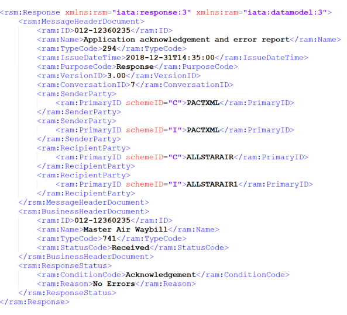
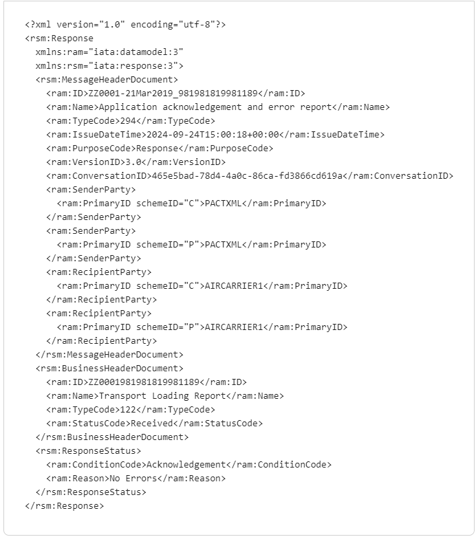
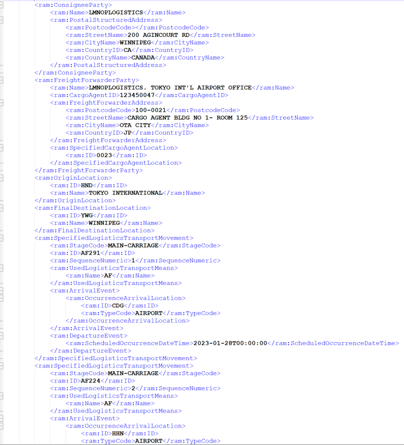
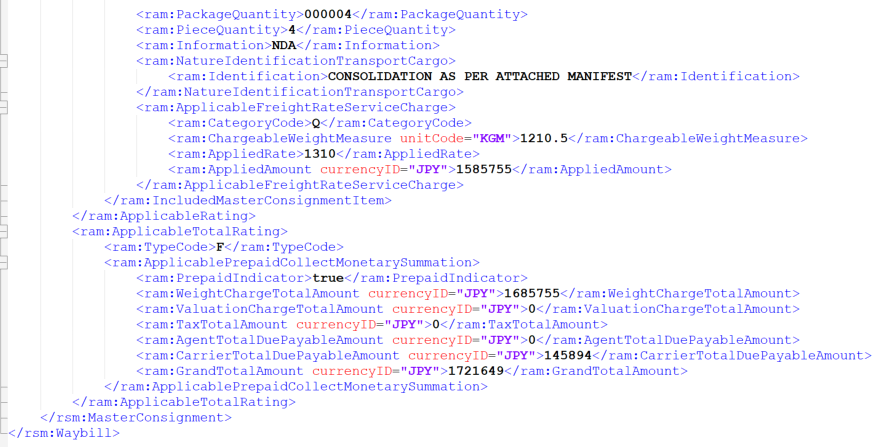
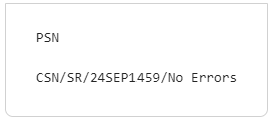
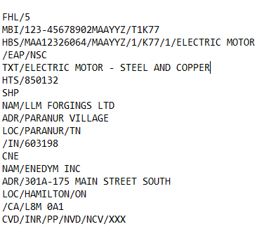
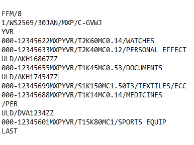

GUIDE De mise en œuvre TECHNIQUE 2024 DU PROGRAMME DE  
CIBLAGE du fret AÉRIEN PRÉALABLE  
AU CHARGEMENT

Table des matières

[1 Aperçu](#aperçu)

[1.1 Contexte](#contexte)

[1.2 Portée](#portée)

[1.3 Public visé](#public-visé)

[1.4 Participants nécessaires et admissibles](#participants-nécessaires-et-admissibles)

[1.4.1 Participants nécessaires (transporteurs aériens)](#participants-nécessaires-transporteurs-aériens)

[1.4.2 Participants admissibles (autres présentateurs de données)](#participants-admissibles-autres-présentateurs-de-données)

[1.5 Points de contact réglementaires](#points-de-contact-réglementaires)

[1.6 Date d’entrée en vigueur](#date-dentrée-en-vigueur)

[2 Connexion au programme CFAPC](#connexion-au-programme-cfapc)

[2.1 Diagramme de ciblage du CFAPC](#diagramme-de-ciblage-du-cfapc)

[2.2 Inscription au CFAPC](#inscription-au-cfapc)

[2.2.1 Inscription](#inscription)

[2.2.2 Configuration initiale et connexion](#configuration-initiale-et-connexion)

[2.2.3 Messages bidirectionnels](#messages-bidirectionnels)

[2.2.4 Configuration des webhook](#configuration-des-webhook)

[2.2.5 Exigences de présentation et réponses](#exigences-de-présentation-et-réponses)

[2.2.5.1.1 Règles opérationnelles et de mise en œuvre](#règles-opérationnelles-et-de-mise-en-œuvre)

[2.3 Environnements d’essai et de production du CFAPC](#environnements-dessai-et-de-production-du-cfapc)

[2.3.1 Environnement d’essai du CFAPC](#environnement-dessai-du-cfapc)

[2.3.2 Environnement de production du CFAPC](#environnement-de-production-du-cfapc)

[3 Caractéristiques des messages du CFAPC](#caractéristiques-des-messages-du-cfapc)

[3.1 Formats des messages](#formats-des-messages)

[3.2 Versions prises en charge des messages du CFAPC](#versions-prises-en-charge-des-messages-du-cfapc)

[3.2.1 Versions Cargo-XML prises en charge](#versions-cargo-xml-prises-en-charge)

[3.2.2 Versions C-IMP prises en charge](#versions-c-imp-prises-en-charge)

[3.2.3 Versions CAMIR prises en charge](#versions-camir-prises-en-charge)

[3.3 Réponses aux messages Cargo-XML](#réponses-aux-messages-cargo-xml)

[3.3.1 Réponses aux messages XFNM](#réponses-aux-messages-xfnm)

[3.3.2 Messages d’avis de statut XCSN](#messages-davis-de-statut-xcsn)

[3.4 Réponses aux messages CAMIR](#réponses-aux-messages-camir)

[3.4.1 Messages de rapport d’erreur préliminaire (PER)](#messages-de-rapport-derreur-préliminaire-per)

[3.4.2 Messages d’avis de statut préliminaire (PSN)](#messages-davis-de-statut-préliminaire-psn)

[3.4.3 Codes de réponse HTTP](#codes-de-réponse-http)

[3.5 Exemples de messages du CFAPC](#exemples-de-messages-du-cfapc)

[3.5.1 Exemple de présentation d’un message Cargo-XML](#exemple-de-présentation-dun-message-cargo-xml)

[3.5.2 Exemple de présentation d’un message C-IMP](#exemple-de-présentation-dun-message-c-imp)

[4 Diagramme du ciblage du CFAPC](#diagramme-du-ciblage-du-cfapc)

[5 Glossaire](#glossaire)

[6 Caractères et descriptions inacceptables](#caractères-et-descriptions-inacceptables)

[6.1 Caractères inacceptables dans le nom ou l’adresse de l’expéditeur/du destinataire ou dans la description des marchandises](#caractères-inacceptables-dans-le-nom-ou-ladresse-de-lexpéditeurdu-destinataire-ou-dans-la-description-des-marchandises)

[6.2 Descriptions de marchandises inacceptables](#descriptions-de-marchandises-inacceptables)

[6.3 Données insuffisantes/de mauvaise qualité](#données-insuffisantesde-mauvaise-qualité)

[7 Modèles de courriels](#modèles-de-courriels)

[7.1 Demande de renseignements](#demande-de-renseignements)

[7.2 Demande de vérification](#demande-de-vérification)

[7.3 Ne pas charger](#ne-pas-charger)

[7.4 Données insuffisantes/de mauvaise qualité](#données-insuffisantesde-mauvaise-qualité-1)

Historique des modifications

| Date | Version | Section(s) | Description/motif |
|----|----|----|----|
| 26 jan. 2024 | 1 |  | Diffusion initiale |
| 10 avril 2024 | 1.1 | 2.2.5.1 Éléments de données du CFAPC | Remarque sur l’heure de départ |
|  |  | 2.3.1 Environnements d’essai et de production du CFAPC | Clarifications sur les mises à l’essai |
|  |  | 3.3.1 Réponses aux messages XFNM | Mise à jour de la définition du INVALID_HOUSE_BILL_NBR |
|  |  | 3.4.1 Messages de rapport d’erreur préliminaire (PER) | Mise à jour de la définition du INVALID_HOUSE_BILL_NBR et des messages d’erreur CAMIR PER |
|  |  | \*Nouvelle section\* 6 sur les descriptions des marchandises | Exemples de descriptions de marchandises acceptables et inacceptables afin d’éviter des erreurs de données insuffisantes  |
| 6 mai 2024         | 1.2 | 2.3.1.1 Mise à l’essai de la présentation des données | Mise à jour de la section afin de fournir des paramètres sur l'analyse des données soumises |
| 27 juin 2024 | 1.3 | 2.2.5.1 Éléments de données du CFAPC | Remarque : Les transitaires doivent mettre à jour le connaissement interne avec le numéro de référence du connaissement principal une fois que celui-ci est connu |
|  |  | \*Nouvelle section\* 2.2.5.1.1 Règles opérationnelles et de mise en œuvre | Décrit les règles opérationnelles et les règles de mise en œuvre concernant les éléments de données du CFAPC |
|  |  | 2.2.5.3 Partie responsable | Changement à l’en-tête de partie responsable lorsque ce champ ne s’applique pas |
|  |  | Nouvelle section 2.3.1.2 Tester automatiquement les procédures d’atténuation des risques (RFI, RFS et DNL) pour les implémentations bidirectionnelles | Tester automatiquement les messages d’atténuation des risques pour les implémentations bidirectionnelles |
|  |  | 3.3.1 Réponses aux messages XFNM | Nouveaux codes de message d’erreur pour routage non valide et synchronisation non valide |
|  |  | 3.3.2 Messages d’avis de statut XCSN | Nouvel exemple XCSN pour un message d’évaluation terminée du CFAPC |
|  |  | 3.3.2 Messages d’avis de statut XCSN | Nouvel exemple XCSN pour un RFI d’un connaissement interne |
|  |  | 3.4.1 Messages de rapport d’erreur préliminaire (PER) | Nouveaux codes de message d’erreur pour routage non valide et synchronisation non valide |
|  |  | 6\. Caractères et descriptions inacceptables | Ajout de messages d’erreur générés manuellement |
|  |  | \*New section\* 6.3 Données insuffisantes/de mauvaise qualité | Réponses d’erreur générés manuellement |
|  |  | \*New section\* 7 Modèles de courriels | Modèles de courriels pour RFI/RFS/DNL et Données insuffisantes/de mauvaise qualité |

# Aperçu

Le programme de ciblage du fret aérien préalable au chargement (CFAPC) vise à cerner et à prendre des mesures d’atténuation en ce qui concerne les expéditions de fret aérien à haut risque susceptibles de contenir des engins explosifs improvisés camouflés avant leur chargement et leur départ pour le Canada. Pour ce faire, on procède à l’évaluation des risques des renseignements avancés sur le fret à l’aide de technologies émergentes.

À compter de l’automne 2024, les transporteurs aériens qui transportent du fret au Canada au départ de destinations internationales seront tenus de présenter des données au CFAPC et, dans certains cas, de prendre des mesures d’atténuation des risques à l’égard d’envois particuliers conformément au *Règlement canadien de 2012 sur la sûreté aérienne*.

## Contexte

Transports Canada collabore avec des experts du secteur de l’aéronautique afin de trouver une solution pouvant facilement s’intégrer aux processus opérationnels existants. Ces bénévoles ont collaboré de près avec Transports Canada pour harmoniser au maximum la présentation de données au CFAPC.

Pour plus de renseignements sur le CFAPC, consultez l’adresse <https://tc.canada.ca/fr/programmes/ciblage-fret-aerien-prealable-chargement-CFAPC>.

## Portée

Le *Règlement canadien de 2012 sur la sûreté aérienne* s’applique aux transporteurs aériens qui transportent du fret à bord d’un vol au départ d’un lieu situé à l’extérieur du Canada à destination d’un aérodrome situé au Canada. Cela comprend le fret à bord des vols passagers, d’affrètement, de messageries/express et ne transportant que du fret, ainsi que les vols en transit ou transférant au Canada (y compris le fret restant à bord (FRAB)).

Le règlement et, par conséquent, le programme CFAPC ne s’appliquent **<u>PAS</u>** à ce qui suit :

- Courrier

- Valises diplomatiques ou consulaires

- Bagages enregistrés des passagers

- Bagages à main des passagers

- Fret aérien transporté à bord d’un vol au départ du Canada

- Fret aérien à bord de vols à l’intérieur du Canada

- Fret qui arrive au Canada par un autre moyen de transport, comme la route, la mer ou le rail (y compris lorsque le dernier segment d’un vol est acheminé par mode routier).

## Public visé

Ce guide s’adresse à l’équipe de mise en œuvre ou au technicien chargé de configurer la connexion des données d’un transporteur aérien au programme CFAPC. Ce guide comprend également des exigences concernant le présentateur et la présentation des données, les dates estimatives d’entrée en vigueur des règlements et l’agencement des messageries bidirectionnelles.

## Participants nécessaires et admissibles

### Participants nécessaires (transporteurs aériens)

Les transporteurs aériens qui transportent du fret à bord d’un vol depuis un lieu situé en dehors du Canada jusqu’à un aérodrome situé au Canada sont tenus de présenter les renseignements obligatoires sur le fret au CFAPC. Voir la section [1.2 Portée](#portée).

### Participants admissibles (autres présentateurs de données)

Les entreprises recrutées par les transporteurs aériens pour fournir des services de TI peuvent participer au programme CFAPC en soumettant et en recevant des données sur le fret au nom du transporteur aérien. Cela comprend les fournisseurs de services tiers, comme les agrégateurs de données et les agents généraux des ventes/de manutention (AGV/AGM).

Les transitaires ou les transporteurs aériens qui établissent des lettres de transport ou qui exploitent des vols avant le dernier point de départ pour le Canada (p. ex., les accords de partage de codes) peuvent également participer au CFAPC à titre volontaire, **<u>à la demande d’un transporteur aérien</u>**.

Au moment de leur inscription au CFAPC, les transporteurs aériens doivent préciser leurs fournisseurs de services afin d’autoriser la connexion de leurs partenaires au sein de la chaîne d’approvisionnement au système CFAPC.

**Remarque :** Même si les transporteurs aériens peuvent déléguer l’échange de renseignements à un fournisseur de services, ce sont les transporteurs aériens qui sont en définitive responsables de se conformer au *Règlement canadien de 2012 sur la sûreté aérienne*.

## Points de contact réglementaires

Transports Canada exige que les points de contact suivants inscrivent un transporteur aérien au CFAPC avant d’amorcer le processus de chargement. Voir la section [2.2.1 Inscription](#inscription) pour plus de précisions.

1.  **Principale personne-ressource responsable de la sûreté du fret :** Il s’agit d’un représentant de la compagnie qui est responsable du respect des règles et règlements de Transports Canada.

- Nom :

- Titre :

- No de téléphone :

- Courriel :

2.  **Contact 24 heures sur 24, 7 jours sur 7 :** Une personne-ressource disponible 24 jours sur 24, 7 jours sur 7, qui peut répondre d’urgence aux demandes de renseignements (RFI), aux demandes de contrôle (RFS) et aux avis Ne pas charger (DNL). Cette personne doit avoir accès aux renseignements complémentaires sur l’envoi et être en mesure d’amorcer des procédures de contrôle face à une éventuelle menace planant sur le fret aérien. Cette personne peut être une boîte de réception dans la mesure où celle‑ci fait l’objet d’une surveillance 24 jours sur 24, 7 jours sur 7.

- Nom :

- Titre :

- No de téléphone :

- Courriel :

3.  **Interlocuteur technique :** Interlocuteur qui peut amorcer la connectivité du système entre le transporteur aérien et Transports Canada et apporter une aide technique pour l’échange de données, notamment intervenir en cas de panne du système.

- Nom :

- Entreprise (si elle diffère du transporteur aérien) :

- Titre :

- No de téléphone :

- Courriel :

## Date d’entrée en vigueur

Les modifications du *Règlement canadien de 2012 sur la sûreté aérienne* entreront en vigueur lors de leur publication dans la partie II de la *Gazette du Canada*, à l’automne 2024. On escompte des transporteurs aériens qu’ils présentent les éléments de données prescrits au CFAPC et qu’ils soient prêts à répondre aux demandes de Transports Canada (RFI, RFS, DNL) à compter de la date de publication, à défaut de quoi ils sont susceptibles de faire l’objet de sanctions administratives pécuniaires (SAP).

Depuis l’automne 2023, Transports Canada s’est mis à inscrire certains transporteurs aériens et entend augmenter leur volume progressivement, jusqu’à la date d’entrée en vigueur du Règlement. L’objectif est de s’assurer que les modifications d’ordre technique et opérationnel peuvent être mises à l’épreuve et en œuvre bien avant la date d’entrée en vigueur.

# Connexion au programme CFAPC

Le programme CFAPC utilise une interface de protocole d’application Web (« API Web ») afin d’expédier des messages aux participants et d’en recevoir de leur part en format XML-Cargo, ou C‑IMP/CAMIR. Vous trouverez plus de précisions à la section [3.1 Formats des messages](#formats-des-messages) et à la section [3.2 Versions prises en charge des messages CFAPC](#versions-prises-en-charge-des-messages-du-cfapc).

Cette section donne un aperçu du processus d’inscription technique et fournit les précisions nécessaires à l’agencement, à la connexion et à la mise à l’essai des données présentées au CFAPC.

## Diagramme de ciblage du CFAPC

Le <u>Diagramme du ciblage du CFAPC</u> illustre le flux prévu des informations du système de production.

Les participants doivent apprendre à connaître les avis qu’ils peuvent s’attendre à recevoir via le programme CFAPC plutôt que par courriel. Dans le cas où une mesure d’atténuation des risques s’avère nécessaire, le programme CFAPC est capable d’envoyer des messages bidirectionnels pour transmettre les RFI, RFS et DNL en temps quasi réel. Voir section [2.2.3 Messageries bidirectionnelles](#messages-bidirectionnels) pour plus de précisions.

## Inscription au CFAPC

Avant de présenter des données au CFAPC, les transporteurs aériens doivent s’adresser à Transports Canada pour une procédure unique d’inscription et d’agencement, laquelle consiste à identifier les personnes-ressources et à fournir les autorisations pour toute personne tierce qui doit présenter des données au CFAPC au nom du transporteur aérien, le cas échéant.

Une fois l’inscription terminée, l’équipe du CFAPC entrera en rapport avec le transporteur aérien ou son participant autorisé pour lui fournir les renseignements de connexion suivants :

- Un symbole d’authentification

- L’URL d’extrémité pour l’environnement d’essai du CFAPC

- Les consignes de connexion, notamment les informations d’en‑tête prescrites

### Inscription

Pour amorcer le processus d’inscription, veuillez entrer en rapport avec Transports Canada à l’adresse <pact-information-cfapc@tc.gc.ca> et préciser les personnes-ressources figurant à la section [1.2.2.3 Points de contact réglementaires](#points-de-contact-réglementaires). Un représentant du CFAPC répondra dans les deux (2) jours ouvrables pour obtenir d’autres renseignements et finaliser l’inscription.

**Remarque :** Il est vivement conseillé aux transporteurs aériens de mener à bien ce processus le plus rapidement possible pour qu’ils aient suffisamment de temps pour mettre à l’épreuve avec succès les données qu’ils présentent avant que la conformité ne devienne obligatoire à l’automne 2024.

### Configuration initiale et connexion

Une fois l’inscription faite, un représentant du CFAPC enverra un courriel à la personne-ressource technique pour lui fournir tous les renseignements nécessaires sur la connexion. Cela comprend un symbole pour l’authentification, l’URL et des renseignements sur la façon d’établir des connexions pour recevoir des messages de l’API Web du CFAPC.

Après s’être branché avec succès au programme CFAPC, un message synchrone standard est immédiatement expédié par le programme CFAPC pour indiquer que la présentation des données a bien été reçue, mais qu’elle n’a pas encore fait l’objet d’une évaluation sur le plan des risques. Ces messages précisent les erreurs d’interprétation et de format et peuvent également indiquer s’il manque un élément de donnée obligatoire. Voir les sections [3.3.1 Réponses aux messages XFNM](#réponses-aux-messages-xfnm) et [3.4.1 Messages de rapport d’erreur préliminaire (PER)](#messages-de-rapport-derreur-préliminaire-per) pour une liste d’erreurs en C-XML et CAMIR, et section [6 Caractères et descriptions inacceptables](#caractères-et-descriptions-inacceptables).

Ces messages d’accusé de réception et d’erreurs synchrones sont distincts des messages bidirectionnels asynchrones que l’on peut activer pour les avis « d’évaluation terminée » et les mesures d’atténuation des risques. Voir la section 2.2.3 Messages bidirectionnels.

### Messages bidirectionnels

Les messages bidirectionnels sont disponibles sur l’API Web pour que les participants reçoivent l’avis « évaluation terminée » et des mises à jour sur l’état d’atténuation des risques de manière asynchrone par le biais de leur solution logicielle. Si une mesure d’atténuation s’avère nécessaire, la mise à jour de la situation est suivie d’un courriel.

**Remarque :** Si les participants ne sont pas en mesure d’établir des messages bidirectionnels, des messages d’accusé de réception synchrones peuvent être renvoyés en guise de réponse aux appels de l’API. Toutes les réponses d’atténuation après l’accusé de réception initial seront ensuite envoyées aux personnes-ressources uniquement par courriel. Voir section [7 Modèles de courriels](#modèles-de-courriels).

Pour se brancher à l’API d’un participant, Transports Canada a besoin des renseignements suivants :

- Des précisions sur la connexion API (le CFAPC peut être connecté à des terminaux multiples).

- Le format de message préféré (Cargo-XML ou C‑IMP) et sa version (voir section [3.2 Versions prises en charge des messages du CFAPC](#versions-prises-en-charge-des-messages-du-cfapc)).

**Remarque :** On peut sélectionner différents formats pour la présentation et la réception.

- Toutes exigences supplémentaires pour la connexion, le cas échéant.

Après avoir confirmé les données sur la connexion, l’équipe du CFAPC envoie aux équipes de mise en œuvre les renseignements prescrits pour recevoir des messages asynchrones du CFAPC. Les messages asynchrones exigent la configuration de webhook pour être reçus du serveur du CFAPC.

### Configuration des webhook

Les messages bidirectionnels exigent la configuration de solutions logicielles intégrées pour recevoir une connexion webhook du serveur du CFAPC à l’aide des éléments suivants :

<table>
<caption>
Tableau 1 : éléments nécessaires pour connexion webhook
</caption>
<colgroup>
<col style="width: 24%" />
<col style="width: 35%" />
<col style="width: 39%" />
</colgroup>
<thead>
<tr>
<th>Élément</th>
<th>Définition</th>
<th>Exemple</th>
</tr>
</thead>
<tbody>
<tr>
<td>URL</td>
<td>Le périphérique du transporteur aérien auquel le CFAPC enverra des messages.</td>
<td><a href="https://myaircarrier.com/api/myendpoint">https://myaircarrier.com/api/myendpoint</a></td>
</tr>
<tr>
<td>Secret</td>
<td>Une chaîne configurée par le transporteur aérien qui sera annexée à chaque message de réponse dans l’en‑tête « X‑PACT-SECRET » pour permettre au transporteur aérien de confirmer que le message a bien été reçu du programme CFAPC.</td>
<td>E6HuaaHIB6knkFyaTuUc934SRz37czVJG 
DM7rBtvKN5AhfWcCP9LRVF0LWx9c17L 
vWADfhXXbFa2iwSSKP8cuDyOnX9NDG6 
4l5icklhXgw3fzQ6IT0suzZSZFrzPfrzfTcSbj 
h3gwlP7FEFF4uJdMrkjLxFDejKUV9kjYNR 
0DOQjWujD7I0K9AW1n 
R314SuCeEoOyIfV..........</td>
</tr>
<tr>
<td>Type de réponse</td>
<td>Le verbe http qui désigne la mesure relative aux données transmises comme la création ou la mise à jour.</td>
<td>POST, PUT</td>
</tr>
<tr>
<td>En‑tête</td>
<td>Une liste des principales paires de clé – valeur ajoutées aux demandes/réponses qui fournissent des renseignements complémentaires.</td>
<td>
« X-MYAIRLINE-REQUIRED-HEADER » : « Custom provided header »

Pour les messages de type texte (FWB, FHL) « Content-Type » : « text/plain »

Pour les messages de type XML (XFMB, XFZB) « Content-Type » : « application/xml »
</td>
</tr>
</tbody>
</table>

Tableau 1 : éléments nécessaires pour connexion webhook

### Exigences de présentation et réponses

Les participants doivent soumettre les données prescrites au CFAPC le plus tôt possible avant le chargement afin de permettre de mener à bien la procédure d’évaluation des risques. Consulter le <u>Diagramme du ciblage du CFAPC</u>.

Les participants reçoivent une série de messages du programme CFAPC qui précisent l’état de l’évaluation de chaque ensemble de données, notamment l’identification des erreurs, la confirmation des messages reçus, les avis « d’évaluation terminée », les demandes de mesures d’atténuation des risques et les avis de résolution des mesures. Tous les avis du système sont transmis en temps quasi réel lorsque les messages bidirectionnels sont activés.

#### Éléments de données du CFAPC

Le CFAPC exige sept (7) éléments de données et un numéro de lettre de transport aérien (+1) afin de procéder à l’évaluation des risques de tout le fret aérien entrant. Ces éléments de données « 7+1 » sont reconnus à l’échelle internationale comme concept d’utilisation des renseignements préalables sur le fret (PLACI), et on les estime utiles à l’évaluation des risques, car il est possible de les obtenir au début du cycle de vie d’expédition du fret et que pris ensemble, ils peuvent révéler des tendances qui fixent des limites pour le fret à faible risque.

On s’attend de la part des participants à ce qu’ils soumettent les éléments de données au CFAPC le plus tôt possible avant le chargement et à ce qu’ils fournissent les mises à jour jusqu’au moment du départ du vol (signalé par la soumission des renseignements sur le vol énumérés ci-dessous). Aucune des données reçues après le départ ne sera évaluée.

Les transporteurs aériens sont tenus de soumettre les données obligatoires suivantes (7+1) au CFAPC pour procéder à l’évaluation des risques le plus tôt possible avant le chargement :

- Le numéro de lettre de transport aérien (qui comprend le numéro de connaissement interne, s’il y a lieu)

- Nom de l’expéditeur d’origine

- Adresse de l’expéditeur d’origine

- Nom du destinataire

- Adresse du destinataire

- La description du fret (description de chaque unité de fret)

- Le nombre total d’unités (dénombrement des unités)

- Le poids total du fret

Le programme CFAPC peut également accepter d’autres éléments de données sous réserve que les éléments réglementaires soient bien présents.

**Remarque :** Les messages de regroupement ne satisfont pas généralement à ces exigences car ceux-ci ne contiennent pas nécessairement les noms et les adresses des expéditeurs d’origine, ni la description de chaque unité de fret, auquel cas tous les connaissements internes connexes sont nécessaires. Bien que le système puisse accepter une description du fret telle que « regroupement », cette description ne satisfait pas aux exigences réglementaires.

**Remarque :** Le présentateur des données peut soumettre un connaissement interne avant de connaître le numéro du connaissement aérien principal et peut laisser ce dernier en blanc (p. ex., lorsque c’est un transitaire qui présente les données sur le connaissement interne pour le transporteur aérien). Une fois connu le numéro du connaissement aérien principal, le connaissement interne doit être présenté à nouveau par le transitaire avec le numéro du connaissement aérien principal avant le départ. Ce sont les transporteurs aériens qui demeurent responsables de se conformer aux exigences réglementaires sur toutes les données à soumettre (y compris lorsque ces données sont présentées par d’autres participants).

En plus des éléments de données « 7+1 », le programme CFAPC demande aussi que les renseignements suivants soient fournis dès que possible après le départ du vol à partir du dernier point de départ et avant son arrivée au Canada :

- La date du vol;

- Le numéro du vol;

- L’aérodrome de destination;

- L’heure de départ; et

- La liste des numéros des lettres de transport aérien du vol.

**Remarque :** le message FFM répond à ces exigences. Le programme CFAPC acceptera l’heure de soumission du message FFM comme étant équivalente à l’heure de départ.

## Règles opérationnelles et de mise en œuvre

Les règles suivantes spécifient les formats de données et fournissent des conseils généraux lors de la présentation des éléments de données requis soit en Cargo-XML ou en C-IMP, au programme CFAPC :

- On suppose que l’heure est en temps universel coordonné (UTC);

- Les numéros du connaissement aérien principal devraient contenir un maximum de 13 caractères.

- Les expéditions de regroupement sont reconnues par les indicateurs suivants dans le connaissement aérien principal :

  - Pour les messages XFWB en Cargo-XML, utilisez le code de document 741 pour les regroupements et le code de document 740 pour les expéditions directes;

  - Pour les messages FWB en C-IMP, utilisez NC pour le champ de description des marchandises pour les regroupements et NG pour les expéditions directes;

- Le code de système harmonisé (code SH) n’est pas obligatoire pour la description des marchandises. Les transmetteurs de données ne sont pas tenus de supprimer les codes HS de la lettre de transport aérien avant de la soumettre.

- Le nombre total d’unités représente le nombre de pièces de fret dans une expédition. La plus petite unité d’emballage externe représente une pièce de fret. Les articles individuels emballés d’une telle façon qu’il soit impossible de les diviser sans défaire l’emballage représentent une seule pièce de fret;

- Le poids est mesuré en kilogrammes.

#### Données d’en‑tête à transmettre

Les données d’en‑tête qui doivent accompagner chaque message envoyé doivent inclure : le symbole, le code de transporteur aérien de l’IATA, et l’identifiant de la partie responsable (au maximum 50 caractères), le cas échéant.

Voici un exemple d’en‑tête valide :

- Ocp-Apim-Subscription-Key: abcd

- Code de transporteur aérien de l’IATA : 014

- Partie responsable : PACTPW8 (facultatif)

- Accepté : texte/simple

- Type de contenu : texte/simple

- Contenu-longueur : 767

- Agent utilisateur : PACTAI/1.0

Le tableau qui suit contient les données d’en‑tête prescrites et facultatives relatives aux demandes du CFAPC, ainsi que les consignes sur la façon de remplir chaque champ.

<table>
<caption>
Tableau 2 : Données d’en-tête des demandes du CFAPC
</caption>
<colgroup>
<col style="width: 30%" />
<col style="width: 69%" />
</colgroup>
<thead>
<tr>
<th>Données d’en-tête</th>
<th>Description</th>
</tr>
</thead>
<tbody>
<tr>
<td><strong>Ocp-Apim-Subscription-Key</strong></td>
<td>Contient le logiciel qui vous a été remis par un représentant du CFAPC au moment de l’inscription.</td>
</tr>
<tr>
<td><strong>Code du transporteur aérien de l’IATA</strong></td>
<td>
Le code à trois chiffres de l’IATA du transporteur aérien qui présente les données.

Référence : <a href="https://www.iata.org/en/about/members/airline-list/">https://www.iata.org/en/about/members/airline-list/</a> ou

<a href="https://www.iata.org/en/publications/store/airline-coding-directory/">https://www.iata.org/en/publications/store/airline-coding-directory/</a> 
</td>
</tr>
<tr>
<td><strong>Partie responsable</strong> &lt;<em>facultatif</em>&gt;</td>
<td>
Code à sept chiffres qui identifie la partie responsable de la réception et de la réponse aux avis d’atténuation des risques, selon le présentateur des données.

Voir <u>Partie responsable</u> pour plus de précisions.
</td>
</tr>
<tr>
<td><strong>Accepté</strong></td>
<td>
Référence : <a href="https://www.rfc-editor.org/rfc/rfc9110.html#name-accept">https://www.rfc-editor.org/rfc/rfc9110.html#name-accept</a>

application/xml pour le fret-XML ou texte/simple pour le C‑IMP
</td>
</tr>
<tr>
<td><strong>Type de contenu</strong></td>
<td>
Référence : <a href="https://www.rfc-editor.org/rfc/rfc9110.html#name-content-type">https://www.rfc-editor.org/rfc/rfc9110.html#name-content-type</a>

application/xml pour le fret-XML ou texte/simple pour le C‑IMP
</td>
</tr>
<tr>
<td><strong>Longueur du contenu</strong></td>
<td>Référence : <a href="https://www.rfc-editor.org/rfc/rfc9110.html#name-content-length">https://www.rfc-editor.org/rfc/rfc9110.html#name-content-length</a> 
Taille de la demande</td>
</tr>
<tr>
<td><strong>Agent utilisateur</strong></td>
<td>
Référence : <a href="https://www.rfc-editor.org/rfc/rfc9110.html#name-user-agent">https://www.rfc-editor.org/rfc/rfc9110.html#name-user-agent</a>

Contient un renvoi au produit/au commentaire décrivant l’application d’où provient la demande.
</td>
</tr>
</tbody>
</table>

Tableau 2 : Données d’en-tête des demandes du CFAPC

#### Partie responsable

La valeur de l’en‑tête de la partie responsable est un code à sept (7) chiffres qui précise quelle partie recevra les avis d’atténuation de tous les risques émis par le CFAPC et qui y répondra. Si le présentateur des données reçoit également et réagit à toutes les mesures d’atténuation des risques, on peut alors enlever l’en-tête de la partie responsable. Cela vaut pour de nombreux transporteurs aériens et transitaires qui s’occupent eux-mêmes des RFI/RFS/DNL.

Pour les agrégateurs de données et toute autre partie qui présente des données au CFAPC au nom d’un transporteur aérien, mais qui ne s’occupe pas de la gestion des mesures d’atténuation des risques, le code de la partie responsable doit préciser la partie responsable.

Le code de la partie responsable doit contenir sept (7) chiffres et comporter les données suivantes :

- Les cinq premières lettres sont toujours CFAPC

- Une seule lettre pour désigner l’environnement du CFAPC :

- un « **P** » pour indiquer l’environnement de production

- un « **E** » pour l’environnement d’essai

- L’indicatif à deux caractères du transporteur aérien de l’IATA (ou le code convenu à deux caractères qui désigne les organismes en dehors de l’IATA, comme les AGV)

Par exemple : **PACTPW8**

**Remarque :** Un représentant du CFAPC précisera à quel environnement le symbole est destiné au moment où il est fourni, pour que le technicien puisse saisir la bonne lettre (P ou E).

#### Types de réponses

À l’aide du <u>Diagramme du ciblage du CFAPC</u>, cette section explique les divers codes de réponses que transmettra le programme CFAPC.

Une fois que l’on reçoit un message du programme CFAPC, on procède à la validation préliminaire des données pour déterminer les erreurs dans les éléments de données « 7+1 », le cas échéant. Ces erreurs peuvent être le reflet d’une demande https mal formatée, des erreurs d’authentification, des problèmes de serveur ou des données de présentation mal formatées. Les codes d’erreur se trouvent dans les <u>Réponses aux messages XFNM</u>, les <u>Messages de rapport d’erreur préliminaire (</u> et les sections des <u>Codes de réponse HTTP</u>.

Quand un message est reçu sans erreurs, un avis « reçu » est envoyé en guise de réponse pour indiquer que les éléments de données « 7+1 » ont bien été reçus par Transports Canada.

Après avoir soumis les données obligatoires pour qu’elles fassent l’objet d’une évaluation, le CFAPC procède à une évaluation des risques pour chaque lettre de transport aérien. Si les données sur la lettre de transport aérien ne contiennent aucun indicateur de risque, le CFAPC transmet aux participants un code qui contient le statut « Évaluation terminée ».

Au cas où les données d’envoi contiendraient des indicateurs de risque, le CFAPC peut alors transmettre des codes pour refléter une RFI, un RFS ou un DNL. Les équipes de mise en œuvre doivent s’assurer que les scénarios d’essai comportent des mesures pour manipuler les codes dans le type de format sélectionné :

- Pour C-XML, qui comprend les codes DL, DV et CD. Voir <u>Messages d’avis de statut XCSN</u>.

- Pour le CAMIR/C-IMP, qui comprend les codes 7H, 7I, 7J, 8H, 8I, 8J, 6H, 6J, et 6I. Voir <u>Messages d’avis de statut préliminaire (PSN)</u>.

- Remarque : Tous les messages du CFAPC contiennent un identifiant de conversation (corps CXML) et/ou un identifiant de corrélation (en‑tête http CXML/CIMP) à titre de référence.

## Environnements d’essai et de production du CFAPC 

Transports Canada propose deux environnements dans le programme CFAPC pour soumettre des données : un environnement d’essai et un environnement de production.

L’environnement d’essai permet aux participants de vérifier les données qu’ils soumettent et de recevoir des réponses du CFAPC dans un espace simulé qui n’affectera pas leurs activités effectives.

L’environnement de production est celui qui offre la plus grande stabilité et le meilleur rendement et il est mis à la disposition des participants dès qu’ils ont procédé avec succès aux essais dans l’environnement d’essai. Lorsque des données réelles sont fournies dans l’environnement de production, le CFAPC aura l’occasion de mieux connaître les données sur le transporteur aérien et de cerner les problèmes de conformité longtemps avant la date d’entrée en vigueur.

### Environnement d’essai du CFAPC

Avant de soumettre des données à l’environnement de production du CFAPC, les participants sont tenus de tester leur connectivité et le formatage des messages dans l’environnement d’essai du CFAPC. Après l’inscription, les participants se voient remettre un symbole d’authentification, une URL d’extrémité et des renseignements sur la façon de configurer les connexions pour recevoir des messages depuis l’environnement de production du CFAPC.

Une fois qu’ils ont testé une quantité satisfaisante de types de messages, de volumes et d’erreurs, les participants sont invités à soumettre toutes les données courantes à destination du Canada dans l’environnement d’essai.

#### Mise à l’essai de la présentation des données 

Les essais dans l’environnement d’essai doivent débuter par un ou deux lots de 20 à 100 données présentées, en utilisant des données aussi proches que possible du « monde réel ». Ces lots serviront à évaluer la capacité du participant à transmettre les données de la lettre de transport au CFAPC et à recevoir des messages d’accusé de réception synchrones ou des erreurs en guise de réponse. Les données soumises seront examinées par un représentant du CFAPC qui vérifiera les éléments suivants:

Fournir tous les éléments de données « 7+1 » afin de recevoir le message d'accusé de réception :

- Numéro de lettre de transport aérien

- Nom et adresse de l’expéditeur d’origine

- Nom et adresse du destinataire

- Description de chaque unité de fret

- Nombre total d’unités

- Poids total du fret

Fournir au moins un de chacun des messages d'essai suivants :

- Connaissement principal (FWB)

- Connaissement interne (FHL)

- Lettre de transport avec poids manquant pour tester les messages d'erreur

- Lettre de transport avec une description des marchandises conformément à la section *6.2 Descriptions de marchandises inacceptables* pour tester les messages d'erreur

Le participant sera avisé par le CFAPC s’il y a des problèmes qu’il faut résoudre ou s’il doit soumettre d’autres données d’essai.

#### Tester automatiquement les procédures d’atténuation des risques (RFI, RFS et DNL) pour les implémentations bidirectionnelles

Lorsqu’ils utilisent l’implémentation bidirectionnelle du CFAPC, les présentateurs de données peuvent tester automatiquement les réponses d’atténuation des risques sans avoir besoin qu’un représentant CFAPC arrange cette période de test. Pour effectuer ce test automatique, les présentateurs de données doivent soumettre à l’environnement d’essai du CFAPC soit un MAWB, un HAWB, ou les deux, avec les codes suivants dans le champ de Description des marchandises.

- CLEAR SHIPMENT PLEASE

- RFI SHIPMENT PLEASE

- CLEAR SHIPMENT PLEASE

- RFS SHIPMENT PLEASE

- CLEAR SHIPMENT PLEASE

- DNL SHIPMENT PLEASE

- CLEAR SHIPMENT PLEASE

**Remarque** : Les codes ci-dessus ne fonctionnent pas dans l’environnement de production du CFAPC

<table>
<colgroup>
<col style="width: 12%" />
<col style="width: 13%" />
<col style="width: 23%" />
<col style="width: 49%" />
</colgroup>
<thead>
<tr>
<th style="text-align: center;"><strong>Commande</strong></th>
<th style="text-align: center;"><strong>Explication</strong></th>
<th style="text-align: center;"><strong>Réponse C-IMP</strong></th>
<th style="text-align: center;"><strong>Réponse Cargo-XML (extrait)</strong></th>
</tr>
</thead>
<tbody>
<tr>
<td>CLEAR SHIPMENT PLEASE</td>
<td>Réponse de test du CFAPC indiquant que le CFAPC a terminé l'évaluation de l'envoi</td>
<td>PSN 
000-12344321 
CSN/SF/12JUN1421/PACT ---TESTING---ASSESSMENT COMPLETE---TESTING--</td>
<td>BusinessHeaderDocument&gt; 
&lt;StatusCode&gt;CO&lt;/StatusCode&gt; 
&lt;ActionTypeCode&gt;000&lt;/ActionTypeCode 
&lt;ActionTypeName&gt;IMP&lt;/ActionTypeName&gt; 
&lt;Information&gt;PACT --TESTING---ASSESSMENT COMPLETE---TESTING---&lt;/Information&gt; 
&lt;IssueDateTime&gt;2024-0614 T20:50:11&lt;/IssueDateTime&gt; 
&lt;/BusinessHeaderDocument&gt;</td>
</tr>
<tr>
<td>RFI SHIPMENT PLEASE</td>
<td>Tester la soumission et la réponse des RFI</td>
<td>PSN 
000-12344321 
CSN/7H/12JUN1421/PACT ---TESTING---REQUEST FOR INFORMATION HOLD---TESTING--</td>
<td>BusinessHeaderDocument&gt; 
&lt;StatusCode&gt;RI&lt;/StatusCode&gt; 
&lt;ActionTypeCode&gt;000&lt;/ActionTypeCode 
&lt;ActionTypeName&gt;IMP&lt;/ActionTypeName&gt; 
&lt;Information&gt;PACT ---TESTING--- REQUEST FOR INFORMATION HOLD ---TESTING---&lt;/Information&gt; 
&lt;IssueDateTime&gt;2024-0614 T20:50:11&lt;/IssueDateTime&gt; 
&lt;/BusinessHeaderDocument&gt;</td>
</tr>
<tr>
<td>CLEAR SHIPMENT PLEASE</td>
<td>Retirer l'état du test « RFI hold » et remettre l'état de ciblage à la normale</td>
<td>
PSN 
000-12344321 
CSN/7I/12JUN1421/PACT ---TESTING---REQUEST FOR INFORMATION HOLD REMOVED---TESTING—

PSN 
000-12344321 
CSN/SF/12JUN1421/PACT ---TESTING---ASSESSMENT COMPLETE---TESTING--
</td>
<td>BusinessHeaderDocument&gt; 
&lt;StatusCode&gt;CO&lt;/StatusCode&gt; 
&lt;ActionTypeCode&gt;000&lt;/ActionTypeCode 
&lt;ActionTypeName&gt;IMP&lt;/ActionTypeName&gt; 
&lt;Information&gt;PACT ---TESTING--- REQUEST FOR INFORMATION HOLD REMOVED---TESTING ---&lt;/Information&gt; 
&lt;IssueDateTime&gt;2024-0614 T20:50:11&lt;/IssueDateTime&gt; 
&lt;/BusinessHeaderDocument&gt;</td>
</tr>
<tr>
<td>RFS SHIPMENT PLEASE</td>
<td>Tester la soumission et la réponse des RFS</td>
<td>PSN 
000-12344321 
CSN/8H/12JUN1421/PACT ---TESTING---REQUEST FOR SCREENING HOLD---TESTING--</td>
<td>BusinessHeaderDocument&gt; 
&lt;StatusCode&gt;RS&lt;/StatusCode&gt; 
&lt;ActionTypeCode&gt;000&lt;/ActionTypeCode 
&lt;ActionTypeName&gt;IMP&lt;/ActionTypeName&gt; 
&lt;Information&gt;PACT ---TESTING--- REQUEST FOR SCREENING HOLD ---TESTING---&lt;/Information&gt; 
&lt;IssueDateTime&gt;2024-0614 T20:50:11&lt;/IssueDateTime&gt; 
&lt;/BusinessHeaderDocument&gt;</td>
</tr>
<tr>
<td>CLEAR SHIPMENT PLEASE</td>
<td>Retirer l'état du test « RFS hold » et remettre l'état de ciblage à la normale</td>
<td>
PSN 
000-12344321 
CSN/8I/12JUN1421/PACT ---TESTING---REQUEST FOR SCREENING HOLD REMOVED---TESTING--

PSN 
000-12344321 
CSN/SF/12JUN1421/PACT ---TESTING---ASSESSMENT COMPLETE---TESTING--
</td>
<td>BusinessHeaderDocument&gt; 
&lt;StatusCode&gt;CO&lt;/StatusCode&gt; 
&lt;ActionTypeCode&gt;000&lt;/ActionTypeCode 
&lt;ActionTypeName&gt;IMP&lt;/ActionTypeName&gt; 
&lt;Information&gt;PACT ---TESTING--- REQUEST FOR SCREENING HOLD REMOVED---TESTING ---&lt;/Information&gt; 
&lt;IssueDateTime&gt;2024-0614 T20:50:11&lt;/IssueDateTime&gt; 
&lt;/BusinessHeaderDocument&gt;</td>
</tr>
<tr>
<td>DNL SHIPMENT PLEASE</td>
<td>Tester la soumission et la réponse des DNL</td>
<td>PSN 
000-12344321 
CSN/6H/12JUN1421/PACT ---TESTING---DO NOT LOAD HOLD---TESTING--</td>
<td>BusinessHeaderDocument&gt; 
&lt;StatusCode&gt;CD&lt;/StatusCode&gt; 
&lt;ActionTypeCode&gt;000&lt;/ActionTypeCode 
&lt;ActionTypeName&gt;IMP&lt;/ActionTypeName&gt; 
&lt;Information&gt;PACT ---TESTING--- DO NOT LOAD HOLD ---TESTING---&lt;/Information&gt; 
&lt;IssueDateTime&gt;2024-0614 T20:50:11&lt;/IssueDateTime&gt; 
&lt;/BusinessHeaderDocument&gt;</td>
</tr>
<tr>
<td>CLEAR SHIPMENT PLEASE</td>
<td>Retirer l'état du test « DNL hold » et remettre l'état de ciblage à la normale</td>
<td>
PSN 
000-12344321 
CSN/6I/12JUN1421/PACT ---TESTING---DO NOT LOAD HOLD REMOVED---TESTING—

PSN 
000-12344321 
CSN/SF/12JUN1421/PACT ---TESTING---ASSESSMENT COMPLETE---TESTING--
</td>
<td>BusinessHeaderDocument&gt; 
&lt;StatusCode&gt;CO&lt;/StatusCode&gt; 
&lt;ActionTypeCode&gt;000&lt;/ActionTypeCode 
&lt;ActionTypeName&gt;IMP&lt;/ActionTypeName&gt; 
&lt;Information&gt;PACT ---TESTING--- DO NOT LOAD HOLD REMOVED ---TESTING ---&lt;/Information&gt; 
&lt;IssueDateTime&gt;2024-0614 T20:50:11&lt;/IssueDateTime&gt; 
&lt;/BusinessHeaderDocument&gt;</td>
</tr>
</tbody>
</table>

##### Code d’essai dans les messages FWB

Dans un message FWB, les codes d’essai sont ajoutés dans la ligne de description du produit.

Image 1 : Ajout de codes d’essai aux messages FWB

##### Code d’essai dans les messages XFWB

Dans un message XFWB, entrez le code d’essai entre la première et la deuxième ligne \<ram:identification\>\</ram:identification\> tags within the first \<IncludedMasterConsignmentitem\> tags. Supprimez toutes les balises restantes \<ram:IncludedMasterConsignmentItem\> avant de soumettre. Si le message XFWB comporte plusieurs balises \<ram:identification\>\</ram:identification\> aucune réponse ne sera envoyée.

<figure>

<figcaption>
Image 2 : Ajout de code d’essai aux messages XFWB
</figcaption>
</figure>

#### Mise à l’essai en direct des procédures d’atténuation des risques (RFI, RFS et DNL)

Après avoir testé avec succès les données présentées, le participant est tenu de procéder à un essai de ses procédures d’atténuation des risques. En plus de l’échange de données, cet essai a pour but de simuler les diverses procédures qui seront mises en place des deux côtés au cas où un envoi présenterait un risque. Cela exige la présence d’un représentant du CFAPC et des personnes-ressources techniques du participant 24 heures sur 24, 7 jours sur 7 (et vraisemblablement de l’agent principal de sûreté du fret dans le cas d’une RFS ou d’un DNL) afin de le prévoir longtemps à l’avance.

L’environnement d’essai du CFAPC adressera alors aux participants un code RFI renvoyant à un envoi particulier et le représentant du CFAPC enverra un courriel d’essai au contact 24/7 en utilisant le modèle de RFI. Le contact 24/7 du participant doit répondre au courriel en fournissant des renseignements complémentaires sur l’envoi, après quoi l’équipe du CFAPC répondra par courriel et présentera un code « RFI résolue ».

Le même processus sera simulé avec un RFS et un DNL. Dans tous les cas, il est vivement conseillé au participant de renvoyer des données réelles dans les modèles réels utilisés, le cas échéant. Par exemple, une RFI peut demander une Déclaration de sûreté de l’envoi (DSE) et/ou un bordereau d’expédition; alors qu’une RFS sollicite un registre de contrôle comportant des renseignements précis stipulés dans le règlement. D’autres directives sont fournies durant la planification de l’essai.

Après un essai fructueux des procédures d’atténuation des risques, le participant sera autorisé à passer au système de production du CFAPC. Durant cette période, les représentants du CFAPC collaboreront avec les participants à la résolution des problèmes techniques qui pourraient survenir durant le passage à l’environnement de production.

**Remarque :** L’environnement d’essai du CFAPC ne bénéficie pas d’un appui 24 heures sur 24.

### Environnement de production du CFAPC

Après suffisamment d’essais dans l’environnement d’essai du CFAPC et l’approbation d’un représentant du CFAPC de Transports Canada, les participants passeront à l’environnement de production du CFAPC. Il est prévu que les participants commencent à travailler dans cet environnement au plus tard à l’automne 2024.

#### Soutien du CFAPC

Transports Canada a adopté et appuie les systèmes de sécurité essentiels inhérents à un environnement de production qui permettent au CFAPC de fonctionner 24 heures sur 24, 7 jours sur 7. Dans le cas inhabituel où le CFAPC connaîtrait une panne inopinée, Transports Canada avertira les participants lorsqu’une panne est confirmée en leur fournissant d’autres directives. Durant une panne, les participants doivent continuer de présenter des données au CFAPC.

Si vous éprouvez des problèmes à vous connecter au CFAPC, veuillez-vous adresser au soutien du CFAPC à l’adresse <pact-information-cfapc@tc.gc.ca>.

#### Procédures d’atténuation des risques (RFI, RFS et DNL)

Si les renseignements fournis ne permettent pas de procéder à l’évaluation des risques d’un envoi, ou qu’il y a suffisamment de données menaçantes qui justifient une RFS ou un DNL, l’environnement de production du CFAPC enverra au participant un code RFI/RFS/DNL renvoyant à un envoi particulier et un représentant du CFAPC fera le suivi au moyen d’un courriel auprès d’un contact présent 24 heures sur 24, 7 jours sur 7 contenant d’autres directives.

Si d’autres mises à jour ou présentations en double sont transmises au CFAPC après l’envoi du code d’atténuation des risques, d’autres messages de réponse seront expédiés en précisant qu’une « retenue » s’impose jusqu’à ce qu’on ait reçu et évalué la réponse par courriel. Si la réponse par courriel est satisfaisante, le représentant du CFAPC répondra par un courriel de confirmation et un message généré par le système sera expédié pour lever la « retenue ». Toutes les transmissions suivantes seront marquées du statut SF ou CO, selon le format du message de réponse.

Si de multiples participants à la chaîne d’approvisionnement ont déjà envoyé au CFAPC un message sur cet envoi précis, toutes les personnes-ressources connexes en seront averties (messages et courriels de statut), y compris ceux associés au connaissement aérien principal dans le cas où un RFI/RFS/DNL est émis en référence à un connaissement interne. La référence au connaissement interne sera incluse dans le champ « Associated Reference Document » ainsi que le sujet du courriel qui suit la DDR/RFS/DNL initiale.

**Remarque :** Jusqu’à ce que la « retenue » soit levée, il est interdit au transporteur aérien de transporter le fret à destination du Canada.

# Caractéristiques des messages du CFAPC

## Formats des messages

Le programme CFAPC expédie et reçoit des messages en utilisant les formats Cargo-XML et CAMIR/C-IMP. Vous trouverez l’appui de ces types de messages à l’adresse :

<https://www.iata.org/en/publications/store/cargo-xml-toolkit/>

<table>
<caption>
Tableau 3 : Types de messages pris en charge pour la présentation des données du CFAPC et les réponses
</caption>
<colgroup>
<col style="width: 12%" />
<col style="width: 19%" />
<col style="width: 23%" />
<col style="width: 23%" />
<col style="width: 22%" />
</colgroup>
<thead>
<tr>
<th>Type de messages Cargo-XML</th>
<th>Type de messages C‑IMP</th>
<th>Type de messages CAMIR</th>
<th>Description</th>
<th>Auteur/origine</th>
</tr>
</thead>
<tbody>
<tr>
<td>XFFM</td>
<td>FFM</td>
<td></td>
<td>Renseignements sur le manifeste de vol</td>
<td>Transporteurs aériens/ présentateurs de données</td>
</tr>
<tr>
<td>XFWB</td>
<td>FWB</td>
<td></td>
<td>Renseignements sur le connaissement aérien principal</td>
<td>Transporteurs aériens/ présentateurs de données/transitaires de fret</td>
</tr>
<tr>
<td>XFZB</td>
<td>FHL</td>
<td></td>
<td>Renseignements sur le connaissement interne</td>
<td>Transporteurs aériens/ présentateurs de données/transitaires de fret</td>
</tr>
<tr>
<td>XFNM</td>
<td></td>
<td>
PER (erreur)

PSN (accusé de réception)
</td>
<td>Notification des erreurs de présentation et des accusés de réception</td>
<td>CFAPC</td>
</tr>
<tr>
<td>XCSN</td>
<td></td>
<td>PSN</td>
<td>Notification d’une « évaluation terminée » ou de la prise ou de la clôture d’une mesure d’atténuation des risques (RFI, RFS, DNL)</td>
<td>CFAPC</td>
</tr>
</tbody>
</table>

Tableau 3 : Types de messages pris en charge pour la présentation des données du CFAPC et les réponses

## Versions prises en charge des messages du CFAPC

Le système CFAPC envoie et reçoit les messages Cargo-XML et CAMIR/C-IMP en fonction des versions suivantes :

### Versions Cargo-XML prises en charge

<table>
<caption>
Tableau 4 : Versions Cargo-XML prises en charge pour présentation au programme CFAPC
</caption>
<colgroup>
<col style="width: 34%" />
<col style="width: 65%" />
</colgroup>
<thead>
<tr>
<th>Type de messages Cargo-XML</th>
<th>Versions acceptées</th>
</tr>
</thead>
<tbody>
<tr>
<td>XFFM</td>
<td><ul>
<li>
Version 2.00
</li>
<li>
Version 3.00
</li>
</ul></td>
</tr>
<tr>
<td>XFWB</td>
<td><ul>
<li>
Version 3.00
</li>
</ul></td>
</tr>
<tr>
<td>XFZB</td>
<td><ul>
<li>
Version 3.00
</li>
</ul></td>
</tr>
<tr>
<td>XCSN</td>
<td><ul>
<li>
Version 1.00
</li>
</ul></td>
</tr>
<tr>
<td>XFNM</td>
<td><ul>
<li>
Version 3.00
</li>
</ul></td>
</tr>
</tbody>
</table>

Tableau 4 : Versions Cargo-XML prises en charge pour présentation au programme CFAPC

### Versions C-IMP prises en charge

<table>
<caption>
Tableau 5 : Versions C-IMP prises en charge dans le CFAPC
</caption>
<colgroup>
<col style="width: 34%" />
<col style="width: 65%" />
</colgroup>
<thead>
<tr>
<th>Type de messages C-IMP</th>
<th>Versions acceptées</th>
</tr>
</thead>
<tbody>
<tr>
<td>FFM</td>
<td><ul>
<li>
Version 7
</li>
<li>
Version 8
</li>
</ul></td>
</tr>
<tr>
<td>FHL</td>
<td><ul>
<li>
Version 4
</li>
<li>
Version 5
</li>
</ul></td>
</tr>
<tr>
<td>FWB</td>
<td><ul>
<li>
Version 16
</li>
<li>
Version 17
</li>
</ul></td>
</tr>
</tbody>
</table>

Tableau 5 : Versions C-IMP prises en charge dans le CFAPC

**Remarque** : chaque ligne d'un message « C-IMP » ne peut pas comporter plus de 69 caractères. Si un message « C-IMP » dépasse 1600 octets, il doit être divisé en deux messages ou plus.

### Versions CAMIR prises en charge

<table>
<caption>
Tableau 6 : Versions et formats de messages sortants dans le CFAPC
</caption>
<colgroup>
<col style="width: 34%" />
<col style="width: 65%" />
</colgroup>
<thead>
<tr>
<th>Type de messages CAMIR</th>
<th>Versions</th>
</tr>
</thead>
<tbody>
<tr>
<td>CAMIR</td>
<td><ul>
<li>
Version 1
</li>
</ul></td>
</tr>
</tbody>
</table>

Tableau 6 : Versions et formats de messages sortants dans le CFAPC

## Réponses aux messages Cargo-XML

Les sections qui suivent font état des réponses aux messages Cargo-XML.

### Réponses aux messages XFNM

Ce type de message expédie des réponses d’erreur et d’accusé de réception depuis le programme CFAPC, telles que soulignées dans le tableau suivant

<table>
<caption>
Tableau 7 : Réponses aux messages XFNM
</caption>
<colgroup>
<col style="width: 24%" />
<col style="width: 20%" />
<col style="width: 54%" />
</colgroup>
<thead>
<tr>
<th>Code de message de réponse</th>
<th>Définition</th>
<th>Exemple</th>
</tr>
</thead>
<tbody>
<tr>
<td>Accusé de réception</td>
<td>Accusé de réception du message reçu sans erreurs</td>
<td>
&lt;ram:ConditionCode&gt;Acknowledgement&lt;/ram:ConditionCode&gt;

&lt;ram:Reason&gt;No Errors&lt;/ram:Reason&gt;
</td>
</tr>
<tr>
<td>MISSING_WBL_LINE</td>
<td>Numéro manquant du connaissement principal</td>
<td>
&lt;ram:ConditionCode&gt;Error&lt;/ram:ConditionCode&gt;

&lt;ram:Reason&gt;MISSING_WBL_LINE&lt;/ram:Reason&gt;
</td>
</tr>
<tr>
<td>MISSING_HOUSE_BILL_NBR</td>
<td>Numéro manquant du connaissement interne</td>
<td>
&lt;ram:ConditionCode&gt;Error&lt;/ram:ConditionCode&gt;

&lt;ram:Reason&gt;MISSING_HOUSE_BILL_NBR&lt;/ram:Reason&gt;
</td>
</tr>
<tr>
<td>INVALID_HOUSE_BILL_NBR</td>
<td>Le numéro du connaissement interne est inexact ou le numéro contient plus de 35 caractères</td>
<td>
&lt;ram:ConditionCode&gt;Error&lt;/ram:ConditionCode&gt;

&lt;ram:Reason&gt;INVALID_HOUSE_BILL_NBR&lt;/ram:Reason&gt;
</td>
</tr>
<tr>
<td>MISSING_CNE_ADDR</td>
<td>Adresse manquante du destinataire</td>
<td>
&lt;ram:ConditionCode&gt;Error&lt;/ram:ConditionCode&gt;

&lt;ram:Reason&gt;MISSING_CNE_ADDR&lt;/ram:Reason&gt;
</td>
</tr>
<tr>
<td>MISSING_CNE_CTRY</td>
<td>Pays manquant du destinataire</td>
<td>
&lt;ram:ConditionCode&gt;Error&lt;/ram:ConditionCode&gt;

&lt;ram:Reason&gt;MISSING_CNE_CTRY&lt;/ram:Reason&gt;
</td>
</tr>
<tr>
<td>MISSING_CNE_NAME</td>
<td>Nom manquant du destinataire</td>
<td>
&lt;ram:ConditionCode&gt;Error&lt;/ram:ConditionCode&gt;

&lt;ram:Reason&gt;MISSING_CNE_NAME&lt;/ram:Reason&gt;
</td>
</tr>
<tr>
<td>MISSING_WEIGHT</td>
<td>Poids manquant du colis</td>
<td>
&lt;ram:ConditionCode&gt;Error&lt;/ram:ConditionCode&gt;

&lt;ram:Reason&gt;MISSING_WEIGHT&lt;/ram:Reason&gt;
</td>
</tr>
<tr>
<td>INVALID_WEIGHT</td>
<td>Le poids n’est pas un chiffre ou n’a pas pu être extrait</td>
<td>
&lt;ram:ConditionCode&gt;Error&lt;/ram:ConditionCode&gt;

&lt;ram:Reason&gt;INVALID_WEIGHT&lt;/ram:Reason&gt;
</td>
</tr>
<tr>
<td>MISSING_BILL_QTY</td>
<td>Le nombre des pièces de fret du connaissement est manquant</td>
<td>
&lt;ram:ConditionCode&gt;Error&lt;/ram:ConditionCode&gt;

&lt;ram:Reason&gt;MISSING_BILL_QTY&lt;/ram:Reason&gt;
</td>
</tr>
<tr>
<td>INVALID_BILL_QTY</td>
<td>Le nombre des pièces de fret du connaissement n’est pas un chiffre ou n’a pas pu être extrait</td>
<td>
&lt;ram:ConditionCode&gt;Error&lt;/ram:ConditionCode&gt;

&lt;ram:Reason&gt;INVALID_BILL_QTY&lt;/ram:Reason&gt;
</td>
</tr>
<tr>
<td>MISSING_SHP_ADDR</td>
<td>Adresse manquante de l’expéditeur</td>
<td>
&lt;ram:ConditionCode&gt;Error&lt;/ram:ConditionCode&gt;

&lt;ram:Reason&gt;MISSING_SHP_ADDR&lt;/ram:Reason&gt;
</td>
</tr>
<tr>
<td>MISSING_SHP_CTRY</td>
<td>Pays manquant de l’expéditeur</td>
<td>
&lt;ram:ConditionCode&gt;Error&lt;/ram:ConditionCode&gt;

&lt;ram:Reason&gt;MISSING_SHP_CTRY&lt;/ram:Reason&gt;
</td>
</tr>
<tr>
<td>MISSING_SHP_NAME</td>
<td>Nom manquant de l’expéditeur</td>
<td>
&lt;ram:ConditionCode&gt;Error&lt;/ram:ConditionCode&gt;

&lt;ram:Reason&gt;MISSING_SHP_NAME&lt;/ram:Reason&gt;
</td>
</tr>
<tr>
<td>MISSING_WT_UNITS</td>
<td>Unités de mesure manquantes des poids</td>
<td>
&lt;ram:ConditionCode&gt;Error&lt;/ram:ConditionCode&gt;

&lt;ram:Reason&gt;MISSING_WT_UNITS&lt;/ram:Reason&gt;
</td>
</tr>
<tr>
<td>INVALID_MESSAGE_TYPE</td>
<td>Il est possible de lire le message, mais on ne peut pas déterminer le type de message</td>
<td>
&lt;ram:ConditionCode&gt;Error&lt;/ram:ConditionCode&gt;

&lt;ram:Reason&gt;INVALID_MESSAGE_TYPE&lt;/ram:Reason&gt;
</td>
</tr>
<tr>
<td>BAD_WBL_FORMAT</td>
<td>On n’a pas pu lire le message</td>
<td>
&lt;ram:ConditionCode&gt;Error&lt;/ram:ConditionCode&gt;

&lt;ram:Reason&gt;BAD_WBL_FORMAT&lt;/ram:Reason&gt;
</td>
</tr>
<tr>
<td>MISSING_CSM_LINE</td>
<td>On n’a pas réussi à extraire les détails de l’envoi</td>
<td>
&lt;ram:ConditionCode&gt;Error&lt;/ram:ConditionCode&gt;

&lt;ram:Reason&gt;MISSING_CSM_LINE&lt;/ram:Reason&gt;
</td>
</tr>
<tr>
<td>MISSING_CNE_LINE</td>
<td>On n’a pas réussi à extraire les détails du destinataire</td>
<td>
&lt;ram:ConditionCode&gt;Error&lt;/ram:ConditionCode&gt;

&lt;ram:Reason&gt;MISSING_CNE_LINE&lt;/ram:Reason&gt;
</td>
</tr>
<tr>
<td>MISSING_SHP_LINE</td>
<td>On n’a pas réussi à extraire les détails de l’expéditeur</td>
<td>
&lt;ram:ConditionCode&gt;Error&lt;/ram:ConditionCode&gt;

&lt;ram:Reason&gt;MISSING_SHP_LINE&lt;/ram:Reason&gt;
</td>
</tr>
<tr>
<td>MISSING_CARGO_DESC</td>
<td>Description manquante du fret</td>
<td>
&lt;ram:ConditionCode&gt;Error&lt;/ram:ConditionCode&gt;

&lt;ram:Reason&gt;MISSING_CARGO_DESC&lt;/ram:Reason&gt;
</td>
</tr>
<tr>
<td>INVALID_ROUTING</td>
<td>Les codes d’acheminement ne contiennent ni « Canada », ni un code d’aéroport ou de ville au Canada.</td>
<td>
&lt;ram:ConditionCode&gt;Error&lt;/ram:ConditionCode&gt;

&lt;ram:Reason&gt;INVALID_ROUTING&lt;/ram:Reason&gt;
</td>
</tr>
<tr>
<td>INVALID_TIMING</td>
<td>Cette expédition est partie et n’est plus dans la portée du programme CFAPC.</td>
<td>
&lt;ram:ConditionCode&gt;Error&lt;/ram:ConditionCode&gt;

&lt;ram:Reason&gt;INVALID_TIMING&lt;/ram:Reason&gt;
</td>
</tr>
<tr>
<td>MISSING_CONSOL_INDI</td>
<td>Ce connaissement aérien principal ressemble à un regroupement (p.ex. fret d’un transitaire à un autre transitaire et/ou contenant une description du fret telle que « regroupement » ou autre formulation similaire) mais ne contient pas l’indicateur de regroupement</td>
<td>
&lt;ram:ConditionCode&gt;Error&lt;/ram:ConditionCode&gt;

&lt;ram:Reason&gt;MISSING_CONSOL_INDI&lt;/ram:Reason&gt;
</td>
</tr>
</tbody>
</table>

Tableau 7 : Réponses aux messages XFNM

##### Exemple XFNM—Message de réponse (erreur)

<figure>

<figcaption>
Figure 3 : Réponse d’erreur Cargo-XML
</figcaption>
</figure>

##### Exemple XFNM — Message de réponse (accusé de réception)

<figure>

<figcaption>
Figure 4 : Accusé de réception Cargo-XML
</figcaption>
</figure>

### Messages d’avis de statut XCSN

Le type de message XCSN crée ou actualise un message d’avis de statut. Ce type de message contient l’un des codes de réponse suivants.

| Code de réponse Cargo-XML | Définition | Exemple |
|----|----|----|
| CO | Évaluation terminée | \<ram:StatusCode\>CO\</ram:StatusCode\> |
| RI | Retenue de la demande de renseignements (RFI) émise ou actuellement en place | \<ram:StatusCode\>RI\</ram:StatusCode\> |
| CO | RFI résolue | \<ram:StatusCode\>CO\</ram:StatusCode\> |
| RS | Demande de vérification (RFS) émise ou actuellement en place | \<ram:StatusCode\>RS\</ram:StatusCode\> |
| CO | RFS résolue – retenue levée | \<ram:StatusCode\>CO\</ram:StatusCode\> |
| CD | Ne pas charger (DNL) émis ou actuellement en place | \<ram:StatusCode\>CD\</ram:StatusCode\> |
| CO | DNL résolu | \<ram:StatusCode\>CO\</ram:StatusCode\> |

Tableau 8 : Codes de réponse Cargo-XML

##### Exemple XCSN — Réponse CSN (évaluation terminée)

<figure>

<figcaption><blockquote>

Figure 5 : Message d’évaluation terminée

</blockquote></figcaption>
</figure>

##### Exemple XCSN - Réponse CSN (RFI)

<figure>

<figcaption>
Figure 61 : Message de réponse RFI
</figcaption>
</figure>

##### Exemple XCSN - Réponse CSN (RFI du connaisement interne) 

<figure>

<figcaption>
Figure 7 : Message de réponse RFI (interne)
</figcaption>
</figure>

## Réponses aux messages CAMIR

La section qui suit souligne les réponses aux messages de format CAMIR.

### Messages de rapport d’erreur préliminaire (PER)

Ce type de message envoie les réponses d’erreur possible suivantes du programme CFAPC.

<table>
<caption>
Tableau 9 : Messages d’erreur CAMIR
</caption>
<colgroup>
<col style="width: 27%" />
<col style="width: 22%" />
<col style="width: 49%" />
</colgroup>
<thead>
<tr>
<th>Type de message de réponse</th>
<th>Explication</th>
<th>Exemple</th>
</tr>
</thead>
<tbody>
<tr>
<td>MISSING_WBL_LINE</td>
<td>Numéro de connaissement principal manquant</td>
<td>
PER

007-12345678-HAW0123456 ERR/422/MISSING_WBL_LINE
</td>
</tr>
<tr>
<td>MISSING_HOUSE_BILL_NBR</td>
<td>Numéro de connaissement interne manquant</td>
<td>
PER

007-54400194-HAW ERR/422/MISSING_HOUSE_BILL_NBR
</td>
</tr>
<tr>
<td>INVALID_HOUSE_BILL_NBR</td>
<td>Numéro de connaissement interne inexact ou le numéro contient plus de 35 caractères</td>
<td>
PER

007-12345678-HAW0123456 ERR/422/INVALID_HOUSE_BILL_NBR
</td>
</tr>
<tr>
<td>MISSING_CNE_ADDR</td>
<td>Adresse manquante du destinataire</td>
<td>
PER

007-12345678-HAW0123456 ERR/422/MISSING_CNE_ADDR
</td>
</tr>
<tr>
<td>MISSING_CNE_CTRY</td>
<td>Pays manquant du destinataire</td>
<td>
PER

007-12345678-HAW0123456 ERR/422/MISSING_CNE_CTRY
</td>
</tr>
<tr>
<td>MISSING_CNE_NAME</td>
<td>Nom manquant du destinataire</td>
<td>
PER

007-12345678-HAW0123456 ERR/422/MISSING_CNE_NAME
</td>
</tr>
<tr>
<td>MISSING_WEIGHT</td>
<td>Poids manquant du colis</td>
<td>
PER

007-12345678-HAW0123456 ERR/422/MISSING_WEIGHT
</td>
</tr>
<tr>
<td>INVALID_WEIGHT</td>
<td>Le poids n’est pas un chiffre ou n’a pas pu être extrait</td>
<td>
PER

007-12345678-HAW0123456 ERR/422/INVALID_WEIGHT
</td>
</tr>
<tr>
<td>MISSING_BILL_QTY</td>
<td>Le nombre des pièces de fret du connaissement est absent</td>
<td>
PER

007-12345678-HAW0123456 ERR/422/MISSING_BILL_QTY
</td>
</tr>
<tr>
<td>INVALID_BILL_QTY</td>
<td>Le nombre des pièces de fret du connaissement n’est pas un chiffre ou n’a pas pu être extrait</td>
<td>
PER

007-12345678-HAW0123456 ERR/422/INVALID_BILL_QTY
</td>
</tr>
<tr>
<td>MISSING_SHP_ADDR</td>
<td>Adresse manquante de l’expéditeur</td>
<td>
PER

007-12345678-HAW0123456 ERR/422/MISSING_SHP_ADDR
</td>
</tr>
<tr>
<td>MISSING_SHP_CTRY</td>
<td>Pays manquant de l’expéditeur</td>
<td>
PER

007-12345678-HAW0123456 ERR/422/MISSING_SHP_CTRY
</td>
</tr>
<tr>
<td>MISSING_SHP_NAME</td>
<td>Nom manquant de l’expéditeur</td>
<td>
PER

007-12345678-HAW0123456 ERR/422/MISSING_SHP_NAME
</td>
</tr>
<tr>
<td>MISSING_WT_UNITS</td>
<td>Unités de mesure manquantes pour les poids</td>
<td>
PER

007-12345678-HAW0123456 ERR/422/MISSING_WT_UNITS
</td>
</tr>
<tr>
<td>INVALID_MESSAGE_TYPE</td>
<td>Possible de lire le message, mais on n’a pas pu déterminer le type de message</td>
<td>
PER

007-12345678-HAW0123456 ERR/400/INVALID_MESSAGE_TYPE
</td>
</tr>
<tr>
<td>BAD_WBL_FORMAT</td>
<td>On n’a pas réussi à lire le message</td>
<td>
PER

ERR/400/BAD_WBL_FORMAT
</td>
</tr>
<tr>
<td>MISSING_CSM_LINE</td>
<td>On n’a pas réussi à extraire les précisions sur l’envoi</td>
<td>
PER

007-12345678-HAW0123456 ERR/422/MISSING_CSM_LINE
</td>
</tr>
<tr>
<td>MISSING_CNE_LINE</td>
<td>On n’a pas réussi à extraire les précisions sur le destinataire</td>
<td>
PER

007-12345678-HAW0123456 ERR/422/MISSING_CNE_LINE
</td>
</tr>
<tr>
<td>MISSING_SHP_LINE</td>
<td>On n’a pas réussi à extraire les précisions sur l’expéditeur</td>
<td>
PER

007-12345678-HAW0123456 ERR/422/MISSING_SHP_LINE
</td>
</tr>
<tr>
<td>MISSING_CARGO_DESC</td>
<td>Description manquante du fret</td>
<td>
PER

007-12345678-HAW0123456 ERR/422/MISSING_CARGO_DESC
</td>
</tr>
<tr>
<td>INVALID_ROUTING</td>
<td>Les codes d’acheminement ne contiennent ni « Canada », ni un code d’aéroport ou de ville au Canada.</td>
<td>
PER

007-12345678-HAW0123456 ERR/422/INVALID_ROUTING
</td>
</tr>
<tr>
<td>INVALID_TIMING</td>
<td>Cette expédition est partie et n’est plus dans la portée du programme CFAPC.</td>
<td>
PER

007-12345678-HAW0123456 ERR/422/INVALID_TIMING
</td>
</tr>
<tr>
<td>MISSING_CONSOL_INDI</td>
<td>Ce connaissement aérien principal ressemble à un regroupement (p.ex. fret d’un transitaire à un autre transitaire et/ou contenant une description du fret telle que « regroupement » ou autre formulation similaire) mais ne contient pas l’indicateur de regroupement</td>
<td>
PER

007-12345678-HAW0123456 ERR/422/ MISSING_CONSOL_INDI
</td>
</tr>
</tbody>
</table>

Tableau 9 : Messages d’erreur CAMIR

##### Exemple PER – Message de réponse (erreur)

<figure>

<figcaption>
Figure 8 : Réponse d’erreur CAMIR
</figcaption>
</figure>

### Messages d’avis de statut préliminaire (PSN)

Ce type de message envoie les réponses possibles suivantes sous format CAMIR du programme CFAPC.

<table>
<caption>
Tableau 10 : Réponses d’accusé de réception et d’atténuation CAMIR
</caption>
<colgroup>
<col style="width: 28%" />
<col style="width: 17%" />
<col style="width: 54%" />
</colgroup>
<thead>
<tr>
<th>Message de réponse</th>
<th>Code du message de réponse</th>
<th>Exemple</th>
</tr>
</thead>
<tbody>
<tr>
<td>Message reçu</td>
<td>SR</td>
<td>
PSN

007-12345678-ABC1022506

CSN/SR/22NOV1902/NO ERRORS
</td>
</tr>
<tr>
<td>Évaluation terminée</td>
<td>SF</td>
<td>
PSN

007-12345678-ABC1022506

CSN/SF/22NOV1902/ASSESSMENT COMPLETE
</td>
</tr>
<tr>
<td>RFI</td>
<td>7H</td>
<td>
PSN

007-12345678- ABC31022506

CSN/7H/22NOV1902/PACT REQUEST FOR INFORMATION HOLD
</td>
</tr>
<tr>
<td>RFI en place</td>
<td>7J</td>
<td>
PSN

007-12345678- ABC31022506

CSN/7J/22NOV1902/PACT REQUEST FOR INFORMATION HOLD CURRENTLY IN PLACE
</td>
</tr>
<tr>
<td>RFI résolue</td>
<td>7I</td>
<td>
PSN

007-12345678- ABC31022506

CSN/7I/22NOV1902/PACT REQUEST FOR INFORMATION HOLD REMOVED
</td>
</tr>
<tr>
<td>RFS</td>
<td>8H</td>
<td>
PSN

007-12345678- ABC31022506

CSN/8H/22NOV1902/PACT REQUEST FOR SCREENING HOLD
</td>
</tr>
<tr>
<td>RFS en place</td>
<td>8J</td>
<td>
PSN

007-12345678- ABC31022506

CSN/8J/22NOV1902/PACT REQUEST FOR SCREENING HOLD CURRENTLY IN PLACE
</td>
</tr>
<tr>
<td>RFS résolue</td>
<td>8I</td>
<td>
PSN

007-12345678- ABC31022506

CSN/8I/22NOV1902/PACT REQUEST FOR SCREENING HOLD REMOVED
</td>
</tr>
<tr>
<td>DNL</td>
<td>6H</td>
<td>
PSN

007-12345678- ABC31022506

CSN/6H/22NOV1902/PACT DO NOT LOAD HOLD
</td>
</tr>
<tr>
<td>DNL en place</td>
<td>6J</td>
<td>
PSN

007-12345678- ABC31022506

CSN/6J/22NOV1902/PACT DO NOT LOAD HOLD CURRENTLY IN PLACE
</td>
</tr>
<tr>
<td>DNL résolu</td>
<td>6I</td>
<td>
PSN

007-12345678- ABC31022506

CSN/6I/22NOV1902/PACT DO NOT LOAD REMOVED
</td>
</tr>
</tbody>
</table>

Tableau 10 : Réponses d’accusé de réception et d’atténuation CAMIR

### Codes de réponse HTTP

Le tableau qui suit souligne les codes de réponse HTTP normaux pris en charge par le CFAPC.

| Code HTTP | Définition |
|----|----|
| 202 | Accepté. Le message a été accepté par Transports Canada. |
| 422 | Le contenu ne peut pas être traité. La syntaxe du message est exacte, mais les renseignements que contient le message sont impossibles à traiter. Veuillez vérifier le contenu de la réponse. |
| 400 | Mauvaise demande. La transmission du message n’est pas prise en charge par Transports Canada. |
| 401 | Non autorisé. Le symbole a expiré. Veuillez vous adresser à Transports Canada pour solliciter un nouveau symbole. |
| 500 | Erreur de service interne. Impossible de traiter ce message. Veuillez essayer à nouveau ultérieurement. |
| 503 | Service non disponible. Le serveur de Transports Canada n’est pas disponible. Veuillez vous adresser à Transports Canada pour d’autres consignes. |

Tableau 11 : Codes de réponse HTTP

## Exemples de messages du CFAPC

Les messages suivants donnent des exemples de données présentées et de réponses escomptées à la fois en format Cargo-XML et CAMIR.

### Exemple de présentation d’un message Cargo-XML

Les messages suivants sont des exemples d’un connaissement aérien principal et d’une réponse d’accusé de réception en format Cargo-XML.

##### Exemple de présentation d’un connaissement aérien principal

<table>
<colgroup>
<col style="width: 100%" />
</colgroup>
<thead>
<tr>
<th></th>
</tr>
</thead>
<tbody>
<tr>
<td></td>
</tr>
<tr>
<td></td>
</tr>
<tr>
<td>

Figure 9 : Exemple d’un connaissement aérien principal Cargo-XML
</td>
</tr>
</tbody>
</table>

##### Réponse (accusé de réception – pas d’erreurs)

<figure>

<figcaption>
Figure 10 : Accusé de réception Cargo-XML – exemple sans erreurs
</figcaption>
</figure>

**Exemple du manifeste de vol**

 

<figure>

<figcaption>
Figure 11 : exemple d’un FFM Cargo-XML
</figcaption>
</figure>

 

### Exemple de présentation d’un message C-IMP

Les messages suivants sont des exemples : de connaissements principal et interne, d’une réponse d’accusé de réception et d’une réponse d’erreur, en format C-IMP et CAMIR. Le dernier exemple représente un message de type FFM d’un manifeste de vol, en format C-IMP.

##### Exemple de présentation d’un connaissement principal

<figure>

<figcaption>
Figure 12 : Exemple de présentation d’un connaissement principal C-IMP
</figcaption>
</figure>

##### Exemple de réponse d’accusé de réception

Figure 13 : Accusé de réception C-IMP

##### Exemple de présentation d’un connaissement interne comportant des erreurs

Figure 14 : Connaissement interne C-IMP comportant des erreurs

##### Exemple de réponse d’erreur

Figure 15 : Exemple de réponse d’erreur

**Exemple de manifeste de vol**

 

Figure 16 : Message du manifeste de vol en format C-IMP

# Diagramme du ciblage du CFAPC

# Glossaire

<table>
<colgroup>
<col style="width: 33%" />
<col style="width: 66%" />
</colgroup>
<thead>
<tr>
<th>Abréviation/terme</th>
<th>Définition</th>
</tr>
</thead>
<tbody>
<tr>
<td>API</td>
<td>Interface de programmation d’application</td>
</tr>
<tr>
<td>C-IMP</td>
<td>Procédures de message d’échange de fret. Protocole de message et norme créés par l’IATA.</td>
</tr>
<tr>
<td>Cargo-XML</td>
<td>Norme XML créée par l’IATA utilisée dans les communications électroniques.</td>
</tr>
<tr>
<td>CAMIR</td>
<td>Type de réponse du programme CFAPC (en réponse au C-IMP)</td>
</tr>
<tr>
<td>CSN/XCSN</td>
<td>Type de message de réponse à un avis de statut douanier</td>
</tr>
<tr>
<td>Data Submitter</td>
<td>Présentateur de données : l’entité qui présente les renseignements numériques de la lettre de transport au CFAPC.</td>
</tr>
<tr>
<td>DNL</td>
<td>Ne pas charger</td>
</tr>
<tr>
<td>FFM (C-IMP) 
XFFM (Cargo-XML)</td>
<td>Message du manifeste de vol</td>
</tr>
<tr>
<td>AGV/AGM</td>
<td>Agent général des ventes/de manutention</td>
</tr>
<tr>
<td>HAWB, HAWB#</td>
<td>Connaissement aérien interne, numéro du connaissement aérien interne</td>
</tr>
<tr>
<td>IATA</td>
<td>Association du transport aérien international</td>
</tr>
<tr>
<td>LPD</td>
<td>Dernier point de départ. Dernière escale à l’itinéraire avant de partir à destination du Canada.</td>
</tr>
<tr>
<td>MAWB, MAWB#</td>
<td>Connaissement aérien principal, numéro du connaissement aérien principal</td>
</tr>
<tr>
<td>CFAPC</td>
<td>Ciblage du fret aérien préalable au chargement</td>
</tr>
<tr>
<td>Participant au CFAPC</td>
<td>L’entité réglementée qui est tenue de participer au CFAPC. Il s’agit toujours du transporteur aérien qui exploite le vol entre le dernier point de départ avant d’arriver au Canada.</td>
</tr>
<tr>
<td>PER</td>
<td>Rapport d’erreur préliminaire. Réponse d’erreur du CFAPC en format C-IMP.</td>
</tr>
<tr>
<td>PSN</td>
<td>Avis de statut préliminaire. Réponse d’accusé de réception du CFAPC en format C-IMP.</td>
</tr>
<tr>
<td>RFI</td>
<td>Demande de renseignements</td>
</tr>
<tr>
<td>RFS</td>
<td>Demande de vérification</td>
</tr>
<tr>
<td>XFNM</td>
<td>Message de réponse envoyé en format Cargo-XML.</td>
</tr>
</tbody>
</table>

# Caractères et descriptions inacceptables

La section suivante fournit des exemples de messages qui seront rejetés parce que les détails requis sont manquants.

Si des messages contenant de telles données inacceptables sont envoyés au CFAPC, une erreur synchrone sera envoyée au présentateur et le message sera rejeté. Voir les sections [3.3.1 Réponses aux messages XFNM](#réponses-aux-messages-xfnm) et [3.4.1 Messages de rapport d’erreur préliminaire (PER)](#messages-de-rapport-derreur-préliminaire-per) pour une liste d’erreurs en C-XML et CAMIR. Ces erreurs sont envoyées immédiatement, mais peuvent également être générées manuellement après examen par un cibleur (voir section [6.3 Données insuffisantes/de mauvaise qualité](#données-insuffisantesde-mauvaise-qualité-1)).

## Caractères inacceptables dans le nom ou l’adresse de l’expéditeur/du destinataire ou dans la description des marchandises

Les caractères et chiffres suivants ne sont pas acceptés dans les champs de données suivants :

- Nom de l’expéditeur

- Adresse de l’expéditeur

- Nom du destinataire

- Adresse du destinataire

- Description des marchandises

| Caractères | Définition |
|----|----|
| 1004, 1005, etc. (chiffres) | Les descriptions qui ne contiennent que des chiffres ne sont pas acceptées. |
| WPX. .wpx (extension de fichier) | Les descriptions qui ne contiennent que des extensions de fichiers ne sont pas acceptées. |
| XXX, … (trois symboles ou lettres identiques ou plus) | Les descriptions qui ne contiennent que trois symboles ou lettres identiques ou plus ne sont pas acceptées. |
| “.”, “-”, “ ” (caractères vides) | Les descriptions qui ne contiennent que des caractères vides ne sont pas acceptées. |
| \$%^&\<\>:”/\\?\* (caractères spéciaux) | Les descriptions qui ne contiennent que des caractères spéciaux ne sont pas acceptées. |
| !£12 (caractères spéciaux et chiffres) | Les descriptions qui ne contiennent que des caractères spéciaux et des chiffres ne sont pas acceptées. |

## Descriptions de marchandises inacceptables

La liste suivante donne des exemples de descriptions de marchandises qui ne sont pas suffisamment précises et qui seront rejetées par le CFAPC.

- Accessories

- All kind of cargo

- All kind of goods

- Articles

- AWB/HAWB

- Baggage

- Birthday gifts

- Bits

- Box

- Case

- Charity

- Collected items

- Commodity

- Company names

- Component

- Consumer

- Equipment, EQP

- Freight all kinds, FAK

- From UPU Postal

- Gift box

- Gifts

- Gizmos

- Goods, GDS

- Handling codes

- Invoice

- Joint shipping

- Label

- Line

- Likewise

- Mail

- Materials

- Merchandise, Merc.

- Miscellaneous products, Misc, Mixed, Mix

- Model

- None

- Odd parts

- Others

- Pad

- Package numbers

- Pallets, PLT

- Parcel

- Parts

- Personal address

- Personal effects

- Pieces, pces

- Pre-addressed parcel

- Private things

- Products

- Returned goods

- Said to contain, STC

- Sample

- Samples for analysis

- Scrap

- Several

- Several goods

- Souvenirs

- Spare

- Spare parts, SPPT

- Sporting goods

- Stuff

- Substance

- Test

- Things

- Toys

- Various

- Various goods

- Various products

- White goods

## Données insuffisantes/de mauvaise qualité

Lorsqu'un cibleur constate que la qualité des données est insuffisante/de mauvaise qualité dans les éléments de données CFAPC requis, une erreur est générée manuellement. Voir les sections [3.3.1 Réponses aux messages XFNM](#réponses-aux-messages-xfnm) et [3.4.1 Messages du rapport d'erreur préliminaire (PER)](#messages-de-rapport-derreur-préliminaire-per) pour une liste d'erreurs en C-XML et CAMIR.

Un courriel sera également envoyé pour s'assurer que l'erreur est reçue par les participants qui n'ont pas activé la messagerie bidirectionnelle (voir la section [7.4 Qualité insuffisante/de mauvaise qualité](#données-insuffisantesde-mauvaise-qualité-1) pour un exemple de modèle de courriel).

**<u>Remarque</u>** : Les participants ne sont pas tenus de répondre aux courriels concernant des données insuffisantes/de mauvaise qualité. Lorsqu'un message d'erreur ou un courriel relatif à des données insuffisantes ou de mauvaise qualité est envoyé, la lettre de transport principale ou aérien est renvoyée avec des données modifiées.

##  

# Modèles de courriels

## Demande de renseignements

**Objet: OUVERTURE DE LA DEMANDE DE RENSEIGNEMENTS (RFI) CFAPC: Numéro de la lettre de transport aérien \<\<\<insérer le numéro de la lettre de transport aérien\>\>\>**

De: <RFIPACT-DDICFAPC@tc.gc.ca>

À: Contact 24/7

CC: <RFIPACT-DDICFAPC@tc.gc.ca>

Transports Canada demande des informations supplémentaires concernant la cargaison identifiée dans la letter de transport aérien (voir l’objet) conformément à la sous-section 741(3) du *Règlement canadien sur la sûreté aérienne, 2012* (RCSA).

Jusqu'à la clôture de cette RFI, il vous est interdit de transporter ce fret sur un vol à destination du Canada, conformément à la sous-section 743 (b) du RCSA.

Veuillez envoyer une réponse à l’adresse suivante : <RFIPACT-DDICFAPC@tc.gc.ca> avec la déclaration de garantie de consignation et remplissez une copie de la lettre de transport aérien principale incluant tout code de manutention, si applicable.

\[Possibilité de saisir un texte libre\]

Merci,

Programme de ciblage du fret aérien préalable au chargement

Transports Canada

**Objet: FERMETURE DE LA DEMANDE DE RENSEIGNEMENTS (RFI) CFAPC: Numéro de la lettre de transport aérien \<\<\<insérer le numéro de la lettre de transport aérien\>\>\>**

De: <RFIPACT-DDICFAPC@tc.gc.ca>

À: Contact 24/7

CC: <RFIPACT-DDICFAPC@tc.gc.ca>

Aucune autre action n'est requise après l'évaluation des informations complémentaires que vous avez fournies.

La demande de renseignements (RFI) est fermée.

Merci,

Programme de ciblage du fret aérien préalable au chargement

Transports Canada

## Demande de vérification

**Sujet: OUVERTURE DE LA DEMANDE DE RENSEIGNEMENTS (RFS) CFAPC: Numéro de la lettre de transport aérien \<\<\<insérer le numéro de la lettre de transport aérien\>\>**

De: <RFIPACT-DDICFAPC@tc.gc.ca>

À: Contact 24/7

CC: <RFIPACT-DDICFAPC@tc.gc.ca>

Transports Canada demande une vérification supplémentaire concernant le fret identifié dans cette lettre de transport aérien (voir l'objet) conformément à l'article 742(1) du *Règlement canadien sur la sûreté aérienne, 2012* (RCSA).

Jusqu'à la fermeture de cette RFS, il vous est interdit de transporter ce fret sur un vol à destination du Canada, conformément à la section 743(d) du RCSA.

Une fois la vérification effectuée, veuillez envoyer une réponse à l'adresse suivante <RFIPACT-DDICFAPC@tc.gc.ca> incluant les informations suivantes:

1)  la méthode de vérfication utilisée;

2)  la date et l’heure de la vérification;

3)  le numéro de la lettre de transport aérien;

4)  si la cargaison contenait un objet menaçant, les mesures prises pour éliminer la menace.

\[Possibilité de saisir un texte libre\]

Merci,

Programme de ciblage du fret aérien préalable au chargement

Transports Canada

**Objet: FERMETURE DE LA DEMANDE DE VÉRIFICATION (RFS) CFAPC: Numéro de la lettre de transport aérien \<\<\<insérer le numéro de la lettre de transport aérien\>\>\>**

De: <RFIPACT-DDICFAPC@tc.gc.ca>

À: Contact 24/7

CC: <RFIPACT-DDICFAPC@tc.gc.ca>

Aucune autre action n'est requise après l'évaluation des informations complémentaires que vous avez fournies.

La demande de vérification (RFS) est fermée.

Merci,

Programme de ciblage du fret aérien préalable au chargement

Transports Canada

## Ne pas charger

**Objet: NE PAS CHARGER (DNL) - CFAPC: Numéro de la lettre de transport aérien \<\<\<insérer le numéro de la lettre de transport aérien\>\>\>**

De: <RFIPACT-DDICFAPC@tc.gc.ca>

À: Contact 24/7

CC: <RFIPACT-DDICFAPC@tc.gc.ca>

\*\*\* Il s'agit d'un avis de Ne pas charger (DNL). \*\*\*

Transports Canada interdit le transport du fret identifié dans cette lettre de transport aérien (voir l'objet) sur un vol à destination du Canada en vertu du paragraphe 743(c) du *Règlement canadien sur la sûreté aérienne* (2012).

Veuillez envoyer une réponse à l'adresse suivante <RFIPACT-DDICFAPC@tc.gc.ca> pour accuser réception de ce message.

\[Possibilité de saisir un texte libre\]

Merci,

Programme de ciblage du fret aérien préalable au chargement

Transports Canada

**Objet: AVIS DE NE PAS CHARGER (DNL) ANNULÉ - CFAPC: Numéro de la lettre de transport aérien \<\<\<insérer le numéro de la lettre de transport aérien\>\>\>**

De: <RFIPACT-DDICFAPC@tc.gc.ca>

À: Contact 24/7

CC: <RFIPACT-DDICFAPC@tc.gc.ca>

L’avis de Ne pas charger (DNL) a été annulé. Il n'est plus interdit de transporter le fret identifié dans cette lettre de transport aérien (voir l'objet) sur un vol à destination du Canada.

L’avis de Ne pas charger est fermée.

Merci,

Programme de ciblage du fret aérien préalable au chargement

Transports Canada

## Données insuffisantes/de mauvaise qualité

**Objet: MESSAGE REJETÉ PAR CFAPC: DONNÉES INSUFFISANTES/DE MAUVAISE QUALITÉ: Numéro de la lettre de transport aérien \<\<\<insérer le numéro de la lettre de transport aérien\>\>\>**

De: <RFIPACT-DDICFAPC@tc.gc.ca>

À: Contact 24/7

CC: <RFIPACT-DDICFAPC@tc.gc.ca>

En raison de l'insuffisance des données dans les champs suivants, le numéro de la lettre de transport aérien \<\<insérer le numéro de la lettre de transport aérien\>\> n'est pas conforme à la sous-section 741(1) du *Règlement canadien sur la sûreté de l'aviation civile (2012) RCSA* et a été rejetée.

\[Afficher le titre des cases cochées et le contenu du message brut\]

Veuillez soumettre à nouveau votre demande avec des données modifiées.

Merci,

Programme de ciblage du fret aérien préalable au chargement

Transports Canada
