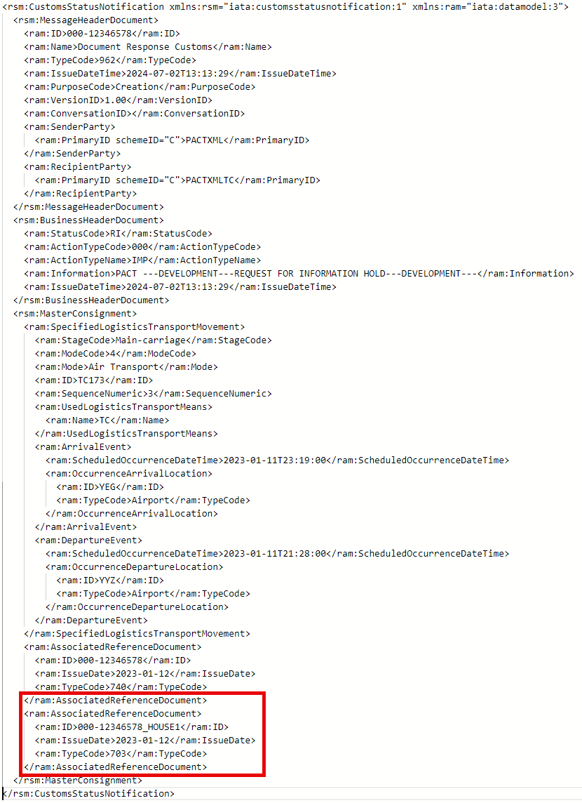
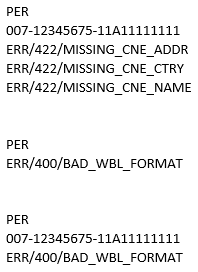
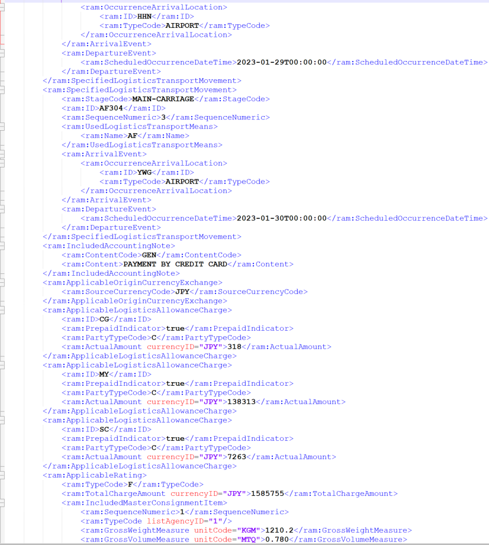
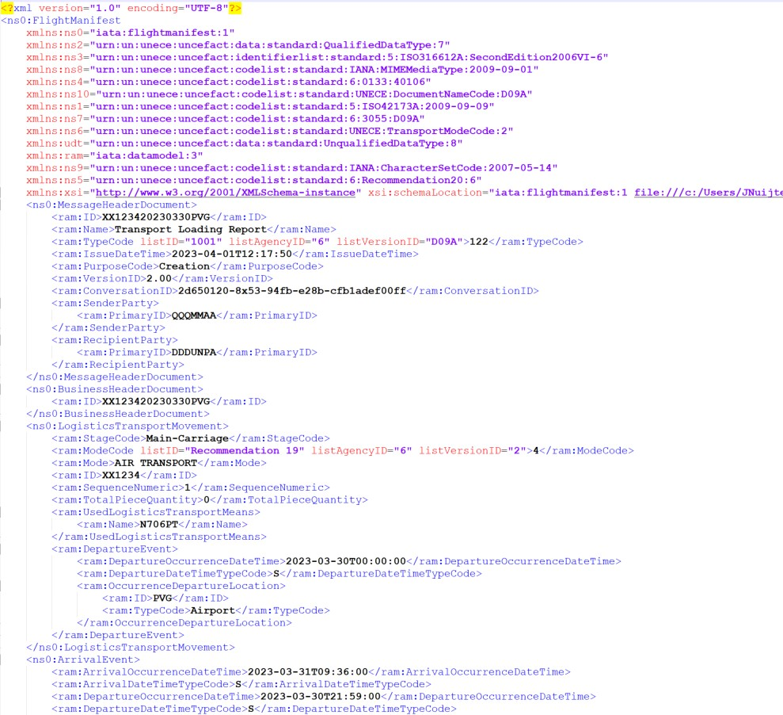
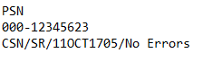
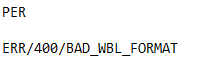

Pre-Load Air Cargo Targeting (PACT)

TECHNICAL Implementation Guide

**Contents**

[1 Overview [10](#overview)](#overview)

[1.1 Background [10](#background)](#background)

[1.2 Scope [10](#scope)](#scope)

[1.3 Target Audience [10](#target-audience)](#target-audience)

[1.4 Required and Eligible Participants [11](#required-and-eligible-participants)](#required-and-eligible-participants)

[1.4.1 Required Participants (Air Carriers) [11](#required-participants-air-carriers)](#required-participants-air-carriers)

[1.4.2 Eligible Participants (Other Data Submitters) [11](#eligible-participants-other-data-submitters)](#eligible-participants-other-data-submitters)

[1.5 Mandatory Points of Contact [11](#mandatory-points-of-contact)](#mandatory-points-of-contact)

[1.6 Effective Date [12](#effective-date)](#effective-date)

[2 Connecting to the PACT System [13](#connecting-to-the-pact-system)](#connecting-to-the-pact-system)

[2.1 PACT Targeting Process Flow [13](#pact-targeting-process-flow)](#pact-targeting-process-flow)

[2.2 PACT Onboarding [13](#pact-onboarding)](#pact-onboarding)

[2.2.1 Registration [13](#registration)](#registration)

[2.2.2 Initial Setup and Connection [14](#initial-setup-and-connection)](#initial-setup-and-connection)

[2.2.3 Two-Way Messaging [14](#two-way-messaging)](#two-way-messaging)

[2.2.4 Webhook Setup [14](#webhook-setup)](#webhook-setup)

[2.2.5 Submission Requirements and Responses [15](#submission-requirements-and-responses)](#submission-requirements-and-responses)

[2.2.5.1 PACT Data Elements [16](#pact-data-elements)](#pact-data-elements)

[2.2.5.1.1 Flight Manifest (FFM) [17](#flight-manifest-ffm)](#flight-manifest-ffm)

[2.2.5.1.2 Business and Implementation Rules [17](#business-and-implementation-rules)](#business-and-implementation-rules)

[2.2.5.2 Header Data Required for Transmission [18](#header-data-required-for-transmission)](#header-data-required-for-transmission)

[2.2.5.3 Responsible Party [19](#responsible-party)](#responsible-party)

[2.2.5.4 Response Types [20](#response-types)](#response-types)

[2.2.5.5 Submission Updates, Duplicates, and Cancellations [21](#submission-updates-duplicates-and-cancellations)](#submission-updates-duplicates-and-cancellations)

[2.3 PACT Test and Production Environments [21](#pact-test-and-production-environments)](#pact-test-and-production-environments)

[2.3.1 PACT Testing Environment [21](#pact-testing-environment)](#pact-testing-environment)

[2.3.1.1 Testing Data Submission [21](#testing-data-submission)](#testing-data-submission)

[2.3.1.2 Testing Risk Mitigation (RFI, RFS and DNL) Procedures Automatically for Two-way Implementations [22](#testing-risk-mitigation-rfi-rfs-and-dnl-procedures-automatically-for-two-way-implementations)](#testing-risk-mitigation-rfi-rfs-and-dnl-procedures-automatically-for-two-way-implementations)

[Test Codes in FWB Messages [25](#test-codes-in-fwb-messages)](#test-codes-in-fwb-messages)

[Test Codes in XFWB Messages [25](#test-codes-in-xfwb-messages)](#test-codes-in-xfwb-messages)

[2.3.1.3 Live Testing of Risk Mitigation (RFI, RFS and DNL) Procedures [26](#live-testing-of-risk-mitigation-rfi-rfs-and-dnl-procedures)](#live-testing-of-risk-mitigation-rfi-rfs-and-dnl-procedures)

[2.3.2 PACT Production Environment [27](#pact-production-environment)](#pact-production-environment)

[2.3.2.1 PACT Support During Outages [27](#pact-support-during-outages)](#pact-support-during-outages)

[2.3.2.2 Risk Mitigation (RFI, RFS and DNL) Procedures [29](#risk-mitigation-rfi-rfs-and-dnl-procedures)](#risk-mitigation-rfi-rfs-and-dnl-procedures)

[3 PACT Message Specifications [30](#pact-message-specifications)](#pact-message-specifications)

[3.1 Message Formats [30](#message-formats)](#message-formats)

[3.2 Supported Versions for PACT Messages [31](#supported-versions-for-pact-messages)](#supported-versions-for-pact-messages)

[3.2.1 Supported Cargo-XML Versions [31](#supported-cargo-xml-versions)](#supported-cargo-xml-versions)

[3.2.2 Supported C-IMP Versions [31](#supported-c-imp-versions)](#supported-c-imp-versions)

[3.2.3 Supported CAMIR Versions [32](#supported-camir-versions)](#supported-camir-versions)

[3.3 Cargo-XML Message Responses [32](#cargo-xml-message-responses)](#cargo-xml-message-responses)

[3.3.1 XFNM Message Responses [32](#xfnm-message-responses)](#xfnm-message-responses)

[XFNM Example—Response Message (Error) [35](#xfnm-exampleresponse-message-error)](#xfnm-exampleresponse-message-error)

[XFNM Example—Response Message (Acknowledgement) [36](#xfnm-exampleresponse-message-acknowledgement)](#xfnm-exampleresponse-message-acknowledgement)

[3.3.2 XCSN Status Notification Messages [38](#xcsn-status-notification-messages)](#xcsn-status-notification-messages)

[XCSN Example—CSN Response (Assessment Complete) [39](#xcsn-examplecsn-response-assessment-complete)](#xcsn-examplecsn-response-assessment-complete)

[XCSN Example—CSN Response (RFI) [41](#_Toc194063876)](#_Toc194063876)

[XCSN Example – CSN Response (RFI from House Waybill) [43](#xcsn-example-csn-response-rfi-from-house-waybill)](#xcsn-example-csn-response-rfi-from-house-waybill)

[3.4 CAMIR Message Responses [44](#camir-message-responses)](#camir-message-responses)

[3.4.1 Preliminary Error Report (PER) Messages [44](#preliminary-error-report-per-messages)](#preliminary-error-report-per-messages)

[PER Example—Response Message (Error) [46](#per-exampleresponse-message-error)](#per-exampleresponse-message-error)

[3.4.2 Preliminary Status Notification (PSN) Messages [47](#preliminary-status-notification-psn-messages)](#preliminary-status-notification-psn-messages)

[3.4.3 HTTP Response Codes [48](#http-response-codes)](#http-response-codes)

[3.5 PACT Message Examples [49](#pact-message-examples)](#pact-message-examples)

[3.5.1 Cargo-XML Message Submission Examples [49](#cargo-xml-message-submission-examples)](#cargo-xml-message-submission-examples)

[Master Air Waybill Submission Example [50](#master-air-waybill-submission-example)](#master-air-waybill-submission-example)

[Response (Acknowledgement-No Errors) [53](#response-acknowledgement-no-errors)](#response-acknowledgement-no-errors)

[Flight Manifest (FFM) Example [54](#flight-manifest-ffm-example)](#flight-manifest-ffm-example)

[3.5.2 C-IMP Message Submission Examples [55](#c-imp-message-submission-examples)](#c-imp-message-submission-examples)

[Master Waybill Submission Example [55](#master-waybill-submission-example)](#master-waybill-submission-example)

[Acknowledgement Response Example [56](#acknowledgement-response-example)](#acknowledgement-response-example)

[House Waybill Submission with Errors Example [56](#house-waybill-submission-with-errors-example)](#house-waybill-submission-with-errors-example)

[Error Response Example [57](#error-response-example)](#error-response-example)

[Flight Manifest (FFM) Example [57](#flight-manifest-ffm-example-1)](#flight-manifest-ffm-example-1)

[4 PACT Targeting Process Flow [58](#pact-targeting-process-flow-1)](#pact-targeting-process-flow-1)

[5 Glossary [59](#glossary)](#glossary)

[6 Unacceptable Characters and Descriptions [60](#unacceptable-characters-and-descriptions)](#unacceptable-characters-and-descriptions)

[6.1 Unacceptable Characters in Shipper/Consignee Name, Address or Commodity Description Fields [60](#unacceptable-characters-in-shipperconsignee-name-address-or-commodity-description-fields)](#unacceptable-characters-in-shipperconsignee-name-address-or-commodity-description-fields)

[6.2 Unacceptable Commodity Descriptions [60](#unacceptable-commodity-descriptions)](#unacceptable-commodity-descriptions)

[6.3 Insufficient/Poor Data Quality (Identified During Assessment) [62](#insufficientpoor-data-quality-identified-during-assessment)](#insufficientpoor-data-quality-identified-during-assessment)

[7 Email Templates [63](#email-templates)](#email-templates)

[7.1 Request for Information (Open and Closed) [63](#request-for-information-open-and-closed)](#request-for-information-open-and-closed)

[7.2 Request for Screening (Open and Closed) [64](#request-for-screening-open-and-closed)](#request-for-screening-open-and-closed)

[7.3 Do No Load (Open and Closed) [65](#do-no-load-open-and-closed)](#do-no-load-open-and-closed)

[7.4 Insufficient/Poor Data Quality [66](#insufficientpoor-data-quality)](#insufficientpoor-data-quality)

[7.5 System Outages [66](#system-outages)](#system-outages)

Change History

<table>
<colgroup>
<col style="width: 21%" />
<col style="width: 13%" />
<col style="width: 24%" />
<col style="width: 40%" />
</colgroup>
<thead>
<tr>
<th>Date</th>
<th>Version</th>
<th>Section(s)</th>
<th>Description/Reason</th>
</tr>
</thead>
<tbody>
<tr>
<td>Jan 26, 2024</td>
<td>1</td>
<td></td>
<td>Initial release</td>
</tr>
<tr>
<td rowspan="5">April 10, 2024</td>
<td rowspan="5">1.1</td>
<td>2.2.5.1 PACT Data Elements</td>
<td>Note on departure time</td>
</tr>
<tr>
<td>2.3.1 PACT Testing Environment</td>
<td>Clarifications on testing</td>
</tr>
<tr>
<td>3.3.1 XFNM Message Responses</td>
<td>Update to INVALID_HOUSE_BILL_NBR definition.</td>
</tr>
<tr>
<td>3.4.1 Preliminary Error Report (PER) Messages</td>
<td>Update to INVALID_HOUSE_BILL_NBR definition and CAMIR PER error messages</td>
</tr>
<tr>
<td>*New section* 6 Commodity Description</td>
<td>Examples of acceptable and unacceptable commodity descriptions to avoid insufficient data errors</td>
</tr>
<tr>
<td>May 6, 2024</td>
<td>1.2</td>
<td>2.3.1.1 Testing Data Submission</td>
<td>Updated section to provide parameters on testing submitted data</td>
</tr>
<tr>
<td rowspan="11">June 27, 2024</td>
<td rowspan="11">1.3</td>
<td>2.2.5.1 PACT Data Elements</td>
<td>Note: freight forwarders must update the house waybill with the master reference once known</td>
</tr>
<tr>
<td>*New section* 2.2.5.1.1 Business and Implementation Rules</td>
<td>Outlines business and implementation rules for the PACT data elements</td>
</tr>
<tr>
<td>2.2.5.3 Responsible Party</td>
<td>Change to Responsible Party header where not applicable</td>
</tr>
<tr>
<td>*New section* 2.3.1.2 Testing Risk Mitigation (RFI, RFS and DNL) Procedures Automatically for Two-way Implementations</td>
<td>Instructions for testing risk mitigation messages automatically (for two-way messaging)</td>
</tr>
<tr>
<td>3.3.1 XFNM Message Responses</td>
<td>New error message codes for invalid routing, invalid timing, and missing consolidation indicator</td>
</tr>
<tr>
<td>3.3.2 XCSN Status Notification Messages</td>
<td>New XCSN Example for a PACT Assessment Complete message</td>
</tr>
<tr>
<td>3.3.2 XCSN Status Notification Messages</td>
<td>New XCSN Example for an RFI received from a house waybill</td>
</tr>
<tr>
<td>3.4.1 Preliminary Error Report (PER) Messages</td>
<td>New error message codes for invalid routing, invalid timing, and missing consolidation indicator</td>
</tr>
<tr>
<td>6 Unacceptable Characters and Descriptions</td>
<td>Addition of manually generated error messages</td>
</tr>
<tr>
<td>*New section* 6.3 Insufficient/Poor Data Quality</td>
<td>Manually generated error responses</td>
</tr>
<tr>
<td>
*New section*

7 Email Templates
</td>
<td>Email templates for RFI/RFS/DNL and Insufficient/Poor Data Quality</td>
</tr>
<tr>
<td rowspan="9">October 17, 2024</td>
<td rowspan="9">1.4</td>
<td>2.2.5.1.1 Business and Implementation Rules</td>
<td>
Definitions for mail and diplomatic bags

Specified address fields and MAWB number format

Non-mandatory data fields accepted
</td>
</tr>
<tr>
<td>2.2.5.4 FFM Response Types</td>
<td>Clarified that FFM messages will receive Response Messages</td>
</tr>
<tr>
<td>*new section* 2.2.5.5 Submission Updates, Duplicates, Cancellations</td>
<td>Explanation of PACT system operations when updated or duplicate messages are sent</td>
</tr>
<tr>
<td>2.3.2.1 PACT Support During Outages</td>
<td>Renamed section and added guidance on continuity of operations in case of system outage</td>
</tr>
<tr>
<td>3.3.1 XFNM Message Responses</td>
<td>
Added FFM reference in examples under BAD_WBL_FORMAT

Added “Figure 5” Response Message to FFM (Acknowledgement)
</td>
</tr>
<tr>
<td>3.4.1 Preliminary Error Report (PER) Messages</td>
<td>Added FFM reference in PER examples under BAD_WBL_FORMAT</td>
</tr>
<tr>
<td>3.4.2 Preliminary Status Notification (PSN) Messages</td>
<td>Added FFM reference in PSN examples under SR</td>
</tr>
<tr>
<td>3.5.2 C-IMP Message Submission Example</td>
<td>Added “Figure 15” Response Message to FFM (Acknowledgement)</td>
</tr>
<tr>
<td>7. Email Templates</td>
<td>Added email example for unplanned PACT system outage (*Section 7.5*)</td>
</tr>
<tr>
<td rowspan="7">February 14, 2025</td>
<td rowspan="7">1.5</td>
<td>1.6 Effective Date</td>
<td>Changed from “upon publication” to April 1, 2025</td>
</tr>
<tr>
<td>2.2.5.1.1 Flight Manifest (FFM)</td>
<td>Added section heading</td>
</tr>
<tr>
<td>2.2.5.2 Header Data Required for Transmission</td>
<td>
Changed instructions for responsible party to “only as directed by a member of the PACT team”

Added instructions for air carriers without an IATA code.
</td>
</tr>
<tr>
<td>2.2.5.3 Responsible Party</td>
<td>Changed instructions for responsible party to “only as directed by a member of the PACT team”</td>
</tr>
<tr>
<td>2.3 PACT Test and Production Environments</td>
<td>Added expectation to be in production before April 1, 2025</td>
</tr>
<tr>
<td>2.3.2 PACT Production Environment</td>
<td>Added expectation to be in production before April 1, 2025</td>
</tr>
<tr>
<td>
3.3.1-3.3.2

3.4.1

3.5.1-3.5.2
</td>
<td>Added sub headers for each example</td>
</tr>
<tr>
<td rowspan="8">March 12, 2025</td>
<td rowspan="8">1.6</td>
<td>2.2.5 Submission Requirements and Responses</td>
<td>Clarified “assessment complete” notification is not mandated by regulation</td>
</tr>
<tr>
<td>2.2.5.4 Response Types</td>
<td>Clarified “assessment complete” notification is not required prior to transport</td>
</tr>
<tr>
<td>2.3.2.1 PACT Support During Outages</td>
<td>Revised PACT outage notification time and procedures</td>
</tr>
<tr>
<td>3.3.1 XFNM Message Responses</td>
<td>Added insufficient/poor data quality reference under error message definitions</td>
</tr>
<tr>
<td>3.3.2 XCSN Status Notification Messages</td>
<td>Updated CSN Response (RFI) example (figure)</td>
</tr>
<tr>
<td>3.4.1 Preliminary Error Report (PER) Messages</td>
<td>Added insufficient/poor data quality reference under error message definitions</td>
</tr>
<tr>
<td>6.3 Insufficient/Poor Data Quality</td>
<td>Clarified System-generated vs. Email-generated errors</td>
</tr>
<tr>
<td>7.5 System Outages</td>
<td>
Renamed heading;

Updated and added PACT email notice examples (figures)
</td>
</tr>
<tr>
<td rowspan="3">April 1, 2025</td>
<td rowspan="3">1.7</td>
<td>2.3.2.1 PACT Support During Outages</td>
<td>
Removed paragraph applicable only prior to Coming Into Force date;

Added phone number to contact (only for issues after-hours with imminent departure)
</td>
</tr>
<tr>
<td>7 Email templates</td>
<td>
Added email accounts in CC and request to Reply All;

Updated text in Planned PACT system outage template
</td>
</tr>
<tr>
<td>7.5 System Outages</td>
<td>Added email template for “assessment complete” interruption</td>
</tr>
<tr>
<td rowspan="4">June 27, 2025</td>
<td rowspan="4">1.8</td>
<td>2.2.5.1 PACT Data Elements</td>
<td>Clarified use of PACT system acknowledgement messages on updates after flight departure (out of scope)</td>
</tr>
<tr>
<td>2.2.5.5 Submission Updates, Duplicates, and Cancellations</td>
<td>Clarified updates considered up to the flight’s departure</td>
</tr>
<tr>
<td>3.3.1 XFNM Message Responses</td>
<td>Removed “invalid timing” error message</td>
</tr>
<tr>
<td>3.4.1 PER Messages</td>
<td>Removed “invalid timing” error message</td>
</tr>
</tbody>
</table>

# Overview

The Pre-load Air Cargo Targeting (PACT) Program aims to identify and apply mitigation measures to inbound high-risk air cargo shipments that could contain concealed improvised explosive devices prior to loading and departure to Canada. This is achieved through the risk assessment of advanced cargo information with the assistance of emerging technologies.

Starting in Fall 2024, air carriers transporting cargo to Canada from international destinations will be required to submit data to PACT and, in some cases, apply risk mitigation measures to specific shipments as per the *Canadian Aviation Security Regulations, 2012*.

## Background 

Transport Canada has been collaborating with aviation industry professionals to create a solution that integrates easily with existing business processes. These volunteers have worked extensively with Transport Canada to make submitting data to PACT as seamless as possible.

For more information on PACT, see <https://tc.canada.ca/en/programs/pre-load-air-cargo-targeting-pact>.

## Scope

The *Canadian Aviation Security Regulations, 2012* apply to air carriers who transport cargo on a flight departing from a place outside Canada to an aerodrome located in Canada. This includes cargo on passenger, charter, courier/express, and cargo-only flights, as well as flights that transit or transfer in Canada (including Freight Remaining on Board (FROB)).

The regulations, and therefore the PACT Program, do **<u>NOT</u>** apply to the following:

Mail

- Diplomatic or consular bags

- Passengers’ checked baggage

- Passengers’ carry-on baggage

  Air cargo transported on an outbound flight, departing Canada

- Air cargo on domestic flights within Canada

  Cargo that arrives in Canada via another mode of transportation, such as by road, sea, or rail (including where the last leg of a flight is transported via truck to Canada).

## Target Audience

This guide is intended for the implementation team or technician who is configuring an air carrier’s data connection to the PACT system. This guide also includes data submitter and submission requirements, estimated regulatory effective dates, and two-way messaging setup.

## Required and Eligible Participants 

### Required Participants (Air Carriers)

Air carriers who transport cargo on a flight from a place outside Canada to an aerodrome located in Canada are required to submit the mandatory cargo information to PACT. See [1.2 Scope](#scope).

### Eligible Participants (Other Data Submitters)

Companies that are engaged by air carriers for IT services may participate in the PACT Program by submitting and receiving cargo data on the air carrier’s behalf. This includes third-party service providers, such as data aggregators and general sales/handling agents (GSAs/GHAs).

Freight forwarders or air carriers who create waybills or operate flights that precede the last point of departure for Canada (e.g., codeshare arrangements) may also participate in PACT voluntarily **<u>at the request of an air carrier</u>**.

Air carriers must identify their service providers upon registration to authorize the partner’s connection to the PACT system.

**Note**: While air carriers may delegate the exchange of information to a service provider, the air carriers are ultimately liable for compliance with the *Canadian Aviation Security Regulations, 2012*.

## Mandatory Points of Contact

Transport Canada requires the following points of contact to register an air carrier with PACT and begin the onboarding process. See section [2.2.1 Registration](#registration) for more details.

1.  **Primary Cargo Security Contact**: A representative of the company who is responsible for compliance with Transport Canada rules and regulations.

    Name:

    Title:

    Phone \#:

    Email:

2.  **24/7 Contact**: A contact who is available 24/7 that can respond urgently to Requests for Information (RFI), Requests for Screening (RFS) and Do Not Load (DNL) notices. This contact must have access to additional shipment information and be able to initiate screening procedures in response to a potential threat to air cargo. This contact can be a shared inbox so long as it is monitored 24/7. 

    Name:

    Title:

    Phone \#:

    Email:

3.  **Technical Contact**: A contact that can initiate system connectivity between the air carrier and Transport Canada and provide technical support for the data exchange, including responding to system outages.

    Name:

    Company (if different than the air carrier):

    Title:

    Phone \#:

    Email:

## Effective Date 

The amendments to the *Canadian Aviation Security Regulations, 2012 (Air Cargo)* will come into force on April 1, 2025. Air carriers will be expected to submit the required data elements to the PACT system and be ready to respond to Transport Canada requests (RFIs, RFSs, DNLs) or they can be subject to administrative monetary penalties (AMPs).

Beginning in Fall 2023, Transport Canada started onboarding select air carriers and aims to increase the volume gradually leading up to the effective date of the regulations. The objective is to ensure any technical and operational modifications can be tested and implemented well in advance of the effective date.

# Connecting to the PACT System 

The PACT system uses a web Application Programming Interface (API) to send and receive messages from participants in either Cargo-XML or C-IMP/CAMIR formats. More information can be found in section [3.1 Message Formats](#message-formats) and [section 3.2 Supported Versions for PACT Messages](#supported-versions-for-pact-messages).

This section provides an overview of the technical onboarding process and provides the details necessary to set up, connect, and test data submissions to PACT.

## PACT Targeting Process Flow

The <u>PACT Targeting Process Flow</u> illustrates the expected information flow of the production system.

Participants should familiarize themselves with what notifications they can expect via the PACT system versus email. In the case where a risk mitigation action is required, the PACT system is capable of two-way messaging to ensure RFIs, RFSs and DNLs are communicated in near-real time. See section [2.2.3 Two-Way Messaging](#two-way-messaging) for more details.

## PACT Onboarding

Before submitting data to PACT, air carriers must contact Transport Canada for a one-time registration and setup, which includes identifying contacts and providing authorizations for any third-party that will be submitting data to PACT on behalf of or in addition to the air carrier, if applicable.

After the registration is complete, the PACT team will contact the air carrier or their participant with the following connection information:

A token for authentication

- The endpoint URL for the PACT test environment

  Connection instructions, including the required header information

### Registration

To begin the registration process, contact Transport Canada at <pact-information-cfapc@tc.gc.ca> and identify the contacts listed in section [1.2.2.3 Mandatory Points of Contacts](#mandatory-points-of-contact). A PACT representative will reply within 2 business days to obtain additional information and complete the registration.

**Note**: It is recommended that air carriers complete this process as soon as possible so they have enough time to successfully test their data submissions before mandatory compliance is required in April 2025.

### Initial Setup and Connection

Once registered, a PACT representative will email the Technical Contact to provide them with the necessary connection information. This includes a token for authentication, the endpoint URL, and information on how to set up connections to receive messages from the PACT web API.

After successfully connecting to the PACT system, a standard synchronous message is sent immediately from the PACT system indicating that the data submission has been received, but not yet risk assessed. These messages indicate any parsing or format errors and may also indicate if a mandatory data element was detected to be missing. See sections [3.3.1 XFNM Message Responses](#xfnm-message-responses) and 3.4.1 [Preliminary Error Report (PER) Messages](#preliminary-error-report-per-messages) for a list of errors in C-XML and CAMIR, and section [6 Unacceptable Characters and Commodity Descriptions](#unacceptable-characters-and-descriptions).

These synchronous acknowledgement and error messages are distinct from the asynchronous two-way messages that can be enabled for “assessment complete” notifications and risk mitigation actions. See section <u>2.2.3 Two-Way Messaging</u>.

### Two-Way Messaging

Two-way messaging is available through the web API so that participants receive “assessment complete” and risk mitigation status updates asynchronously through their software solution. If a mitigation action is required, the status update is followed by an email.

**Note:** If participants are unable to establish two-way messaging, synchronous acknowledgement messages will still be returned as a response to the API calls. All mitigation responses after the initial acknowledgement would then be sent to contacts via email only. See section [7 Email Templates](#email-templates).

To connect to a participant’s API, Transport Canada requires the following information:

API connection details (PACT can connect to multiple endpoints).

Preferred message format (Cargo-XML or C-IMP) and version (See section [3.2 Supported Versions for PACT Messages](#supported-versions-for-pact-messages)).

**Note**: Different formats can be selected for submission and receipt.

Any additional requirements for connection, if required.

After confirming connection information, the PACT team will send implementation teams the required information for receiving messages from PACT asynchronously. Asynchronous messaging requires that webhooks are set up to be received from the PACT server.

### Webhook Setup

Two-way messaging requires integrated software solutions to be set up to receive a webhook connection from the PACT server using the following elements:

<table>
<caption>
Table 1: Required Elements for Webhook Setup
</caption>
<colgroup>
<col style="width: 24%" />
<col style="width: 35%" />
<col style="width: 39%" />
</colgroup>
<thead>
<tr>
<th>Element</th>
<th>Definition</th>
<th>Example</th>
</tr>
</thead>
<tbody>
<tr>
<td>URL</td>
<td>The air carrier’s endpoint, to which PACT will send messages.</td>
<td><a href="https://myaircarrier.com/api/myendpoint">https://myaircarrier.com/api/myendpoint</a></td>
</tr>
<tr>
<td>Secret</td>
<td>A string set by the air carrier that will be attached to each response message in the header “X-PACT-SECRET” as a way for the air carrier to validate the message came from the PACT system.</td>
<td>E6HuaaHIB6knkFyaTuUc934SRz37czVJG 
DM7rBtvKN5AhfWcCP9LRVF0LWx9c17L 
vWADfhXXbFa2iwSSKP8cuDyOnX9NDG6 
4l5icklhXgw3fzQ6IT0suzZSZFrzPfrzfTcSbj 
h3gwlP7FEFF4uJdMrkjLxFDejKUV9kjYNR 
0DOQjWujD7I0K9AW1n 
R314SuCeEoOyIfV..........</td>
</tr>
<tr>
<td>ResponseType</td>
<td>HTTP verb that denotes the action for transmitted data such as creating or updating.</td>
<td>POST, PUT</td>
</tr>
<tr>
<td>Headers</td>
<td>A list of key value pairs added to requests/responses that provide additional information.</td>
<td>
“X-MYAIRLINE-REQUIRED-HEADER”: “Custom provided header”

For text-based messages (FWB, FHL): “Content-Type”: “text/plain”

For xml-based messages (XFMB, XFZB): “Content-Type”: “application/xml”
</td>
</tr>
</tbody>
</table>

Table 1: Required Elements for Webhook Setup

### Submission Requirements and Responses

Participants should submit the required data to PACT as early as possible before loading to allow for the risk assessment process to be completed. Refer to <u>PACT Targeting Process Flow</u>.

Participants will receive a series of messages from the PACT system that will communicate the status of each dataset’s assessment, including error identification, confirmation of receipts, “assessment complete” notifications, requests for risk mitigation actions and action resolution notifications. All system notifications are transmitted in near-real time when two-way messaging is enabled.

> **Note:** The “assessment complete” notification is not mandatory: air carriers are not required to wait for the assessment complete status before loading or transporting air cargo to Canada.

#### PACT Data Elements

PACT requires 7 data elements and an air waybill number (+1) in order to complete its risk assessment of all inbound air cargo. These “7+1” data elements are internationally recognized as Pre-Loading Advance Cargo Information (PLACI), and they have been found useful for risk assessment because they can be obtained early in the cargo shipment lifecycle and taken together, can reveal trends that establish thresholds for low-risk cargo.

Air carriers are required to submit the following mandatory data (7+1) to PACT for risk assessment as early as possible before loading and must provide any updates up to the departure of the flight (marked by the flight departure information). Any data received after departure will receive an acknowledgement message but will not be assessed (i.e. will not receive an “assessment complete”).

- Air waybill number (includes house bill number if applicable)

- Original shipper name

- Original shipper address

- Consignee name

- Consignee address

- Cargo description (a description of each piece of cargo)

- Total number of pieces (piece count)

- Total weight of the cargo

The PACT system can also accept additional data elements if the mandatory elements are present.

**Note:** Consolidation messages do not typically satisfy these requirements as they may lack the original shipper names and addresses and a piece-level description of the cargo. While the system will accept “consol” or “consolidation” for the cargo description, this would not be considered compliant with the regulations, in which case all associated house waybills would be required.

**Note**: A data submitter may submit a house waybill before the master air waybill number (MAWB) is known and leave the MAWB number blank (e.g., in the case where a freight forwarder is submitting house-level data for the air carrier). Once the master air waybill number is known, the house waybill must be resubmitted by the freight forwarder with the master air waybill number included before departure. Air carriers remain liable for compliance with the regulatory requirements with respect to all data submissions (including those submitted at the house level by other data submitters).

##### Flight Manifest (FFM)

In addition to the 7+1 pre-load data elements, PACT also requires the following flight information as soon as feasible after the flight’s departure from its LPD before arrival in Canada:

- The date of the flight;

- The flight number;

- The destination aerodrome;

- The departure time; and

- A list of the air waybill numbers for the flight.

**Note**: The FFM message satisfies these requirements. PACT will accept the submission time of the FFM message as equivalent to the departure time.

##### Business and Implementation Rules

The following rules specify data formats and provide general guidance when submitting the required data elements to PACT using either Cargo-XML or C-IMP:

- Time is assumed to be in Coordinated Universal Time (UTC);

- Address: For the shipper and consignee addresses, the PACT system requires, **at a minimum**, data for the \<Address Line 1\> and \<Country\> fields. If the postal/zip code is unavailable, the node must be included but left blank (i.e., \<PostcodeCode\>\</PostcodeCode\>);

- Master air waybill numbers should be a maximum of 13 characters and should align with the format defined in IATA Resolution 600a and Recommended Practice 1675:

  - serial number which contains a 3-digit IATA-issued airline code number, followed by a hyphen, followed by an 8-digit serial number including the check digit placed at the extreme right position;

<!-- -->

- Consolidated shipments are recognized by the following indicators in the master air waybill:

- For Cargo-XML XFWB messages, use document code 741 for consolidations and 740 for direct shipments;

  - For C-IMP FWB messages, use NC for the goods description field for consolidations and NG for direct shipments;

- The Harmonized System (HS) Code is **not** required for the commodity description. Data submitters are not required to remove HS codes from the air waybill prior to its submission;

- The piece count is the total number of pieces of cargo in a shipment. A single piece of cargo is the smallest external packing unit in that shipment. Individual items packaged in such a way that they cannot be divided without first undoing the packing represent one piece;

- Weight is measured in kilograms;

- With the exception of mail and diplomatic bags, data that is submitted in fields other than those mandated by PACT does not need to be removed during submission. For example, data fields such as Sender or Recipient Qualifier are not required by PACT but will not result in an error message from the PACT system;

- Mail (**not** in scope for PACT) is any indivisible mailable matter (message, information, funds or goods), transmitted by designated postal operators, from the time it is posted to the time it is delivered;

  Diplomatic bag (**not** in scope for PACT): in keeping with the international standard set out in Article 27 of the Vienna Convention on Diplomatic Relations, packages constituting a diplomatic bag must bear visible external marks of their character and may contain only diplomatic documents or articles intended for official use.

#### Header Data Required for Transmission

The header data required for each transmitted message must include: the token and the air carrier’s IATA airline code. The responsible party identifier (maximum 50 characters) should only be applied as directed by a member of the PACT team.

An example of a valid header is:

Ocp-Apim-Subscription-Key: abcd

Iata-Airline-Code: 014

Responsible-Party: PACTPW8 (if applicable)

- Accept: text/plain

- Content-Type: text/plain

- Content-Length: 767

- User-Agent: PACTAI/1.0

The following table provides required and optional header data for PACT requests, and instructions for how to complete each field.

<table>
<caption>
Table 2: Header Data for PACT Requests
</caption>
<colgroup>
<col style="width: 30%" />
<col style="width: 69%" />
</colgroup>
<thead>
<tr>
<th>Header Data</th>
<th>Description</th>
</tr>
</thead>
<tbody>
<tr>
<td><strong>Ocp-Apim-Subscription-Key</strong></td>
<td>Contains the token given to you by a PACT representative at registration.</td>
</tr>
<tr>
<td><strong>Iata-Airline-Code</strong></td>
<td>
The three-digit IATA code for the air carrier that is submitting the data.

Reference: <a href="https://www.iata.org/en/about/members/airline-list/">https://www.iata.org/en/about/members/airline-list/</a> or

<a href="https://www.iata.org/en/publications/store/airline-coding-directory/">https://www.iata.org/en/publications/store/airline-coding-directory/</a>

<strong>Note</strong>: if you do not have a three-digit IATA code, please email the PACT inbox (<a href="mailto:PACT-Information-CFAPC@tc.gc.ca">PACT-Information-CFAPC@tc.gc.ca</a>) to determine acceptable alternatives.
</td>
</tr>
<tr>
<td><strong>Responsible-Party</strong> 
&lt;<em>if applicable</em>&gt;</td>
<td>
A seven-digit code that identifies the party responsible for receiving and responding to risk mitigation notifications, depending on the data submitter.

See <a href="#responsible-party">Responsible Party</a> for more details.
</td>
</tr>
<tr>
<td><strong>Accept</strong></td>
<td>
Reference: <a href="https://www.rfc-editor.org/rfc/rfc9110.html#name-accept">https://www.rfc-editor.org/rfc/rfc9110.html#name-accept</a>

application/xml for Cargo-XML or text/plain for C-IMP
</td>
</tr>
<tr>
<td><strong>Content-Type</strong></td>
<td>
Reference: <a href="https://www.rfc-editor.org/rfc/rfc9110.html#name-content-type">https://www.rfc-editor.org/rfc/rfc9110.html#name-content-type</a>

application/xml for Cargo-XML or text/plain for C-IMP
</td>
</tr>
<tr>
<td><strong>Content-Length</strong></td>
<td>Reference: <a href="https://www.rfc-editor.org/rfc/rfc9110.html#name-content-length">https://www.rfc-editor.org/rfc/rfc9110.html#name-content-length 
</a>Size of request</td>
</tr>
<tr>
<td><strong>User-Agent</strong></td>
<td>
Reference: <a href="https://www.rfc-editor.org/rfc/rfc9110.html#name-user-agent">https://www.rfc-editor.org/rfc/rfc9110.html#name-user-agent</a>

Contains a reference to the product/comment describing what application the request is being sent from
</td>
</tr>
</tbody>
</table>

Table 2: Header Data for PACT Requests

#### Responsible Party

The Responsible Party header value is a 7-digit code that is used to identify a third party that is responsible for responding to all risk mitigation notifications initiated by PACT and that is not the air carrier or the data submitter. The responsible party identifier should only be applied as directed by the PACT team.

The Responsible Party code should be 7 digits and include the following data:

- The first four letters are always PACT

- A single letter to denote the PACT environment:

  A “**P”** to indicate the production environment

  An “**A**” for the testing environment

  The IATA two-character air carrier designator (or agreed upon two-character code to designate organizations outside of IATA, such as GSAs)

For example: **PACTPW8**

**Note**: A PACT representative will specify which environment the token is intended for when it is provided, so the technician can enter the correct letter (P or A).

#### Response Types

Using the <u>PACT Targeting Process Flow</u> as reference, this section details the various response codes the PACT system will transmit.

Once a message is received by the PACT system, an initial data validation is performed to identify errors in the “7+1” data elements, if applicable. Errors could reflect a poorly formatted https request, authentication errors, server problems or improperly formatted submission data. Error codes can be found in the <u>XFNM Message Responses</u>, <u>Preliminary Error Report (PER) Messages</u>, and <u>HTTP Response Codes</u> sections.

When a message is received without errors, a “received” notification is sent as a reply to indicate that the “7+1” data elements were successfully received by Transport Canada.

After submitting the mandatory data for evaluation, PACT conducts a risk assessment for each air waybill. If the air waybill data does not contain any risk indicators, PACT transmits a code which communicates the status of “assessment complete” to the participant. This code is not required prior to loading or transporting cargo to Canada but serves as an indicator that it is highly unlikely that an RFI, RFS or DNL will be issued for that shipment.

If a PACT targeter is unable to complete their risk assessment due to insufficient or poor data quality within the required PACT data elements, an error is manually generated. See section [6.3 Insufficient/Poor Data Quality](#_Insufficient/Poor_Data_Quality).

In the case where the shipment data contains risk indicators, PACT could transmit codes to reflect an RFI, RFS or DNL. Implementation teams must ensure test scenarios include measures to handle codes in the chosen format type:

For C-XML, that includes RI, RS and CD codes. See <u>XCSN Status Notification Messages</u>.

For CAMIR/C-IMP, that includes 7H, 7I, 7J, 8H, 8I, 8J, 6H, 6J, and 6I codes. See <u>Preliminary Status Notification (PSN) Messages</u>.

**Note**: All messages from PACT include a Conversation Identifier (CXML body) and/or Correlation Identifier (CXML/CIMP http headers) for reference.

**Note**: FFM acknowledgement or error response messages will follow the same format as those for air waybill submissions. Examples can be found in the <u>XFNM Message Responses</u> and [Preliminary Status Notification (PSN) Messages](#preliminary-status-notification-psn-messages)Preliminary Error Report (PER) Messages sections.

####  Submission Updates, Duplicates, and Cancellations

Participants must provide updates to submitted house (FHL) and/or master (FWB) waybill information, up to the departure of the flight.

When a data submitter submits an updated or duplicate FHL or FWB, the PACT system will compare that submission with the last message that was sent, as applicable, and identify it as new or updated (which includes duplicates). Participants will receive a confirmation of receipt for every update that is submitted. The latest submission will be treated as the most up-to-date source of information up to the flight’s departure. If the update does not change PACT’s risk assessment, participants will again receive the “assessment complete” message. Where a HAWB has been linked to a MAWB, any updates to the HAWB must include the associated MAWB number. FHL or FWB cancellations are not supported.

The PACT system can accept duplicate, updated and split FFMs, and will consider the timing of the first FFM as the departure time for the flight. Updates may serve to submit missing information but will not remove information that was previously submitted. FFM cancellations are not supported.

## PACT Test and Production Environments

Transport Canada offers two PACT system environments for submitting data: a test environment and a production environment.

The test environment allows participants to test their data submissions and to receive responses from PACT in a simulated space that will not affect their actual operations.

The production environment provides the greatest stability and performance and will be made available to participants once they have successfully completed testing in the test environment. Providing real data in the production environment provides PACT an opportunity to familiarize itself with the air carrier’s data and identify any compliance issues well in advance of the effective date.

All participants are expected to be fully operational in the production environment ahead of April 1, 2025.

### PACT Testing Environment

Before submitting data to the PACT production environment, participants are required to test their connectivity and message formatting in the PACT test environment. After registering, participants are given a token for authentication, the endpoint URL, and information on how to set up connections to receive messages from the PACT test environment.

When a satisfactory amount of message types, volume, and errors have been tested, participants will then be invited to submit all Canada-bound live data to the production environment.

#### Testing Data Submission

Testing in the test environment should start with 1-2 batches of 20-100 data submissions using as close to “real-world” data as possible. These batches will be used to test the PACT participant’s ability to transmit waybill data to PACT and receive synchronous acknowledgement messages or errors in response. The data submissions will be vetted by a PACT representative who will examine the data for the following elements:

Provide completed 7+1 to receive acknowledgement message:

- Air waybill number

- Name and address of each original shipper

- Name and address of each consignee

- Description of each piece of cargo

- Number of pieces

- Total weight of the cargo

Provide the following flight manifest (FFM) information (after the flight’s departure):

- Date and departure time of the flight

- Flight number

- Destination aerodrome

- List of the air waybill numbers for the flight

Provide at least one of each of the following test messages:

- Master air waybill (FWB)

- House waybill (FHL)

- Flight manifest (XFFM/FFM)

- Waybill with missing weight to test error message

  Waybill with a commodity description from <u>Unacceptable Commodity Descriptions</u> to test error message

  Flight manifest with missing flight number to test error message

The participant will be notified by PACT if there were any issues that need to be resolved or if additional test data is required.

#### Testing Risk Mitigation (RFI, RFS and DNL) Procedures Automatically for Two-way Implementations

When using a two-way implementation to PACT, data submitters can test risk mitigation responses automatically without requiring a PACT representative to schedule a testing period. This test would require data submitters to submit either one or both a MAWB and HAWB with the following test codes in the Commodity Description section to the PACT test environment.

- CLEAR SHIPMENT PLEASE

  RFI SHIPMENT PLEASE

- CLEAR SHIPMENT PLEASE

- RFS SHIPMENT PLEASE

- CLEAR SHIPMENT PLEASE

- DNL SHIPMENT PLEASE

- CLEAR SHIPMENT PLEASE

**Note**: The above test codes do not work in the PACT production environment.

It is recommended to run CLEAR SHIPMENT PLEASE after each risk mitigation test code. Although the command is the same, the response messages are different depending on the type of risk mitigation test code that is being cleared.

<table>
<colgroup>
<col style="width: 12%" />
<col style="width: 13%" />
<col style="width: 23%" />
<col style="width: 50%" />
</colgroup>
<thead>
<tr>
<th style="text-align: center;"><strong>Command</strong></th>
<th style="text-align: center;"><strong>Purpose</strong></th>
<th style="text-align: center;"><strong>C-IMP Response</strong></th>
<th style="text-align: center;"><strong>Cargo-XML Response (excerpt)</strong></th>
</tr>
</thead>
<tbody>
<tr>
<td>CLEAR SHIPMENT PLEASE</td>
<td>Test response from PACT to indicate that PACT has finished assessing the shipment</td>
<td>PSN 
000-12344321 
CSN/SF/12JUN1421/PACT ---TESTING---ASSESSMENT COMPLETE---TESTING--</td>
<td>BusinessHeaderDocument&gt; 
&lt;StatusCode&gt;CO&lt;/StatusCode&gt; 
&lt;ActionTypeCode&gt;000&lt;/ActionTypeCode 
&lt;ActionTypeName&gt;IMP&lt;/ActionTypeName&gt; 
&lt;Information&gt;PACT --TESTING---ASSESSMENT COMPLETE---TESTING---&lt;/Information&gt; 
&lt;IssueDateTime&gt;2024-0614 T20:50:11&lt;/IssueDateTime&gt; 
&lt;/BusinessHeaderDocument&gt;</td>
</tr>
<tr>
<td>RFI SHIPMENT PLEASE</td>
<td>Test RFI submission and response</td>
<td>PSN 
000-12344321 
CSN/7H/12JUN1421/PACT ---TESTING---REQUEST FOR INFORMATION HOLD---TESTING--</td>
<td>BusinessHeaderDocument&gt; 
&lt;StatusCode&gt;RI&lt;/StatusCode&gt; 
&lt;ActionTypeCode&gt;000&lt;/ActionTypeCode 
&lt;ActionTypeName&gt;IMP&lt;/ActionTypeName&gt; 
&lt;Information&gt;PACT ---TESTING--- REQUEST FOR INFORMATION HOLD ---TESTING---&lt;/Information&gt; 
&lt;IssueDateTime&gt;2024-0614 T20:50:11&lt;/IssueDateTime&gt; 
&lt;/BusinessHeaderDocument&gt;</td>
</tr>
<tr>
<td>CLEAR SHIPMENT PLEASE</td>
<td>Clear the test RFI hold status and return targeting status to normal</td>
<td>
PSN 
000-12344321 
CSN/7I/12JUN1421/PACT ---TESTING---REQUEST FOR INFORMATION HOLD REMOVED---TESTING—

PSN 
000-12344321 
CSN/SF/12JUN1421/PACT ---TESTING---ASSESSMENT COMPLETE---TESTING--
</td>
<td>BusinessHeaderDocument&gt; 
&lt;StatusCode&gt;CO&lt;/StatusCode&gt; 
&lt;ActionTypeCode&gt;000&lt;/ActionTypeCode 
&lt;ActionTypeName&gt;IMP&lt;/ActionTypeName&gt; 
&lt;Information&gt;PACT ---TESTING--- REQUEST FOR INFORMATION HOLD REMOVED---TESTING ---&lt;/Information&gt; 
&lt;IssueDateTime&gt;2024-0614 T20:50:11&lt;/IssueDateTime&gt; 
&lt;/BusinessHeaderDocument&gt;</td>
</tr>
<tr>
<td>RFS SHIPMENT PLEASE</td>
<td>Test RFS submission and response</td>
<td>PSN 
000-12344321 
CSN/8H/12JUN1421/PACT ---TESTING---REQUEST FOR SCREENING HOLD---TESTING--</td>
<td>BusinessHeaderDocument&gt; 
&lt;StatusCode&gt;RS&lt;/StatusCode&gt; 
&lt;ActionTypeCode&gt;000&lt;/ActionTypeCode 
&lt;ActionTypeName&gt;IMP&lt;/ActionTypeName&gt; 
&lt;Information&gt;PACT ---TESTING--- REQUEST FOR SCREENING HOLD ---TESTING---&lt;/Information&gt; 
&lt;IssueDateTime&gt;2024-0614 T20:50:11&lt;/IssueDateTime&gt; 
&lt;/BusinessHeaderDocument&gt;</td>
</tr>
<tr>
<td>CLEAR SHIPMENT PLEASE</td>
<td>Clear the test RFS hold status and return targeting status to normal</td>
<td>
PSN 
000-12344321 
CSN/8I/12JUN1421/PACT ---TESTING---REQUEST FOR SCREENING HOLD REMOVED---TESTING--

PSN 
000-12344321 
CSN/SF/12JUN1421/PACT ---TESTING---ASSESSMENT COMPLETE---TESTING--
</td>
<td>BusinessHeaderDocument&gt; 
&lt;StatusCode&gt;CO&lt;/StatusCode&gt; 
&lt;ActionTypeCode&gt;000&lt;/ActionTypeCode 
&lt;ActionTypeName&gt;IMP&lt;/ActionTypeName&gt; 
&lt;Information&gt;PACT ---TESTING--- REQUEST FOR SCREENING HOLD REMOVED---TESTING ---&lt;/Information&gt; 
&lt;IssueDateTime&gt;2024-0614 T20:50:11&lt;/IssueDateTime&gt; 
&lt;/BusinessHeaderDocument&gt;</td>
</tr>
<tr>
<td>DNL SHIPMENT PLEASE</td>
<td>Test DNL submission and response</td>
<td>PSN 
000-12344321 
CSN/6H/12JUN1421/PACT ---TESTING---DO NOT LOAD HOLD---TESTING--</td>
<td>BusinessHeaderDocument&gt; 
&lt;StatusCode&gt;CD&lt;/StatusCode&gt; 
&lt;ActionTypeCode&gt;000&lt;/ActionTypeCode 
&lt;ActionTypeName&gt;IMP&lt;/ActionTypeName&gt; 
&lt;Information&gt;PACT ---TESTING--- DO NOT LOAD HOLD ---TESTING---&lt;/Information&gt; 
&lt;IssueDateTime&gt;2024-0614 T20:50:11&lt;/IssueDateTime&gt; 
&lt;/BusinessHeaderDocument&gt;</td>
</tr>
<tr>
<td>CLEAR SHIPMENT PLEASE</td>
<td>Clear the test DNL hold status and return targeting status to normal</td>
<td>
PSN 
000-12344321 
CSN/6I/12JUN1421/PACT ---TESTING---DO NOT LOAD HOLD REMOVED---TESTING—

PSN 
000-12344321 
CSN/SF/12JUN1421/PACT ---TESTING---ASSESSMENT COMPLETE---TESTING--
</td>
<td>BusinessHeaderDocument&gt; 
&lt;StatusCode&gt;CO&lt;/StatusCode&gt; 
&lt;ActionTypeCode&gt;000&lt;/ActionTypeCode 
&lt;ActionTypeName&gt;IMP&lt;/ActionTypeName&gt; 
&lt;Information&gt;PACT ---TESTING--- DO NOT LOAD HOLD REMOVED ---TESTING ---&lt;/Information&gt; 
&lt;IssueDateTime&gt;2024-0614 T20:50:11&lt;/IssueDateTime&gt; 
&lt;/BusinessHeaderDocument&gt;</td>
</tr>
</tbody>
</table>

##### Test Codes in FWB Messages

In an FWB message, test codes are added in the commodity description line.

<figure>

<figcaption>
Figure 1: Adding test codes to FWB messages
</figcaption>
</figure>

##### Test Codes in XFWB Messages

In a XFWB message, enter the test code between the first \<ram:identification\>\</ram:identification\> tags within the first \<IncludedMasterConsignmentitem\> tags. Delete any remaining \<ram:IncludedMasterConsignmentItem\> tags before submitting. If the XFWB message has multiple \<ram:identification\>\</ram:identification\> tags, no response will be sent.

<figure>

<figcaption>
Figure 2: Adding test codes to XFWB messages
</figcaption>
</figure>

#### Live Testing of Risk Mitigation (RFI, RFS and DNL) Procedures

After testing data submission successfully, the participant is required to complete a test of their risk mitigation procedures. In addition to the data exchange, this test is meant to simulate the various procedures that would be enacted on both sides should a risk be identified with a shipment. This requires the availability of a PACT representative and the participant’s technical and 24/7 contacts (and likely the Primary Cargo Security Contact in the case of an RFS or DNL) so it will be scheduled ahead of time.

The PACT test environment will send the participant an RFI code referencing a particular shipment and the PACT representative will follow with a test email to the 24/7 contact using the RFI template. The participant’s 24/7 contact must respond to the email with additional information about the shipment, after which the PACT team will respond by email and then submit an “RFI resolved” code.

The same process will be simulated with an RFS and DNL. In all cases, it is recommended that the participant return real information in the actual templates that are used, as applicable. For example, an RFI may request a Consignment Security Declaration (CSD) and/or a packing list; whereas an RFS will request a screening record with specific information as stipulated in the regulations. More guidance will be provided during the scheduling of the test.

After a successful test of risk mitigation procedures, the participant will be approved to move to the PACT production system. During this period, PACT representatives will work with participants to resolve any technical issues that may arise in the transition to the production environment.

**Note**: The PACT test environment does not have 24-hour support.

###  PACT Production Environment

After sufficient testing in the PACT test environment and approval from a PACT representative from Transport Canada, participants would move to the PACT production environment. All participants are expected to be fully operational in the production environment ahead of April 1, 2025.

#### PACT Support During Outages

Transport Canada has implemented and supports the critical fail-safe systems inherent in a production environment that keeps PACT running 24/7. In the case that PACT experiences an unscheduled outage, Transport Canada will notify participants by email when an outage is confirmed and when it has been resolved. An email template of the expected outage notification from Transport Canada is shown in [Section 7](#system-outages).

If participants experience issues with the PACT system such that they are unable to submit the data or do not receive the acknowledgement message as expected, participants are asked to implement an exponential retry policy over a 15-minute window. If participants’ submission attempts remain unsuccessful after 15 minutes and no outage notification has been sent by Transport Canada, participants are asked to email the PACT inbox (<PACT-Information-CFAPC@tc.gc.ca>) to notify Transport Canada of the issue.

Transport Canada Information Technology (IT) Support will be available during business hours by way of the PACT Information inbox; however, Transport Canada operates a 24/7 Operations Centre that will be available via email (<TC.PPP.TC@tc.gc.ca>) after hours (4pm to 8am ET). Please email both <PACT-Information-CFAPC@tc.gc.ca> and <TC.PPP.TC@tc.gc.ca> if you encounter issues after hours. If shipment(s) are scheduled for departure within 2 hours of the start of the outage window and no acknowledgements have been received, air carriers may call the 24/7 Operations Centre at +1 (613) 990-4879 for support (after hours only).

After confirming the outage, Transport Canada will notify air carriers by email as follows:

1.  **Outage impacting data submission and/or confirmation of receipt (“acknowledgement”):**

If the outage is expected to last more than 60 minutes (from the time air carriers are notified of the outage), Transport Canada will temporarily suspend enforcement of the “acknowledgement message” requirement. Transport Canada will inform air carriers of this temporary suspension via email. As a result, air carriers would not be penalized for transporting cargo without having received Transport Canada’s confirmation of receipt of the PACT 7+1 data elements (that is typically required under the *Canadian Aviation Security Regulations, 2012*). Please queue all data to be submitted to Transport Canada after the outage is resolved. Depending on the length of the outage, Transport Canada may lift the requirement to queue, which would be communicated via email. Transport Canada will provide regular updates by email (every 2 hours during business hours, 8am to 4pm ET).

Once the outage is resolved, Transport Canada will notify air carriers by email. Transport Canada will allow a 2-hour grace period after the outage resolution notification, allowing air carriers to resume regular operations without being penalized for transporting cargo without having received the “acknowledgement message” as described above. Please queue and send to the PACT system all mandated data for the shipments that were transported during the outage.

> **Note:** For shipments that received an acknowledgement message <u>prior to</u> issuance of the Security Notice, <u>air carriers must not transport</u> those shipments with an outstanding or unresolved Request for Information (RFI), Request for Screening (RFS), or Do Not Load notice (DNL). These outstanding mitigation measures will be addressed via email during an outage. Any outstanding mitigation measures will need to be resolved before the air carrier is permitted to transport the implicated shipment.

2.  **Outage impacting “assessment complete” but not data submission and/or confirmation of receipt (“acknowledgement”):**

If the outage impacting “assessment complete” messages is expected to last more than 60 minutes (from the time air carriers are notified of the outage), Transport Canada will provide regular updates by email (every 2 hours during business hours, 8am to 4pm ET). As the “assessment complete” message is not a regulatory requirement, air carriers can continue moving cargo during the outage, so long as the shipment does not have an outstanding RFI, RFS, or DNL.

**If an air carrier or their delegated service provider experiences an unplanned outage:**

As soon as the air carrier becomes aware of the unplanned outage, the air carrier must inform Transport Canada and advise as soon as the outage is resolved. During business hours (8am to 4pm ET), please inform <PACT-Information-CFAPC@tc.gc.ca> and after hours (4pm to 8am ET), please inform both <TC.PPP.TC@tc.gc.ca> and <PACT-Information-CFAPC@tc.gc.ca>. If any of the air carrier’s shipments are scheduled for departure within 2 hours of the start of the outage window and no acknowledgements have been received, air carriers may call the 24/7 Operations Centre for support at +1 (613) 990-4879 (after hours only).

If the outage is expected to last more than 60 minutes (from the time air carriers notify Transport Canada of the outage), Transport Canada <u>may</u> issue a temporary suspension of the PACT regulatory requirements, on a case-by-case basis.

**For scheduled/planned system downtime:**

Air carriers with a planned period of system unavailability must notify Transport Canada at <PACT-Information-CFAPC@tc.gc.ca> at least three (3) business days before the planned downtime. The PACT team will provide instructions on a case-by-case basis in those circumstances.

PACT planned system unavailability for maintenance is expected to be at most 4.5 hours annually. Air carriers will be notified at least three (3) business days before the planned downtime with further instructions.

#### Risk Mitigation (RFI, RFS and DNL) Procedures

If a shipment cannot be risk assessed with the information provided, or if there is sufficient threat information to warrant an RFS or DNL, the PACT production environment will send the participant an RFI/RFS/DNL code referencing a particular shipment and a PACT representative will follow with an email to the 24/7 contact with further instructions.

If further updates or duplicate submissions are transmitted to PACT after the risk mitigation code is sent, additional response messages will be sent indicating that a continued “hold” exists until the email response is received and evaluated. If the email response is satisfactory, the PACT representative will respond with a confirmation email and a system-generated message transmission is sent to release the “hold”. All subsequent transmissions will be marked with an SF or CO status, depending on the response message format.

If multiple supply-chain participants have previously sent PACT a message about this specific shipment, all associated contacts will be notified (status messages and emails), including those associated with the master air waybill if the RFI/RFS/DNL is issued in reference to a house waybill. The reference to the house waybill number will be included in the Associated Reference Document field as well as the subject of the email.

**Note**: Until the “hold” is removed, the air carrier is prohibited from transporting the cargo to Canada.

# PACT Message Specifications

## Message Formats

The PACT system sends and receives messages using Cargo-XML and CAMIR/C-IMP message formats. Support for these message types can be found at:

<https://www.iata.org/en/publications/store/cargo-xml-toolkit/>

<table>
<caption>
Table 3: Message Types Supported for PACT Data Submission and Responses
</caption>
<colgroup>
<col style="width: 18%" />
<col style="width: 20%" />
<col style="width: 21%" />
<col style="width: 20%" />
<col style="width: 19%" />
</colgroup>
<thead>
<tr>
<th>Cargo-XML Message Type</th>
<th>
C-IMP

Message Type
</th>
<th>CAMIR Message Type</th>
<th>Description</th>
<th>Author/Origin</th>
</tr>
</thead>
<tbody>
<tr>
<td>XFFM</td>
<td>FFM</td>
<td></td>
<td>Flight manifest information</td>
<td>Air carriers/data submitters</td>
</tr>
<tr>
<td>XFWB</td>
<td>FWB</td>
<td></td>
<td>Master air waybill information</td>
<td>Air carriers/data submitters/freight forwarders</td>
</tr>
<tr>
<td>XFZB</td>
<td>FHL</td>
<td></td>
<td>House waybill information</td>
<td>Air carriers/data submitters/freight forwarders</td>
</tr>
<tr>
<td>XFNM</td>
<td></td>
<td>
PER (error)

PSN (acknowledgement)
</td>
<td>Notification of submission errors and acknowledgements</td>
<td>PACT</td>
</tr>
<tr>
<td>XCSN</td>
<td></td>
<td>PSN</td>
<td>Notification of an “assessment complete” or the opening or closing of a risk mitigation action (RFI, RFS, DNL)</td>
<td>PACT</td>
</tr>
</tbody>
</table>

Table 3: Message Types Supported for PACT Data Submission and Responses

## Supported Versions for PACT Messages

The PACT system sends and receives Cargo-XML and CAMIR/C-IMP message formats based on the following versions:

### Supported Cargo-XML Versions

<table>
<caption>
Table 4: Supported Cargo-XML Versions for PACT Submission
</caption>
<colgroup>
<col style="width: 34%" />
<col style="width: 65%" />
</colgroup>
<thead>
<tr>
<th>Cargo-XML Message type</th>
<th>Accepted Versions</th>
</tr>
</thead>
<tbody>
<tr>
<td>XFFM</td>
<td><ul>
<li>
Version 2.00
</li>
<li>
Version 3.00
</li>
</ul></td>
</tr>
<tr>
<td>XFWB</td>
<td><ul>
<li>
Version 3.00
</li>
</ul></td>
</tr>
<tr>
<td>XFZB</td>
<td><ul>
<li>
Version 3.00
</li>
</ul></td>
</tr>
<tr>
<td>XCSN</td>
<td><ul>
<li>
Version 1.00
</li>
</ul></td>
</tr>
<tr>
<td>XFNM</td>
<td><ul>
<li>
Version 3.00
</li>
</ul></td>
</tr>
</tbody>
</table>

Table 4: Supported Cargo-XML Versions for PACT Submission

### Supported C-IMP Versions

<table>
<caption>
Table 5: Supported C-IMP Versions in PACT
</caption>
<colgroup>
<col style="width: 34%" />
<col style="width: 65%" />
</colgroup>
<thead>
<tr>
<th>C-IMP Message type</th>
<th>Accepted Versions</th>
</tr>
</thead>
<tbody>
<tr>
<td>FFM</td>
<td><ul>
<li>
Version 7
</li>
<li>
Version 8
</li>
</ul></td>
</tr>
<tr>
<td>FHL</td>
<td><ul>
<li>
Version 4
</li>
<li>
Version 5
</li>
</ul></td>
</tr>
<tr>
<td>FWB</td>
<td><ul>
<li>
Version 16
</li>
<li>
Version 17
</li>
</ul></td>
</tr>
</tbody>
</table>

Table 5: Supported C-IMP Versions in PACT

**Note**: Each line in a C-IMP message cannot be longer than 69 characters. If a C-IMP message is longer than 1600 bytes, it must be split into two or more messages.

### Supported CAMIR Versions 

<table>
<caption>
Table 6: PACT Outbound Message Types and Versions
</caption>
<colgroup>
<col style="width: 34%" />
<col style="width: 65%" />
</colgroup>
<thead>
<tr>
<th>CAMIR Message type</th>
<th>Versions</th>
</tr>
</thead>
<tbody>
<tr>
<td>CAMIR</td>
<td><ul>
<li>
Version 1
</li>
</ul></td>
</tr>
</tbody>
</table>

Table 6: PACT Outbound Message Types and Versions

## Cargo-XML Message Responses

The following sections outline message responses for Cargo-XML message formats.

### XFNM Message Responses 

This message type sends error and acknowledgement responses from the PACT system as outlined in the following table.

<table>
<caption>
Table 7: XFNM Message Responses
</caption>
<colgroup>
<col style="width: 24%" />
<col style="width: 20%" />
<col style="width: 54%" />
</colgroup>
<thead>
<tr>
<th>Response Message Code</th>
<th>Definition</th>
<th>Example</th>
</tr>
</thead>
<tbody>
<tr>
<td>Acknowledgement</td>
<td>
Acknowledgement of received message without errors

<em>Note: Also used in response to FFM</em>
</td>
<td>
&lt;ram:ConditionCode&gt;Acknowledgement&lt;/ram:ConditionCode&gt;

&lt;ram:Reason&gt;No Errors&lt;/ram:Reason&gt;
</td>
</tr>
<tr>
<td>MISSING_WBL_LINE</td>
<td>Master waybill number missing</td>
<td>
&lt;ram:ConditionCode&gt;Error&lt;/ram:ConditionCode&gt;

&lt;ram:Reason&gt;MISSING_WBL_LINE&lt;/ram:Reason&gt;
</td>
</tr>
<tr>
<td>MISSING_HOUSE_BILL_NBR</td>
<td>House waybill number missing</td>
<td>
&lt;ram:ConditionCode&gt;Error&lt;/ram:ConditionCode&gt;

&lt;ram:Reason&gt;MISSING_HOUSE_BILL_NBR&lt;/ram:Reason&gt;
</td>
</tr>
<tr>
<td>INVALID_HOUSE_BILL_NBR</td>
<td>House waybill number is not correct, or number is greater than 35 characters</td>
<td>
&lt;ram:ConditionCode&gt;Error&lt;/ram:ConditionCode&gt;

&lt;ram:Reason&gt;INVALID_HOUSE_BILL_NBR&lt;/ram:Reason&gt;
</td>
</tr>
<tr>
<td>MISSING_CNE_ADDR</td>
<td>
Missing consignee address

<em>Note: “MISSING” also used for insufficient/ poor data quality</em>
</td>
<td>
&lt;ram:ConditionCode&gt;Error&lt;/ram:ConditionCode&gt;

&lt;ram:Reason&gt;MISSING_CNE_ADDR&lt;/ram:Reason&gt;
</td>
</tr>
<tr>
<td>MISSING_CNE_CTRY</td>
<td>Missing consignee country</td>
<td>
&lt;ram:ConditionCode&gt;Error&lt;/ram:ConditionCode&gt;

&lt;ram:Reason&gt;MISSING_CNE_CTRY&lt;/ram:Reason&gt;
</td>
</tr>
<tr>
<td>MISSING_CNE_NAME</td>
<td>
Missing consignee name

<em>Note: “MISSING” also used for insufficient/ poor data quality</em>
</td>
<td>
&lt;ram:ConditionCode&gt;Error&lt;/ram:ConditionCode&gt;

&lt;ram:Reason&gt;MISSING_CNE_NAME&lt;/ram:Reason&gt;
</td>
</tr>
<tr>
<td>MISSING_WEIGHT</td>
<td>Missing package weight</td>
<td>
&lt;ram:ConditionCode&gt;Error&lt;/ram:ConditionCode&gt;

&lt;ram:Reason&gt;MISSING_WEIGHT&lt;/ram:Reason&gt;
</td>
</tr>
<tr>
<td>INVALID_WEIGHT</td>
<td>Weight is not a number or could not be extracted</td>
<td>
&lt;ram:ConditionCode&gt;Error&lt;/ram:ConditionCode&gt;

&lt;ram:Reason&gt;INVALID_WEIGHT&lt;/ram:Reason&gt;
</td>
</tr>
<tr>
<td>MISSING_BILL_QTY</td>
<td>Waybill piece count is missing</td>
<td>
&lt;ram:ConditionCode&gt;Error&lt;/ram:ConditionCode&gt;

&lt;ram:Reason&gt;MISSING_BILL_QTY&lt;/ram:Reason&gt;
</td>
</tr>
<tr>
<td>INVALID_BILL_QTY</td>
<td>Waybill piece count is not a number or could not be extracted</td>
<td>
&lt;ram:ConditionCode&gt;Error&lt;/ram:ConditionCode&gt;

&lt;ram:Reason&gt;INVALID_BILL_QTY&lt;/ram:Reason&gt;
</td>
</tr>
<tr>
<td>MISSING_SHP_ADDR</td>
<td>
Missing shipper address

<em>Note: “MISSING” also used for insufficient/ poor data quality</em>
</td>
<td>
&lt;ram:ConditionCode&gt;Error&lt;/ram:ConditionCode&gt;

&lt;ram:Reason&gt;MISSING_SHP_ADDR&lt;/ram:Reason&gt;
</td>
</tr>
<tr>
<td>MISSING_SHP_CTRY</td>
<td>Missing shipper country</td>
<td>
&lt;ram:ConditionCode&gt;Error&lt;/ram:ConditionCode&gt;

&lt;ram:Reason&gt;MISSING_SHP_CTRY&lt;/ram:Reason&gt;
</td>
</tr>
<tr>
<td>MISSING_SHP_NAME</td>
<td>
Missing shipper name

<em>Note: “MISSING” also used for insufficient/ poor data quality</em>
</td>
<td>
&lt;ram:ConditionCode&gt;Error&lt;/ram:ConditionCode&gt;

&lt;ram:Reason&gt;MISSING_SHP_NAME&lt;/ram:Reason&gt;
</td>
</tr>
<tr>
<td>MISSING_WT_UNITS</td>
<td>Missing units of measurement for weights</td>
<td>
&lt;ram:ConditionCode&gt;Error&lt;/ram:ConditionCode&gt;

&lt;ram:Reason&gt;MISSING_WT_UNITS&lt;/ram:Reason&gt;
</td>
</tr>
<tr>
<td>INVALID_MESSAGE_TYPE</td>
<td>Can read message, but could not determine the type of message</td>
<td>
&lt;ram:ConditionCode&gt;Error&lt;/ram:ConditionCode&gt;

&lt;ram:Reason&gt;INVALID_MESSAGE_TYPE&lt;/ram:Reason&gt;
</td>
</tr>
<tr>
<td>BAD_WBL_FORMAT</td>
<td>
Could not read message

<em>Note: Also used in response to FFM</em>
</td>
<td>
&lt;ram:ConditionCode&gt;Error&lt;/ram:ConditionCode&gt;

&lt;ram:Reason&gt;BAD_WBL_FORMAT&lt;/ram:Reason&gt;
</td>
</tr>
<tr>
<td>MISSING_CSM_LINE</td>
<td>Failed to extract consignment details</td>
<td>
&lt;ram:ConditionCode&gt;Error&lt;/ram:ConditionCode&gt;

&lt;ram:Reason&gt;MISSING_CSM_LINE&lt;/ram:Reason&gt;
</td>
</tr>
<tr>
<td>MISSING_CNE_LINE</td>
<td>Failed to extract consignee details</td>
<td>
&lt;ram:ConditionCode&gt;Error&lt;/ram:ConditionCode&gt;

&lt;ram:Reason&gt;MISSING_CNE_LINE&lt;/ram:Reason&gt;
</td>
</tr>
<tr>
<td>MISSING_SHP_LINE</td>
<td>Failed to extract shipper details</td>
<td>
&lt;ram:ConditionCode&gt;Error&lt;/ram:ConditionCode&gt;

&lt;ram:Reason&gt;MISSING_SHP_LINE&lt;/ram:Reason&gt;
</td>
</tr>
<tr>
<td>MISSING_CARGO_DESC</td>
<td>
Missing cargo description

<em>Note: “MISSING” also used for insufficient/ poor data quality</em>
</td>
<td>
&lt;ram:ConditionCode&gt;Error&lt;/ram:ConditionCode&gt;

&lt;ram:Reason&gt;MISSING_CARGO_DESC&lt;/ram:Reason&gt;
</td>
</tr>
<tr>
<td>INVALID_ROUTING</td>
<td>Routing codes do not contain Canada or airport/city code in Canada.</td>
<td>
&lt;ram:ConditionCode&gt;Error&lt;/ram:ConditionCode&gt;

&lt;ram:Reason&gt;INVALID_ROUTING&lt;/ram:Reason&gt;
</td>
</tr>
<tr>
<td></td>
<td></td>
<td></td>
</tr>
<tr>
<td>MISSING_CONSOL_INDI</td>
<td>
This master air waybill looks like a consolidation (e.g. freight forwarder to freight forwarder and/or commodity description is “consolidation” or similar) but is missing the consolidation indicator.

<em>Note: “MISSING” also used for insufficient/ poor data quality</em>
</td>
<td>
&lt;ram:ConditionCode&gt;Error&lt;/ram:ConditionCode&gt;

&lt;ram:Reason&gt;MISSING_CONSOL_INDI&lt;/ram:Reason&gt;
</td>
</tr>
</tbody>
</table>

Table 7: XFNM Message Responses

##### XFNM Example—Response Message (Error)

<figure>

<figcaption>
Figure 3: Cargo-XML Error Response
</figcaption>
</figure>

##### XFNM Example—Response Message (Acknowledgement)

<figure>

<figcaption>
Figure 4: Cargo-XML Acknowledgement Response
</figcaption>
</figure>

<figure>

<figcaption>
Figure 5: Cargo-XML FFM Response Example
</figcaption>
</figure>

### XCSN Status Notification Messages

The XCSN message type creates or updates a status notification message. This message type contains one of the following response codes.

| Cargo-XML Response Code | Definition | Example |
|----|----|----|
| CO | Assessment Complete | \<ram:StatusCode\>CO\</ram:StatusCode\> |
| RI | Request for Information (RFI) hold issued or currently in place | \<ram:StatusCode\>RI\</ram:StatusCode\> |
| CO | RFI Resolved | \<ram:StatusCode\>CO\</ram:StatusCode\> |
| RS | Request for Screening (RFS) issued or currently in place | \<ram:StatusCode\>RS\</ram:StatusCode\> |
| CO | RFS resolved—Hold removed | \<ram:StatusCode\>CO\</ram:StatusCode\> |
| CD | Do Not Load (DNL) issued or currently in place | \<ram:StatusCode\>CD\</ram:StatusCode\> |
| CO | DNL Resolved | \<ram:StatusCode\>CO\</ram:StatusCode\> |

Table 8: Cargo-XML Response Codes

##### XCSN Example—CSN Response (Assessment Complete)

<figure>

<figcaption>
Figure 6: Assessment Complete Message
</figcaption>
</figure>

**XCSN Example—CSN Response (RFI)**

\<?xml version="1.0" encoding="utf-8"?\>

\<rsm:CustomsStatusNotification xmlns:rsm="iata:customsstatusnotification:1" xmlns:ram="iata:datamodel:3"\>

  \<rsm:MessageHeaderDocument\>

    \<ram:ID\>000-77777770_14022509334427\</ram:ID\>

    \<ram:Name\>Document Response Customs\</ram:Name\>

    \<ram:TypeCode\>962\</ram:TypeCode\>

    \<ram:IssueDateTime\>2025-02-14T09:33:48\</ram:IssueDateTime\>

    \<ram:PurposeCode\>Creation\</ram:PurposeCode\>

    \<ram:VersionID\>1.00\</ram:VersionID\>

    \<ram:ConversationID\>3b3df451-d896-484a-9878-3ba0871f0445\</ram:ConversationID\>

    \<ram:SenderParty\>

      \<ram:PrimaryID schemeID="C"\>PACTXML\</ram:PrimaryID\>

    \</ram:SenderParty\>

    \<ram:SenderParty\>

      \<ram:PrimaryID schemeID="P"\>PACTXML\</ram:PrimaryID\>

    \</ram:SenderParty\>

    \<ram:RecipientParty\>

      \<ram:PrimaryID schemeID="C"\>XXAIRCARRIER\</ram:PrimaryID\>

    \</ram:RecipientParty\>

    \<ram:RecipientParty\>

      \<ram:PrimaryID schemeID="P"\>XXAIRCARRIER\</ram:PrimaryID\>

    \</ram:RecipientParty\>

  \</rsm:MessageHeaderDocument\>

  \<rsm:BusinessHeaderDocument\>

    \<ram:StatusCode\>RI\</ram:StatusCode\>

    \<ram:ActionTypeCode\>000\</ram:ActionTypeCode\>

    \<ram:ActionTypeName\>IMP\</ram:ActionTypeName\>

    \<ram:Information\>PACT REQUEST FOR INFORMATION HOLD\</ram:Information\>

    \<ram:IssueDateTime\>2025-02-14T09:33:48\</ram:IssueDateTime\>

  \</rsm:BusinessHeaderDocument\>

  \<rsm:MasterConsignment\>

    \<ram:SpecifiedLogisticsTransportMovement\>

      \<ram:StageCode\>Main-Carriage\</ram:StageCode\>

      \<ram:ID\>XX0000\</ram:ID\>

      \<ram:SequenceNumeric\>1\</ram:SequenceNumeric\>

      \<ram:UsedLogisticsTransportMeans\>

        \<ram:Name\>XX\</ram:Name\>

      \</ram:UsedLogisticsTransportMeans\>

      \<ram:ArrivalEvent\>

        \<ram:OccurrenceArrivalLocation\>

          \<ram:ID\>YVR\</ram:ID\>

          \<ram:Name\>VANCOUVER AIRPORT\</ram:Name\>

          \<ram:TypeCode\>Airport\</ram:TypeCode\>

        \</ram:OccurrenceArrivalLocation\>

      \</ram:ArrivalEvent\>

      \<ram:DepartureEvent\>

        \<ram:OccurrenceDepartureLocation\>

          \<ram:ID\>FRA\</ram:ID\>

          \<ram:Name\>FRANKFURT MAIN\</ram:Name\>

          \<ram:TypeCode\>Airport\</ram:TypeCode\>

        \</ram:OccurrenceDepartureLocation\>

      \</ram:DepartureEvent\>

    \</ram:SpecifiedLogisticsTransportMovement\>

    \<ram:AssociatedReferenceDocument\>

      \<ram:ID\>000-77777770\</ram:ID\>

      \<ram:IssueDate\>2025-02-14\</ram:IssueDate\>

      \<ram:TypeCode\>741\</ram:TypeCode\>

    \</ram:AssociatedReferenceDocument\>

  \</rsm:MasterConsignment\>

\</rsm:CustomsStatusNotification\>

Figure 7: RFI Response Message

##### XCSN Example – CSN Response (RFI from House Waybill) 

<figure>

<figcaption>
Figure 8: RFI Response Message (House)
</figcaption>
</figure>

## CAMIR Message Responses

The following sections outline message responses for CAMIR message formats.

### Preliminary Error Report (PER) Messages 

This message type sends the following possible error responses from the PACT system.

<table>
<caption>
Table 9: CAMIR Error Messages
</caption>
<colgroup>
<col style="width: 28%" />
<col style="width: 29%" />
<col style="width: 42%" />
</colgroup>
<thead>
<tr>
<th>Response Message Type</th>
<th>Explanation</th>
<th>Example</th>
</tr>
</thead>
<tbody>
<tr>
<td>MISSING_WBL_LINE</td>
<td>Master waybill number missing</td>
<td>
PER

007-12345678-HAW0123456 ERR/422/MISSING_WBL_LINE
</td>
</tr>
<tr>
<td>MISSING_HOUSE_BILL_NBR</td>
<td>House waybill number missing</td>
<td>
PER

007-54400194-HAW ERR/422/MISSING_HOUSE_BILL_NBR
</td>
</tr>
<tr>
<td>INVALID_HOUSE_BILL_NBR</td>
<td>House waybill number is not correct, or number is greater than 35 characters</td>
<td>
PER

007-12345678-HAW0123456 ERR/422/INVALID_HOUSE_BILL_NBR
</td>
</tr>
<tr>
<td>MISSING_CNE_ADDR</td>
<td>
Missing consignee address

<em>Note: “MISSING” also used for insufficient/ poor data quality</em>
</td>
<td>
PER

007-12345678-HAW0123456 ERR/422/MISSING_CNE_ADDR
</td>
</tr>
<tr>
<td>MISSING_CNE_CTRY</td>
<td>Missing consignee country</td>
<td>
PER

007-12345678-HAW0123456 ERR/422/MISSING_CNE_CTRY
</td>
</tr>
<tr>
<td>MISSING_CNE_NAME</td>
<td>
Missing consignee name

<em>Note: “MISSING” also used for insufficient/ poor data quality</em>
</td>
<td>
PER

007-12345678-HAW0123456 ERR/422/MISSING_CNE_NAME
</td>
</tr>
<tr>
<td>MISSING_WEIGHT</td>
<td>Missing package weight</td>
<td>
PER

007-12345678-HAW0123456 ERR/422/MISSING_WEIGHT
</td>
</tr>
<tr>
<td>INVALID_WEIGHT</td>
<td>Weight is not a number or could not be extracted</td>
<td>
PER

007-12345678-HAW0123456 ERR/422/INVALID_WEIGHT
</td>
</tr>
<tr>
<td>MISSING_BILL_QTY</td>
<td>Waybill piece count is missing</td>
<td>
PER

007-12345678-HAW0123456 ERR/422/MISSING_BILL_QTY
</td>
</tr>
<tr>
<td>INVALID_BILL_QTY</td>
<td>Waybill piece count is not a number or could not be extracted</td>
<td>
PER

007-12345678-HAW0123456 ERR/422/INVALID_BILL_QTY
</td>
</tr>
<tr>
<td>MISSING_SHP_ADDR</td>
<td>
Missing shipper address

<em>Note: “MISSING” also used for insufficient/ poor data quality</em>
</td>
<td>
PER

007-12345678-HAW0123456 ERR/422/MISSING_SHP_ADDR
</td>
</tr>
<tr>
<td>MISSING_SHP_CTRY</td>
<td>Missing shipper country</td>
<td>
PER

007-12345678-HAW0123456 ERR/422/MISSING_SHP_CTRY
</td>
</tr>
<tr>
<td>MISSING_SHP_NAME</td>
<td>
Missing shipper name

<em>Note: “MISSING” also used for insufficient/ poor data quality</em>
</td>
<td>
PER

007-12345678-HAW0123456 ERR/422/MISSING_SHP_NAME
</td>
</tr>
<tr>
<td>MISSING_WT_UNITS</td>
<td>Missing units of measurement for weights</td>
<td>
PER

007-12345678-HAW0123456 ERR/422/MISSING_WT_UNITS
</td>
</tr>
<tr>
<td>INVALID_MESSAGE_TYPE</td>
<td>Can read message, but could not determine the type of message</td>
<td>
PER

007-12345678-HAW0123456 ERR/400/INVALID_MESSAGE_TYPE
</td>
</tr>
<tr>
<td>BAD_WBL_FORMAT</td>
<td>
Could not read message

<em>Note: Also used in response to FFM</em>
</td>
<td>
PER

ERR/400/BAD_WBL_FORMAT
</td>
</tr>
<tr>
<td>MISSING_CSM_LINE</td>
<td>Failed to extract consignment details</td>
<td>
PER

007-12345678-HAW0123456 ERR/422/MISSING_CSM_LINE
</td>
</tr>
<tr>
<td>MISSING_CNE_LINE</td>
<td>Failed to extract consignee details</td>
<td>
PER

007-12345678-HAW0123456 ERR/422/MISSING_CNE_LINE
</td>
</tr>
<tr>
<td>MISSING_SHP_LINE</td>
<td>Failed to extract shipper details</td>
<td>
PER

007-12345678-HAW0123456 ERR/422/MISSING_SHP_LINE
</td>
</tr>
<tr>
<td>MISSING_CARGO_DESC</td>
<td>
Missing cargo description

<em>Note: “MISSING” also used for insufficient/ poor data quality</em>
</td>
<td>
PER

007-12345678-HAW0123456 ERR/422/MISSING_CARGO_DESC
</td>
</tr>
<tr>
<td>INVALID_ROUTING</td>
<td>Routing codes do not contain Canada or airport/city code in Canada.</td>
<td>
PER

007-12345678-HAW0123456 ERR/422/INVALID_ROUTING
</td>
</tr>
<tr>
<td></td>
<td></td>
<td></td>
</tr>
<tr>
<td>MISSING_CONSOL_INDI</td>
<td>
This master waybill looks like a consolidation (e.g. freight forwarder to freight forwarder and/or commodity description is “consolidation” or similar) but is missing the consolidation indicator

<em>Note: “MISSING” also used for insufficient/ poor data quality</em>
</td>
<td>
PER

007-12345678-HAW0123456 ERR/422/ MISSING_CONSOL_INDI
</td>
</tr>
</tbody>
</table>

Table 9: CAMIR Error Messages

##### PER Example—Response Message (Error)

<figure>

<figcaption>
Figure 9: CAMIR Error Response
</figcaption>
</figure>

### Preliminary Status Notification (PSN) Messages

This message type sends the following possible responses in CAMIR format from the PACT system.

<table>
<caption>
Table 10: CAMIR Acknowledgement and Mitigation Responses
</caption>
<colgroup>
<col style="width: 28%" />
<col style="width: 17%" />
<col style="width: 54%" />
</colgroup>
<thead>
<tr>
<th>Response Message</th>
<th>Response Message Code</th>
<th>Example</th>
</tr>
</thead>
<tbody>
<tr>
<td>Message Received</td>
<td>SR</td>
<td>
PSN

007-12345678-ABC1022506

CSN/SR/22NOV1902/NO ERRORS
</td>
</tr>
<tr>
<td>Message Received (FFM)</td>
<td>SR</td>
<td>
PSN

CSN/SR/22NOV1902/NO ERRORS
</td>
</tr>
<tr>
<td>Assessment Complete</td>
<td>SF</td>
<td>
PSN

007-12345678-ABC1022506

CSN/SF/22NOV1902/ASSESSMENT COMPLETE
</td>
</tr>
<tr>
<td>RFI</td>
<td>7H</td>
<td>
PSN

007-12345678- ABC31022506

CSN/7H/22NOV1902/ PACT REQUEST FOR INFORMATION HOLD
</td>
</tr>
<tr>
<td>RFI In Place</td>
<td>7J</td>
<td>
PSN

007-12345678- ABC31022506

CSN/7J/22NOV1902/PACT REQUEST FOR INFORMATION HOLD CURRENTLY IN PLACE
</td>
</tr>
<tr>
<td>RFI Resolved</td>
<td>7I</td>
<td>
PSN

007-12345678- ABC31022506

CSN/7I/22NOV1902/ PACT REQUEST FOR INFORMATION HOLD REMOVED
</td>
</tr>
<tr>
<td>RFS</td>
<td>8H</td>
<td>
PSN

007-12345678- ABC31022506

CSN/8H/22NOV1902/PACT REQUEST FOR SCREENING HOLD
</td>
</tr>
<tr>
<td>RFS In Place</td>
<td>8J</td>
<td>
PSN

007-12345678- ABC31022506

CSN/8J/22NOV1902/PACT REQUEST FOR SCREENING HOLD CURRENTLY IN PLACE
</td>
</tr>
<tr>
<td>RFS Resolved</td>
<td>8I</td>
<td>
PSN

007-12345678- ABC31022506

CSN/8I/22NOV1902/ PACT REQUEST FOR SCREENING HOLD REMOVED
</td>
</tr>
<tr>
<td>DNL</td>
<td>6H</td>
<td>
PSN

007-12345678- ABC31022506

CSN/6H/22NOV1902/PACT DO NOT LOAD HOLD
</td>
</tr>
<tr>
<td>DNL In Place</td>
<td>6J</td>
<td>
PSN

007-12345678- ABC31022506

CSN/6J/22NOV1902/PACT DO NOT LOAD HOLD CURRENTLY IN PLACE
</td>
</tr>
<tr>
<td>DNL Resolved</td>
<td>6I</td>
<td>
PSN

007-12345678- ABC31022506

CSN/6I/22NOV1902/ PACT DO NOT LOAD REMOVED
</td>
</tr>
</tbody>
</table>

Table 10: CAMIR Acknowledgement and Mitigation Responses

### HTTP Response Codes

The following table outlines standard HTTP response codes supported by PACT.

| HTTP Code | Definition |
|----|----|
| 202 | Accepted. The message was accepted by Transport Canada. |
| 422 | Content cannot be processed. The syntax of the message is correct, but the information in the message cannot be processed. Please check the contents of the response. |
| 400 | Bad request. The message transmission is not supported by Transport Canada. |
| 401 | Unauthorized. The token has expired. Please contact Transport Canada to request a new token. |
| 500 | Internal Service Error. Unable to process this message. Please try again later. |
| 503 | Service Unavailable. Transport Canada’s server is not available. Please contact Transport Canada for further instructions. |

Table 11: HTTP Response Codes

## PACT Message Examples 

The following sample messages provide examples of data submissions and expected responses in both Cargo-XML and CAMIR.

### Cargo-XML Message Submission Examples

The following messages show examples of a master air waybill and acknowledgement response in Cargo-XML.

#### Master Air Waybill Submission Example

<table>
<colgroup>
<col style="width: 100%" />
</colgroup>
<thead>
<tr>
<th></th>
</tr>
</thead>
<tbody>
<tr>
<td></td>
</tr>
<tr>
<td></td>
</tr>
<tr>
<td>

Figure 10: Cargo-XML Master Air Waybill Example
</td>
</tr>
</tbody>
</table>

#### Response (Acknowledgement-No Errors)

<figure>

<figcaption>
Figure 11: Cargo-XML Acknowledgement—No Errors Example
</figcaption>
</figure>

#### Flight Manifest (FFM) Example

<figure>

<figcaption>
Figure 12: C-XML FFM Example
</figcaption>
</figure>

### C-IMP Message Submission Examples

The following are examples of master and house waybills with acknowledgement and error responses in C-IMP and CAMIR. The final example contains flight manifest information in the FFM C-IMP message type.

#### Master Waybill Submission Example

<figure>

<figcaption>
Figure 13: C-IMP Master Waybill Submission Example
</figcaption>
</figure>

#### Acknowledgement Response Example

<figure>

<figcaption>
Figure 14: CAMIR Acknowledgement Response
</figcaption>
</figure>

<figure>

<figcaption>
Figure 15: CAMIR Acknowledgement Response to FFM
</figcaption>
</figure>

#### House Waybill Submission with Errors Example 

<figure>

<figcaption>
Figure 16: C-IMP House Waybill with Errors
</figcaption>
</figure>

#### Error Response Example

<figure>

<figcaption>
Figure 17: CAMIR Error Response Example
</figcaption>
</figure>

#### Flight Manifest (FFM) Example 

<figure>

<figcaption>
Figure 18: C-IMP FFM Example
</figcaption>
</figure>

# PACT Targeting Process Flow

# Glossary

<table>
<colgroup>
<col style="width: 33%" />
<col style="width: 66%" />
</colgroup>
<thead>
<tr>
<th>Abbreviation/Term</th>
<th>Definition</th>
</tr>
</thead>
<tbody>
<tr>
<td>API</td>
<td>Application Programming Interface</td>
</tr>
<tr>
<td>C-IMP</td>
<td>Cargo Interchange Message Procedures. A message protocol and standard created by IATA.</td>
</tr>
<tr>
<td>Cargo-XML</td>
<td>XML standard created by IATA used in electronic communication.</td>
</tr>
<tr>
<td>CAMIR</td>
<td>Customs Automated Manifest Interface Requirements. A PACT system response type (in response to C-IMP).</td>
</tr>
<tr>
<td>CSN/XCSN</td>
<td>Customs Status Notification response message type</td>
</tr>
<tr>
<td>Data Submitter</td>
<td>The entity submitting digital waybill information to PACT.</td>
</tr>
<tr>
<td>DNL</td>
<td>Do Not Load</td>
</tr>
<tr>
<td>FFM (C-IMP) 
XFFM (Cargo-XML)</td>
<td>Flight manifest message</td>
</tr>
<tr>
<td>GSA/GHA</td>
<td>General Sales Agent/Ground Handling Agent</td>
</tr>
<tr>
<td>HAWB, HAWB#</td>
<td>House air waybill, house waybill number</td>
</tr>
<tr>
<td>IATA</td>
<td>International Air Transport Association</td>
</tr>
<tr>
<td>LPD</td>
<td>Last Point of Departure. The last stop in a routing before departing for Canada.</td>
</tr>
<tr>
<td>MAWB, MAWB#</td>
<td>Master air waybill, master waybill number</td>
</tr>
<tr>
<td>PACT</td>
<td>Pre-load Air Cargo Targeting</td>
</tr>
<tr>
<td>PER</td>
<td>Preliminary Error Report. Error response from PACT in C-IMP format.</td>
</tr>
<tr>
<td>PSN</td>
<td>Preliminary Status Notification. Acknowledgement response from PACT in C-IMP format.</td>
</tr>
<tr>
<td>RFI</td>
<td>Request for Information</td>
</tr>
<tr>
<td>RFS</td>
<td>Request for Screening</td>
</tr>
<tr>
<td>XFNM</td>
<td>Response message sent in Cargo-XML format.</td>
</tr>
</tbody>
</table>

# Unacceptable Characters and Descriptions

The following section provides examples of messages that will be rejected because the required detail is missing.

If messages with unacceptable data are submitted to PACT, a synchronous data error is sent to the submitter and the message is rejected. See sections [3.3.1 XFNM Message Responses](#xfnm-message-responses) and 3.4.1 [Preliminary Error Report (PER) Messages](#preliminary-error-report-per-messages) for a list of errors in C-XML and CAMIR. These errors are sent immediately but can also be manually generated upon review by a targeter (see section [6.3 Insufficient/Poor Data Quality](#_Insufficient/Poor_Data_Quality)).

## Unacceptable Characters in Shipper/Consignee Name, Address or Commodity Description Fields

The following characters and numbers are not accepted if this data is submitted as one of the following:

- Shipper name

- Shipper address

- Consignee name

- Consignee address

- Commodity description

| Characters | Explanation |
|----|----|
| 1004, 1005, etc. (numbers) | Descriptions that only contain numbers are not accepted. |
| WPX. .wpx (file extension) | Descriptions that only contain file extensions are not accepted. |
| XXX, … (three or more equal symbols or letters) | Descriptions that only contain three or more identical symbols or letters are not accepted. |
| “.”, “-”, “ ” (empty characters) | Descriptions that only contain empty characters are not accepted. |
| \$%^&\<\>:”/\\?\* (special characters) | Descriptions that only contain special characters are not accepted. |
| !£12 (special characters and numbers) | Descriptions that only contain special characters and numbers are not accepted. |

## Unacceptable Commodity Descriptions

The following list shows examples of commodity descriptions that do not contain enough detail and will be rejected by PACT.

- Accessories

- All kind of cargo

- All kind of goods

- Articles

- AWB/HAWB

- Baggage

- Birthday gifts

- Bits

- Box

- Case

- Charity

- Collected items

- Commodity

- Company names

- Component

- Consumer

- Equipment, EQP

- Freight all kinds, FAK

- From UPU Postal

- Gift box

- Gifts

- Gizmos

- Goods, GDS

- Handling codes

- Invoice

- Joint shipping

- Label

- Line

- Likewise

- Mail

- Materials

- Merchandise, Merc.

- Miscellaneous products, Misc, Mixed, Mix

- Model

- None

- Odd parts

- Others

- Pad

- Package numbers

- Pallets, PLT

- Parcel

- Parts

- Personal address

- Personal effects

- Pieces, pces

- Pre-addressed parcel

- Private things

- Products

- Returned goods

- Said to contain, STC

- Sample

- Samples for analysis

- Scrap

- Several

- Several goods

- Souvenirs

- Spare

- Spare parts, SPPT

- Sporting goods

- Stuff

- Substance

- Test

- Things

- Toys

- Various

- Various goods

- Various products

- White goods

## Insufficient/Poor Data Quality (Identified During Assessment)

In the case where a targeter finds insufficient or poor data quality within the required [PACT data elements](#pact-data-elements), an error is manually generated. See sections [3.3.1 XFNM Message Responses](#xfnm-message-responses) and 3.4.1 [Preliminary Error Report (PER) Messages](#preliminary-error-report-per-messages) for a list of errors in C-XML and CAMIR. For participants who do not have two-way messaging enabled, an email identifying the error type will be sent (see section [7.4 Insufficient/Poor Data Quality](#_Insufficient/Poor_Data_Quality_1) for an example of the email template).

**<u>Note:</u>** Participants are not required to respond to Insufficient/Poor Data Quality emails. When an error message or Insufficient/Poor Data Quality email is sent, the expectation is that the master or house waybill will be resent with amended data.

##  

# Email Templates

## Request for Information (Open and Closed)

**Subject: OPEN PACT REQUEST FOR INFORMATION (RFI): AWB# \<\<\<insert *airwaybill number*\>\>\>**

From: <RFIPACT-DDICFAPC@tc.gc.ca>

To: 24/7 Contact

CC: <RFIPACT-DDICFAPC@tc.gc.ca>; ABAPPACTOperations-OperationsCFAPC@tc.gc.ca

Transport Canada is requesting additional information respecting the cargo identified in this air waybill (see subject line) pursuant to subsection 741(3) of the *Canadian Aviation Security Regulations, 2012* (CASR).

Until this RFI is closed, you are prohibited from transporting this cargo on a flight to Canada as per subsection 743 (b) of the CASR.

Please Reply All with the Consignment Security Declaration (CSD) and a complete copy of the master air waybill including any handling codes, as applicable.

\[Ability to enter free text\]

Thank you,

Pre-load Air Cargo Targeting (PACT) Program

Transport Canada

**Subject: CLOSED PACT REQUEST FOR INFORMATION (RFI): AWB# \<\<\<insert *airwaybill number*\>\>\>**

From: <RFIPACT-DDICFAPC@tc.gc.ca>

To: 24/7 Contact

CC: <RFIPACT-DDICFAPC@tc.gc.ca>; ABAPPACTOperations-OperationsCFAPC@tc.gc.ca

No further action is required after the assessment of the additional information you provided.

This RFI is closed.

Thank you,

Pre-load Air Cargo Targeting (PACT) Program

Transport Canada

## Request for Screening (Open and Closed)

**Subject: OPEN PACT REQUEST FOR SCREENING (RFS): AWB# \<\<\<insert *airwaybill number*\>\>\>**

From: <RFIPACT-DDICFAPC@tc.gc.ca>

To: 24/7 Contact

CC: <RFIPACT-DDICFAPC@tc.gc.ca>; ABAPPACTOperations-OperationsCFAPC@tc.gc.ca

Transport Canada is requesting additional screening respecting the cargo identified in this air waybill (see subject line) pursuant to section 742(1) of the *Canadian Aviation Security Regulations, 2012* (CASR).

Until this RFS is closed, you are prohibited from transporting this cargo on a flight to Canada as per section 743(d) of the CASR.

After the screening is carried out, please Reply All with the following information:

1)  the screening methods used;

2)  the date and time of the screening;

3)  the air waybill number;

4)  if the cargo contained a threat item, the action taken to remove the threat.

\[Ability to enter free text\]

Thank you,

Pre-load Air Cargo Targeting (PACT) Program

Transport Canada

**Subject: CLOSED PACT REQUEST FOR SCREENING (RFS): AWB# \<\<\<insert *airwaybill number*\>\>\>**

From: <RFIPACT-DDICFAPC@tc.gc.ca>

To: 24/7 Contact

CC: <RFIPACT-DDICFAPC@tc.gc.ca>; ABAPPACTOperations-OperationsCFAPC@tc.gc.ca

No further action is required after the assessment of the screening information you provided.

This RFS is closed.

Thank you,

Pre-load Air Cargo Targeting (PACT) Program

Transport Canada

## Do No Load (Open and Closed)

**Subject: DO NOT LOAD NOTICE (DNL) - PACT: AWB# \<\<\<insert *airwaybill number*\>\>\>**

From: <RFIPACT-DDICFAPC@tc.gc.ca>

To: 24/7 Contact

CC: <RFIPACT-DDICFAPC@tc.gc.ca>; ABAPPACTOperations-OperationsCFAPC@tc.gc.ca

\*\*\*This is a Do Not Load (DNL) notice\*\*\*

Transport Canada is prohibiting the transportation of the cargo identified in this air waybill (see subject line) on a flight to Canada pursuant to subsection 743(c) of the *Canadian Aviation Security Regulations, 2012*.

Please Reply All to acknowledge receipt of this message.

\[Ability to enter free text\]

Thank you,

Pre-load Air Cargo Targeting (PACT) Program

Transport Canada

**Subject: CANCELLED DO NOT LOAD NOTICE (DNL) - PACT: AWB# \<\<\<insert *airwaybill number*\>\>\>**

From: <RFIPACT-DDICFAPC@tc.gc.ca>

To: 24/7 Contact

CC: <RFIPACT-DDICFAPC@tc.gc.ca>; ABAPPACTOperations-OperationsCFAPC@tc.gc.ca

The Do Not Load (DNL) notice has been cancelled. The cargo identified in this air waybill (see subject line) is no longer prohibited from being transported on a flight to Canada.

This DNL is closed.

Thank you,

Pre-load Air Cargo Targeting (PACT) Program

Transport Canada

## Insufficient/Poor Data Quality

**Subject: MESSAGE REJECTED BY PACT: INSUFFICIENT/POOR DATA: AWB# \<\<\<insert *airwaybill number*\>\>\>**

From: <RFIPACT-DDICFAPC@tc.gc.ca>

To: 24/7 Contact

CC: <RFIPACT-DDICFAPC@tc.gc.ca>; ABAPPACTOperations-OperationsCFAPC@tc.gc.ca

Due to insufficient/poor data in the following fields, AWB#\<\<\<insert airwaybill number\>\>\> does not meet subsection 741(1) of the *Canadian Aviation Security Regulations, 2012* (CASR) and has been rejected.

\[Display title(s) of checked box(es) and content from raw message\]

Please resubmit with amended data.

Thank you,

Pre-load Air Cargo Targeting (PACT) Program

Transport Canada

## System Outages

**Subject: NOTICE OF UNPLANNED PACT SYSTEM OUTAGE**

From: [PACT-Information-CFAPC@tc.gc.ca](https://034gc.sharepoint.com/sites/TC-001-006/GC1120/PACT%20AI/Policy/BCP_BIA/PACT-Information-CFAPC@tc.gc.ca) \[<TC.PPP.TC@tc.gc.ca> (after hours)\]

To: 24/7 Contact; Primary Contact; Technical Contact

CC: <PACT-Information-CFAPC@tc.gc.ca>; <TC.PPP.TC@tc.gc.ca>; <ABAPPACTOperations-OperationsCFAPC@tc.gc.ca>

**Start Date/Time (ET/UTC):**

**Estimated End Date/Time (ET/UTC):**

Please be advised that Transport Canada is currently experiencing an unplanned system outage impacting data submissions and acknowledgement/error messages.

Transport Canada is working to resolve the issue and will notify you of updates by email within one hour.

Please queue your data submissions in anticipation of the resumption of system availability or until notified otherwise.

Additional details on outage procedures are available in the [PACT Technical Implementation Guide.](https://github.com/tc-ca/pact-cfapc)

We thank you for your patience and cooperation.

Pre-load Air Cargo Targeting (PACT) Program

**Subject: UPDATE ON PACT SYSTEM OUTAGE - SUSPENDED ENFORCEMENT OF 743(a)**

From: [PACT-Information-CFAPC@tc.gc.ca](https://034gc.sharepoint.com/sites/TC-001-006/GC1120/PACT%20AI/Policy/BCP_BIA/PACT-Information-CFAPC@tc.gc.ca) \[<TC.PPP.TC@tc.gc.ca> (after hours)\]

To: 24/7 Contact; Primary Contact; Technical Contact

CC: <PACT-Information-CFAPC@tc.gc.ca>; <TC.PPP.TC@tc.gc.ca>; <ABAPPACTOperations-OperationsCFAPC@tc.gc.ca>

**Start Date/Time (ET/UTC):** \[e.g. March 19, 2025 11:00am ET/3pm UTC)

**Estimated End Date/Time (ET/UTC):**

This is a follow-up to the notice of an unplanned PACT system outage impacting data submissions and acknowledgement/error messages.

**Transport Canada is temporarily suspending enforcement of the “acknowledgement message”** requirement of the PACT Program (paragraph 743(a) of the *Canadian Aviation Security Regulations*, *2012*). On a temporary basis only, air carriers will **not** be penalized for transporting cargo without having received confirmation of receipt from Transport Canada.

This temporary suspension applies to all air carriers transporting cargo from a place outside Canada to an aerodrome located in Canada and is valid until 2 hours after the notification of the outage resolution.

**Shipments with an outstanding or unresolved Request for Information (RFI), Request for Screening (RFS), or Do Not Load Notice (DNL)** **must not be transported.** These risk mitigation measures will be addressed via email.

Please queue your data submissions (all “7+1” data elements and the post-departure (FFM) data elements) in anticipation of the resumption of system availability.

Transport Canada is working to resolve the issue and will notify you of updates by email every 2 hours during business hours. Additional details on outage procedures are available in the [PACT Technical Implementation Guide.](https://github.com/tc-ca/pact-cfapc)

We thank you for your patience and cooperation.

Pre-load Air Cargo Targeting (PACT) Program

**Subject: NOTICE OF PACT “ASSESSMENT COMPLETE” MESSAGE INTERRUPTION**

From: [PACT-Information-CFAPC@tc.gc.ca](https://034gc.sharepoint.com/sites/TC-001-006/GC1120/PACT%20AI/Policy/BCP_BIA/PACT-Information-CFAPC@tc.gc.ca) \[<TC.PPP.TC@tc.gc.ca> (after hours)\]

To: 24/7 Contact; Primary Contact; Technical Contact

CC: ; <TC.PPP.TC@tc.gc.ca>; <ABAPPACTOperations-OperationsCFAPC@tc.gc.ca>

**Start Date/Time (ET/UTC):**

**Estimated End Date/Time (ET/UTC):**

Please be advised that Transport Canada is currently experiencing an interruption impacting the “Assessment Complete” and RFI/RFS/DNL message feature of the PACT system.

As a reminder, air carriers are not required to wait for the “Assessment Complete” message before transporting air cargo to Canada, so long as: 1) they have received the “acknowledgement message” and 2) the shipment does not have an outstanding RFI, RFS, or DNL.

*Note: during this interruption all RFI, RFS, DNL notices will be sent via email only.*

Transport Canada is working to resolve the issue and will notify you upon resumption of “Assessment Complete” messages.

Additional details on requirements for transport are available in the [PACT Technical Implementation Guide.](https://github.com/tc-ca/pact-cfapc)

We thank you for your patience and cooperation.

Pre-load Air Cargo Targeting (PACT) Program

**Subject: NOTICE OF PLANNED PACT SYSTEM OUTAGE**

From: [PACT-Information-CFAPC@tc.gc.ca](mailto:../Policy/BCP_BIA/PACT-Information-CFAPC@tc.gc.ca); \[<TC.PPP.TC@tc.gc.ca> (after hours)\]

To: 24/7 Contact; Primary Contact; Technical Contact

CC: <PACT-Information-CFAPC@tc.gc.ca>; <TC.PPP.TC@tc.gc.ca>; <ABAPPACTOperations-OperationsCFAPC@tc.gc.ca>

**Start Date/Time (ET/UTC):**

**Estimated End Date/Time (ET/UTC):**

Please be advised that Transport Canada has scheduled PACT system maintenance that will interrupt regular system functionality during the times stated above. System features that will be interrupted include: \[CHOOSE data submission and acknowledgement/error messages and two-way messages ("Assessment Complete” and RFI/RFS/DNL)\].

If the outage is expected to last longer than 2 hours and it affects data submission and acknowledgement/error messages, a Suspended Enforcement of 743(a) Notice will be issued on the day of the outage to ensure continued cargo operations. During this time, air carriers will be expected to queue their data submissions until the resumption of system availability.

If two-way messaging is affected only, cargo can continue to be transported without the “Assessment Complete” message and RFI/RFS/DNLs will be managed by email.

We thank you for your patience and cooperation.

Pre-load Air Cargo Targeting (PACT) Program

**Subject: \[One of\] NOTICE OF OUTAGE RESOLUTION /// END OF INTERRUPTION FOR SYSTEM MAINTENANCE**

From: [PACT-Information-CFAPC@tc.gc.ca](https://034gc.sharepoint.com/sites/TC-001-006/GC1120/PACT%20AI/Policy/BCP_BIA/PACT-Information-CFAPC@tc.gc.ca) \[<TC.PPP.TC@tc.gc.ca> (after hours)\]

To: 24/7 Contact; Primary Contact; Technical Contact

CC: ; <TC.PPP.TC@tc.gc.ca>; <ABAPPACTOperations-OperationsCFAPC@tc.gc.ca>

This is to inform you that the planned PACT system maintenance/unplanned outage/interruption that began on yyyy-mm-dd at hh:mm (ET/UTC) is now complete/has been resolved and that full system functionality has resumed.

As a reminder, the [PACT Technical Implementation Guide](https://github.com/tc-ca/pact-cfapc) provides instructions on resumption of regular operations after an outage or planned system maintenance.

We thank you for your patience and cooperation.

Pre-load Air Cargo Targeting (PACT) Program

