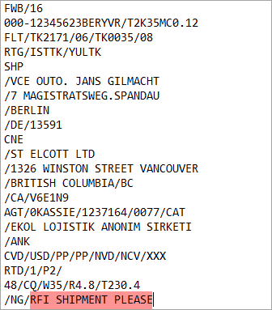
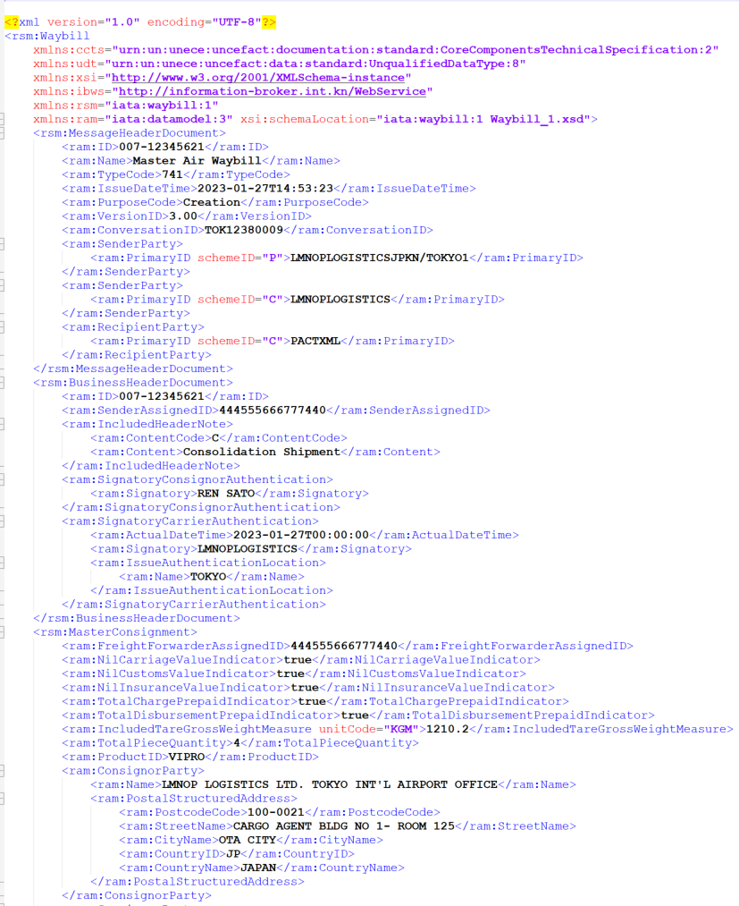
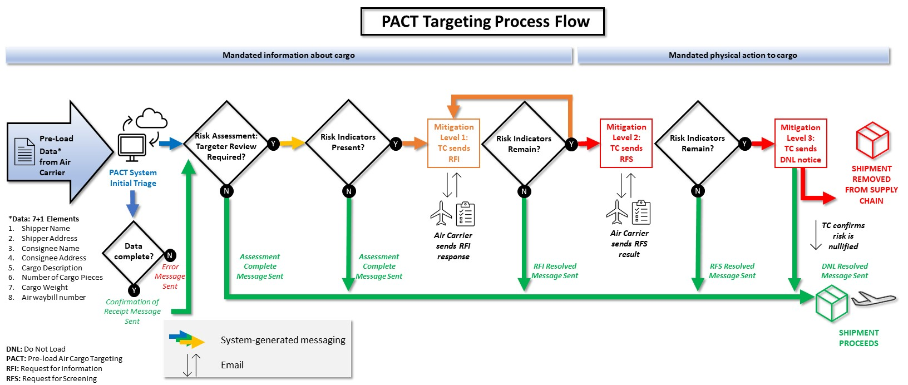

# Pre-Load Air Cargo Targeting (PACT)

## TECHNICAL Implementation Guide 2024

[Overview](#overview)

[Background](#background)

[Scope](#scope)

[Target Audience](#target-audience)

[Required and Eligible Participants](#required-and-eligible-participants)

[Required Participants (Air Carriers)](#required-participants-air-carriers)

[Eligible Participants (Other Data Submitters](#eligible-participants-other-data-submitters)

[Mandatory Points of Contact](#mandatory-points-of-contact)

[Effective Date](#effective-date)

[Connecting to the PACT System](#connecting-to-the-pact-system)

[PACT Targeting Process Flow](#pact-targeting-process-flow)

[PACT Onboarding](#pact-onboarding)

[Registration](#registration)

[Initial Setup and Connection](#initial-setup-and-connection)

[Two-Way Messaging](#two-way-messaging)

[Webhook Setup](#webhook-setup)

[Submission Requirements and Responses](#submission-requirements-and-responses)

[PACT Test and Production Environments](#pact-test-and-production-environments)

[PACT Testing Environment](#pact-testing-environment)

[PACT Production Environment](#pact-production-environment)

[PACT Message Specifications](#pact-message-specifications)

[Message Formats](#message-formats)

[Supported Versions for PACT Messages](#supported-versions-for-pact-messages)

[Supported Cargo-XML Versions](#supported-cargo-xml-versions)

[Supported C-IMP Versions](#supported-c-imp-versions)

[Supported CAMIR Versions](#supported-camir-versions)

[Cargo-XML Message Responses](#cargo-xml-message-responses)

[XFNM Message Responses](#xfnm-message-responses)

[XCSN Status Notification Messages](#xcsn-status-notification-messages)

[CAMIR Message Responses](#camir-message-responses)

[Preliminary Error Report (PER) Messages](#preliminary-error-report-per-messages)

[Preliminary Status Notification (PSN) Messages](#preliminary-status-notification-psn-messages)

[HTTP Response Codes](#http-response-codes)

[PACT Message Examples](#pact-message-examples)

[Cargo-XML Message Submission Example](#cargo-xml-message-submission-example)

[C-IMP Message Submission Example](#c-imp-message-submission-example)

[PACT Targeting Process Flow](#pact-targeting-process-flow-1)

[Glossary](#glossary)

[Unacceptable Characters and Descriptions](#unacceptable-characters-and-descriptions)

[Unacceptable Characters in Shipper/Consignee Name, Address or Commodity Description Fields](#unacceptable-characters-in-shipperconsignee-name-address-or-commodity-description-fields)

[Unacceptable Commodity Descriptions](#unacceptable-commodity-descriptions)

# Change History

| Date         | Version | Section(s) | Description/Reason |
|--------------|---------|------------|--------------------|
| Jan 26 2024 |  1       |            | Initial release    |
| April 10 2024 |  1.1       |   PACT Data Elements | Note on departure time   |
|  |       |  [PACT Testing Environment](#pact-testing-environment) | Clarifications on testing  |
|  |       |   [XFNM Message Responses](#xfnm-message-responses) | Update to INVALID_HOUSE_BILL_NBR definition  |
|  |       |   [Preliminary Error Report (PER) Messages](#preliminary-error-report-per-messages) | Update to INVALID_HOUSE_BILL_NBR definition and CAMIR PER error messages  |
|  |       |   New section [Unacceptable Commodity Descriptions](#unacceptable-commodity-descriptions) |Examples of acceptable and unacceptable commodity descriptions to avoid insufficient data errors.  |
| May 06 2024 |  1.2       | [Testing Data Submission](#testing-data-submission) | Updated section to provide parameters on testing submitted data   |

# Overview

The Pre-load Air Cargo Targeting (PACT) Program aims to identify and apply mitigation measures to inbound high-risk air cargo shipments that could contain concealed improvised explosive devices prior to loading and departure to Canada. This is achieved through the risk assessment of advanced cargo information with the assistance of emerging technologies.

Starting in Fall 2024, air carriers transporting cargo to Canada from international destinations will be required to submit data to PACT and, in some cases, apply risk mitigation measures to specific shipments as per the *Canadian Aviation Security Regulations, 2012*.

## Background 

Transport Canada has been collaborating with aviation industry professionals to create a solution that integrates easily with existing business processes. These volunteers have worked extensively with Transport Canada to make submitting data to PACT as seamless as possible.

For more information on PACT, see <https://tc.canada.ca/en/programs/pre-load-air-cargo-targeting-pact>.

## Scope

The *Canadian Aviation Security Regulations, 2012* apply to air carriers who transport cargo on a flight departing from a place outside Canada to an aerodrome located in Canada. This includes cargo on passenger, charter, courier/express, and cargo-only flights, as well as flights that transit or transfer in Canada (including Freight Remaining on Board (FROB)).

The regulations, and therefore the PACT Program, do **<u>NOT</u>** apply to the following:

- Mail

- Diplomatic or consular bags

- Passengers’ checked baggage

- Passengers’ carry-on baggage

- Air cargo transported on an outbound flight, departing Canada

- Air cargo on domestic flights within Canada

- Cargo that arrives in Canada via another mode of transportation, such as by road, sea, or rail (including where the last leg of a flight is transported via truck to Canada).

## Target Audience

This guide is intended for the implementation team or technician who is configuring an air carrier’s data connection to the PACT system. This guide also includes data submitter and submission requirements, estimated regulatory effective dates, and two-way messaging setup.

## Required and Eligible Participants 

### Required Participants (Air Carriers)

Air carriers who transport cargo on a flight from a place outside Canada to an aerodrome located in Canada are required to submit the mandatory cargo information to PACT. See [Scope](#scope).

### Eligible Participants (Other Data Submitters)

Companies that are engaged by air carriers for IT services may participate in the PACT Program by submitting and receiving cargo data on the air carrier’s behalf. This includes third-party service providers, such as data aggregators and general sales/handling agents (GSAs/GHAs).

Freight forwarders or air carriers who create waybills or operate flights that precede the last point of departure for Canada (e.g., codeshare arrangements) may also participate in PACT voluntarily **<u>at the request of an air carrier</u>**.

Air carriers must identify their service providers upon registration to authorize the partner’s connection to the PACT system.

**Note**: While air carriers may delegate the exchange of information to a service provider, the air carriers are ultimately liable for compliance with the *Canadian Aviation Security Regulations, 2012*.

## Mandatory Points of Contact

Transport Canada requires the following points of contact to register an air carrier with PACT and begin the onboarding process. See section [Registration](#registration) for more details.

1.  **Primary Cargo Security Contact**: A representative of the company who is responsible for compliance with Transport Canada rules and regulations.

- Name:

- Title:

- Phone \#:

- Email:

2.  **24/7 Contact**: A contact who is available 24/7 that can respond urgently to Requests for Information (RFI), Requests for Screening (RFS) and Do Not Load (DNL) notices. This contact must have access to additional shipment information and be able to initiate screening procedures in response to a potential threat to air cargo. This contact can be a shared inbox so long as it is monitored 24/7. 

- Name:

- Title:

- Phone \#:

- Email:

3.  **Technical Contact**: A contact that can initiate system connectivity between the air carrier and Transport Canada and provide technical support for the data exchange, including responding to system outages.

- Name:

- Company (if different than the air carrier):

- Title:

- Phone \#:

- Email:

## Effective Date 

The *Canadian Aviation Security Regulations, 2012* will come into effect upon publication in the *Canada Gazette*, Part II in Fall 2024. Air carriers will be expected to submit the required data elements to the PACT system and be ready to respond to Transport Canada requests (RFIs, RFSs, DNLs) as of the date of publication or they can be subject to administrative monetary penalties (AMPs).

Beginning in Fall 2023, Transport Canada started onboarding select air carriers and aims to increase the volume gradually leading up to the effective date of the regulations. The objective is to ensure any technical and operational modifications can be tested and implemented well in advance of the effective date.

# Connecting to the PACT System 

The PACT system uses a web Application Programming Interface (API) to send and receive messages from participants in either Cargo-XML or C-IMP/CAMIR formats. More information can be found in section [Message Formats](#message-formats) and section [Supported Versions for PACT Messages](#supported-versions-for-pact-messages).

This section provides an overview of the technical onboarding process and provides the details necessary to set up, connect, and test data submissions to PACT.

## PACT Targeting Process Flow

The [PACT Targeting Process Flow](#pact-targeting-process-flow-1) illustrates the expected information flow of the production system.

Participants should familiarize themselves with what notifications they can expect via the PACT system versus email. In the case where a risk mitigation action is required, the PACT system is capable of two-way messaging to ensure RFIs, RFSs and DNLs are communicated in near-real time. See section [Two-Way Messaging](#two-way-messaging) for more details.

## PACT Onboarding

Before submitting data to PACT, air carriers must contact Transport Canada for a one-time registration and setup, which includes identifying contacts and providing authorizations for any third-party that will be submitting data to PACT on behalf of or in addition to the air carrier, if applicable.

After the registration is complete, the PACT team will contact the air carrier or their participant with the following connection information:

- A token for authentication

- The endpoint URL for the PACT test environment

- Connection instructions, including the required header information

### Registration

To begin the registration process, contact Transport Canada at <pact-information-cfapc@tc.gc.ca> and identify the contacts listed in section [Mandatory Points of Contacts](#mandatory-points-of-contact). A PACT representative will reply within 2 business days to obtain additional information and complete the registration.

**Note**: It is recommended that air carriers complete this process as soon as possible so they have enough time to successfully test their data submissions before mandatory compliance is required in the fall of 2024.

### Initial Setup and Connection

Once registered, a PACT representative will email the Technical Contact to provide them with the necessary connection information. This includes a token for authentication, the endpoint URL, and information on how to set up connections to receive messages from the PACT web API.

After successfully connecting to the PACT system, a standard synchronous message is sent immediately from the PACT system indicating that the data submission has been received, but not yet risk assessed. These messages indicate any parsing or format errors and may also indicate if a mandatory data element was detected to be missing.

These synchronous acknowledgement and error messages are distinct from the asynchronous two-way messages that can be enabled for “assessment complete” notifications and risk mitigation actions. See section [Two-Way Messaging](#two-way-messaging).

### Two-Way Messaging

Two-way messaging is available through the web API so that participants receive “assessment complete” and risk mitigation status updates asynchronously through their software solution. If a mitigation action is required, the status update is followed by an email.

**Note:** If participants are unable to establish two-way messaging, synchronous acknowledgement messages will still be returned as a response to the API calls. All mitigation responses after the initial acknowledgement would then be sent to contacts via email only.

To connect to a participant’s API, Transport Canada requires the following information:

- API connection details (PACT can connect to multiple endpoints).

- Preferred message format (Cargo-XML or C-IMP) and version (See section [Supported Versions for PACT Messages](#supported-versions-for-pact-messages)).

**Note**: Different formats can be selected for submission and receipt.

- Any additional requirements for connection, if required.

After confirming connection information, the PACT team will send implementation teams the required information for receiving messages from PACT asynchronously. Asynchronous messaging requires that webhooks are set up to be received from the PACT server.

### Webhook Setup

Two-way messaging requires integrated software solutions to be set up to receive a webhook connection from the PACT server using the following elements:

| Element         | Definition | Example | 
|:--------------|:---------|:------------|
| URL        | The air carrier’s endpoint, to which PACT will send messages.   |https://myaircarrier.com/api/myendpoint
|     Secret         |     A string set by the air carrier that will be attached to each response message in the header “X-PACT-SECRET” as a way for the air carrier to validate the message came from the PACT system.    |  E6HuaaHIB6knkFyaTuUc934SRz37czVJGDM7rBtvKN5AhfWcCP9LRVF0LWx9c17LvWADfhXXbFa2iwSSKP8cuDyOnX9DG64l5icklhXgw3fzQ6IT0suzZSZFrzPfrzfTcSbjh3gwlP7FEFF4uJdMrkjLxFDejKUV9kjYNR0DOQjWujD7I0K9AW1nR314SuCeEoOyIfV..........     |
| ResponseType          |  HTTP verb that denotes the action for transmitted data such as creating or updating.       |           POST, PUT | 
| Headers    | A list of key value pairs added to requests/responses that provide additional information  |  “X-MYAIRLINE-REQUIRED-HEADER”: “Custom provided header”;   For text-based messages (FWB, FHL): “Content-Type”: “text/plain”; For xml-based messages (XFMB, XFZB):“Content-Type”; “application/xml”; | 

### Submission Requirements and Responses

Participants should submit the required data to PACT as early as possible before loading to allow for the risk assessment process to be completed. Refer to [PACT Targeting Process Flow](#pact-targeting-process-flow-1).

Participants will receive a series of messages from the PACT system that will communicate the status of each dataset’s assessment, including error identification, confirmation of receipts, “assessment complete” notifications, requests for risk mitigation actions and action resolution notifications. All system notifications are transmitted in near-real time when two-way messaging is enabled.

#### PACT Data Elements

PACT requires 7 data elements and an air waybill number (+1) in order to complete its risk assessment of all inbound air cargo. These “7+1” data elements are internationally recognized as Pre-Loading Advanced Cargo Information (PLACI), and they have been found useful for risk assessment because they can be obtained early in the cargo shipment lifecycle and taken together, can reveal trends that establish thresholds for low-risk cargo.

Participants are expected to submit the data elements to PACT as early as possible before loading and must provide any updates up to the departure of the flight (marked by the flight departure information). Any data received after departure will not be assessed.

Air carriers are required to submit the following mandatory data (7+1) to PACT for risk assessment as early as possible before loading:

- Air waybill number (includes house bill number if applicable)

- Original shipper name

- Original shipper address

- Consignee name

- Consignee address

- Cargo description (a description of each piece of cargo)

- Total number of pieces (piece count)

- Total weight of the cargo

The PACT system can also accept additional data elements if the mandatory elements are present.

**Note:** Consolidation messages do not typically satisfy these requirements as they may lack the original shipper names and addresses and a piece-level description of the cargo. While the system will accept “consol” or “consolidation” for the cargo description, this would not be considered compliant with the regulations, in which case all associated house waybills would be required.

**Note**: A data submitter may submit a house waybill before the master air waybill number (MAWB) is known and leave the MAWB number blank (e.g., in the case where a freight forwarder is submitting house-level data for the air carrier). Once the master air waybill number is known, the house waybill must be resubmitted by the air carrier or the freight forwarder with the master air waybill number included before departure. Air carriers remain liable for compliance with the regulatory requirements with respect to all data submissions (including those submitted at the house level by other data submitters).

In addition to the 7+1 pre-load data elements, PACT also requires the following flight information as soon as feasible after the flight’s departure from its LPD before arrival in Canada:

- The date of the flight;

- The flight number;

- The destination aerodrome;

- The departure time; and

- A list of the air waybill numbers for the flight.

**Note**: The FFM message satisfies these requirements. PACT will accept the submission time of the FFM message as equivalent to the departure time.

#### Header Data Required for Transmission

The header data required for each transmitted message must include: the token, the air carrier’s IATA airline code, and a responsible party identifier (maximum 50 characters), as applicable.

An example of a valid header is:

- Ocp-Apim-Subscription-Key: abcd

- Iata-Airline-Code: 014

- Responsible-Party: PACTPW8 (if applicable)

- Accept: text/plain

- Content-Type: text/plain

- Content-Length: 767

- User-Agent: PACTAI/1.0

The following table provides required and optional header data for PACT requests, and instructions for how to complete each field.

| Header Data        | Description |
|:--------------|:---------|
|**Ocp-Apim-Subscription-Key** |Contains the token given to you by a PACT representative at registration|
|**Iata-Airline-Code**                  |The three-digit IATA code for the air carrier that is submitting the data. Reference: https://www.iata.org/en/about/members/airline-list/ or https://www.iata.org/en/publications/store/airline-coding-directory/
|**Responsible-Party** (if applicable)|  A seven-digit code that identifies the party responsible for receiving and responding to risk mitigation notifications, depending on the data submitter.  See [Responsible Party](#Responsible-Party) for more details               |
|**Accept**                                     |	Reference: https://www.rfc-editor.org/rfc/rfc9110.html#name-accept; application/xml for Cargo-XML or text/plain for C-IMP
|**Content-Type**                          |  	Reference: https://www.rfc-editor.org/rfc/rfc9110.html#name-content-type; application/xml for Cargo-XML or text/plain for C-IMP |
|**Content-Length**                       |Size of request. Reference: https://www.rfc-editor.org/rfc/rfc9110.html#name-content-length|
|**User-Agent**                                |Contains a reference to the product/comment describing what application the request is being sent from. Reference: https://www.rfc-editor.org/rfc/rfc9110.html#name-user-agent|

#### Responsible Party

The Responsible Party header value is a 7-digit code that identifies which party will receive and respond to all risk mitigation notifications initiated by PACT. If the data submitter also receives and responds to all risk mitigation measures, then the Responsible Party value can be left blank. This is true for many air carriers and freight forwarders who handle RFI/RFS/DNLs themselves.

For data aggregators and any other parties that submit data to PACT on behalf of an air carrier but do not manage risk mitigation measures, the Responsible Party code must indicate the party that is responsible.

The Responsible Party code should be 7 digits and include the following data:

- The first four letters are always PACT

- A single letter to denote the PACT environment:

- A “**P”** to indicate the production environment

- An “**A**” for the testing environment

- The IATA two-character air carrier designator (or agreed upon two-character code to designate organizations outside of IATA, such as GSAs)

For example: **PACTPW8**

**Note**: A PACT representative will specify which environment the token is intended for when it is provided, so the technician can enter the correct letter (P or A).

#### Response Types

Using the [PACT Targeting Process Flow](#pact-targeting-process-flow-1) as reference, this section details the various response codes the PACT system will transmit.

Once a message is received by the PACT system, an initial data validation is performed to identify errors in the “7+1” data elements, if applicable. Errors could reflect a poorly formatted https request, authentication errors, server problems or improperly formatted submission data. Error codes can be found in the XFNM Message Responses, Preliminary Error Report (PER) Messages, and HTTP Response Codes sections.

When a message is received without errors, a “received” notification is sent as a reply to indicate that the “7+1” data elements were successfully received by Transport Canada.

After submitting the mandatory data for evaluation, PACT conducts a risk assessment for each air waybill. If the air waybill data does not contain any risk indicators, PACT transmits a code which communicates the status of “Assessment Complete” to the participant.

In the case where the shipment data contains risk indicators, PACT could transmit codes to reflect an RFI, RFS or DNL. Implementation teams must ensure test scenarios include measures to handle codes in the chosen format type:

- For C-XML, that includes RI, RS and CD codes. See [XCSN Status Notification Messages](#xcsn-status-notification-messages).

- For CAMIR/C-IMP, that includes 7H, 7I, 7J, 8H, 8I, 8J, 6H, 6J, and 6I codes. See [Preliminary Status Notification (PSN) Messages](#preliminary-status-notification-psn-messages).

**Note**: All messages from PACT include a Conversation Identifier (CXML body) and/or Correlation Identifier (CXML/CIMP http headers) for reference.

## PACT Test and Production Environments

Transport Canada offers two PACT system environments for submitting data: a test environment and a production environment.

The test environment allows participants to test their data submissions and to receive responses from PACT in a simulated space that will not affect their actual operations.

The production environment provides the greatest stability and performance and will be made available to participants once they have successfully completed testing in the test environment. Providing real data in the production environment provides PACT an opportunity to familiarize itself with the air carrier’s data and identify any compliance issues well in advance of the effective date.

### PACT Testing Environment

Before submitting data to the PACT production environment, participants are required to test their connectivity and message formatting in the PACT test environment. After registering, participants are given a token for authentication, the endpoint URL, and information on how to set up connections to receive messages from the PACT test environment.

When a satisfactory amount of message types, volume, and errors have been tested, participants will then be invited to submit all Canada-bound live data to the production environment.

#### Testing Data Submission

Testing in the test environment should start with 1-2 batches of 20-100 data submissions using as close to “real-world” data as possible. These batches will be used to test the PACT participant’s ability to transmit waybill data to PACT and receive synchronous acknowledgement messages or errors in response.    The data submissions will be vetted by a PACT representative who will examine the data for the following elements:  
Provide completed 7+1 to receive acknowledgement message:
- Air waybill number
- Name and address of each original shipper
- Name and address of each consignee
- Description of each piece of cargo
- Number of pieces
- Total weight of the cargo
Provide at least one of each of the following test messages: 
- Master air waybill (FWB)
- House waybill (FHL)
- Waybill with missing weight to test error message
- Waybill with a commodity description from Unacceptable [Unacceptable Commodity Descriptions](#unacceptable-commodity-descriptions) to test error message.

The participant will be notified by PACT if there were any issues that need to be resolved or if additional test data is required.

#### Testing Risk Mitigation (RFI, RFS and DNL) Procedures

After testing data submission successfully, the participant is required to complete a test of their risk mitigation procedures. In addition to the data exchange, this test is meant to simulate the various procedures that would be enacted on both sides should a risk be identified with a shipment. This requires the availability of a PACT representative and the participant’s technical and 24/7 contacts (and likely the Primary Cargo Security Contact in the case of an RFS or DNL) so it will be scheduled ahead of time.

The PACT test environment will send the participant an RFI code referencing a particular shipment and the PACT representative will follow with a test email to the 24/7 contact using the RFI template. The participant’s 24/7 contact must respond to the email with additional information about the shipment, after which the PACT team will respond by email and then submit an “RFI resolved” code.

The same process will be simulated with an RFS and DNL. In all cases, it is recommended that the participant return real information in the actual templates that are used, as applicable. For example, an RFI may request a Consignment Security Declaration (CSD) and/or a packing list; whereas an RFS will request a screening record with specific information as stipulated in the regulations. More guidance will be provided during the scheduling of the test.

After a successful test of risk mitigation procedures, the participant will be approved to move to the PACT production system. During this period, PACT representatives will work with participants to resolve any technical issues that may arise in the transition to the production environment.

**Note**: The PACT test environment does not have 24-hour support.

### PACT Production Environment

After sufficient testing in the PACT test environment and approval from a PACT representative from Transport Canada, participants would move to the PACT production environment. It is expected that participants begin submitting to this environment by the fall of 2024 at the latest.

#### PACT Support

Transport Canada has implemented and supports the critical fail-safe systems inherent in a production environment that keeps PACT running 24/7. In the unusual case that PACT experiences an unscheduled outage, Transport Canada would notify participants when an outage is confirmed with further instructions. During any outage, participants should continue to submit data to PACT.

If you experience any issues connecting to PACT, contact PACT support at <pact-information-cfapc@tc.gc.ca>.

#### Risk Mitigation (RFI, RFS and DNL) Procedures

If a shipment cannot be risk assessed with the information provided, or if there is sufficient threat information to warrant an RFS or DNL, the PACT production environment will send the participant an RFI/RFS/DNL code referencing a particular shipment and a PACT representative will follow with an email to the 24/7 contact with further instructions.

If further updates or duplicate submissions are transmitted to PACT after the risk mitigation code is sent, additional response messages will be sent indicating that a continued “hold” exists until the email response is received and evaluated. If the email response is satisfactory, the PACT representative will respond with a confirmation email and a system-generated message transmission is sent to release the “hold”. All subsequent transmissions will be marked with an SF or CO status, depending on the response message format.

If multiple supply-chain participants have previously sent PACT a message about this specific shipment, all associated contacts will be notified (status messages and emails).

**Note**: Until the “hold” is removed, the air carrier is prohibited from transporting the cargo to Canada.

# PACT Message Specifications

## Message Formats

The PACT system sends and receives messages using Cargo-XML and CAMIR/C-IMP message formats. Support for these message types can be found at:

<https://www.iata.org/en/publications/store/cargo-xml-toolkit/>

| Cargo-XML Message Type| C-IMP Message Type | CAMIR Message Type     | Description | Author/Origin|
| :----------                               |    :--------                      |      :------------                      | :--------         | :--------             |
| XFFM                                    | FFM	  |           |Flight manifest information|	Air carriers/data submitters|
| XFWB                                    | FWB|           |Master air waybill information|	Air carriers/data submitters/freight forwarders|
| XFZB                                      | FHL	  |           |	House waybill information|	Air carriers/data submitters/freight forwarders|
| XFNM                                    |                      |  PER (error), PSN (acknowledgement)        |Notification of submission errors and acknowledgements|	PACT|
| XCSN                                     |                     |   PSN       |Notification of an “assessment complete” or the opening or closing of a risk mitigation action (RFI, RFS, DNL)|	PACT|

## Supported Versions for PACT Messages

The PACT system sends and receives Cargo-XML and CAMIR/C-IMP message formats based on the following versions:

### Supported Cargo-XML Versions

| Cargo-XML Message type   | Accepted Versions |
| :---        |:----        |
| XFFM      | Version 2.00, Version 3.00 |
| XFWB   | Version 3.00        | 
| XFZB      | Version 3.00       | 
| XCSN   | Version 1.00       | 
| XFNM      | Version 3.00       | 

### Supported C-IMP Versions

|C-IMP Message type   | Accepted Versions |
| :---        |:----        |
| FFM      | Version 7, Version 8 |
| FHL   | Version 4, Version 5        | 
| FWB      | Version 16, Version 17       | 

**Note**: Each line in a C-IMP message cannot be longer than 69 characters. If a C-IMP message is longer than 1600 bytes, it must be split into two or more messages.

### Supported CAMIR Versions 

|CAMIR Message type   |  Versions |
| :---        |:----        |
| CAMIR      | Version 1 |

## Cargo-XML Message Responses

The following sections outline message responses for Cargo-XML message formats.

### XFNM Message Responses 

This message type sends error and acknowledgement responses from the PACT system as outlined in the following table.

| Response Message Code      | Definition | Example     |
| :---        |:----        | :----         |
| Acknowledgement      | Acknowledgement of received message without errors       |\<ram:ConditionCode>Acknowledgement</ram:ConditionCode>|
|        |      |  \<ram:Reason>No Errors</ram:Reason>|
| MISSING_WBL_LINE      | Master waybill number missing       |\<ram:ConditionCode>Error</ram:ConditionCode>|
|        |      |  \<ram:Reason>MISSING_WBL_LINE</ram:Reason>|
| MISSING_HOUSE_BILL_NBR      | 	House waybill number missing       |\<ram:ConditionCode>Error</ram:ConditionCode>|
|        |      |  \<ram:Reason>MISSING_HOUSE_BILL_NBR</ram:Reason>|
| INVALID_HOUSE_BILL_NBR      | House waybill number is not correct       |\<ram:ConditionCode>Error</ram:ConditionCode>|
|        |      |  \<ram:Reason>INVALID_HOUSE_BILL_NBR</ram:Reason>|
| MISSING_CNE_ADDR      | Missing consignee address       |\<ram:ConditionCode>Error</ram:ConditionCode>|
|        |      |  \<ram:Reason>MISSING_CNE_ADDR</ram:Reason>|
| MISSING_CNE_CTRY      | Missing consignee country       |\<ram:ConditionCode>Error</ram:ConditionCode>
|        |      |  \<ram:Reason>MISSING_CNE_CTRY</ram:Reason>|
| MISSING_CNE_NAME	      | Missing consignee name       |\<ram:ConditionCode>Acknowledgement</ram:ConditionCode>|
|        |      |  \<ram:Reason>MISSING_CNE_NAME</ram:Reason>|
| MISSING_WEIGHT      | Missing package weight       |\<ram:ConditionCode>Error</ram:ConditionCode>|
|        |      |  \<ram:Reason>MISSING_WEIGHT</ram:Reason>|
| INVALID_WEIGHT	     | Weight is not a number or could not be extracted	|\<ram:ConditionCode>Error</ram:ConditionCode>|
|        |      |  \<ram:Reason>INVALID_WEIGHT</ram:Reason>|
| MISSING_BILL_QTY      | Waybill piece count is missing       |\<ram:ConditionCode>Error</ram:ConditionCode>|
|        |      |  \<ram:Reason>MISSING_BILL_QTY</ram:Reason>|
| INVALID_BILL_QTY      | 	Waybill piece count is not a number or could not be extracted       |\<ram:ConditionCode>Error</ram:ConditionCode>|
|        |      |  \<ram:Reason>INVALID_BILL_QTY</ram:Reason>|
| MISSING_SHP_ADDR      | 	Missing shipper address       |\<ram:ConditionCode>Error</ram:ConditionCode>|
|        |      |  \<ram:Reason>MISSING_SHP_ADDR</ram:Reason>|
| MISSING_SHP_CTRY      | Missing shipper country       |\<ram:ConditionCode>Error</ram:ConditionCode>|
|        |      |  \<ram:Reason>MISSING_SHP_CTRY</ram:Reason>|
| MISSING_SHP_NAME      | Missing shipper name      |\<ram:ConditionCode>Error</ram:ConditionCode>|
|        |      |  \<ram:Reason>MISSING_SHP_NAME</ram:Reason>|
| MISSING_WT_UNITS     | 	Missing units of measurement for weights      |\<ram:ConditionCode>Error</ram:ConditionCode>|
|        |      |  \<ram:Reason>MISSING_WT_UNITS</ram:Reason>|
| INVALID_MESSAGE_TYPE      | 	Can read message, but could not determine the type of message       |\<ram:ConditionCode>Error</ram:ConditionCode>|
|        |      |  \<ram:Reason>INVALID_MESSAGE_TYPE</ram:Reason>|
| BAD_WBL_FORMAT      | Could not read message       |\<ram:ConditionCode>Error</ram:ConditionCode>|
|        |      |  \<ram:Reason>BAD_WBL_FORMAT</ram:Reason>|
| MISSING_CSM_LINE      | Failed to extract consignment details       |\<ram:ConditionCode>Error</ram:ConditionCode>|
|        |      |  \<ram:Reason>MISSING_CSM_LINE</ram:Reason>|
| MISSING_CNE_LINE     | Failed to extract consignee details      |\<ram:ConditionCode>Error</ram:ConditionCode>|
|        |      |  \<ram:Reason>MISSING_CNE_LINE</ram:Reason>|
| MISSING_SHP_LINE      | Failed to extract shipper details       |\<ram:ConditionCode>Error</ram:ConditionCode>|
|        |      |  \<ram:Reason>MISSING_SHP_LINE</ram:Reason>|
| MISSING_CARGO_DESC      | Missing cargo description       |\<ram:ConditionCode>Error</ram:ConditionCode>|
|        |      |  \<ram:Reason>MISSING_CARGO_DESC</ram:Reason>|

##### XFNM Example—Response Message (Error)

##### XFNM Example—Response Message (Acknowledgement)

### XCSN Status Notification Messages

The XCSN message type creates or updates a status notification message. This message type contains one of the following response codes.

| Cargo-XML Response Code | Definition                                                      | Example                                 |
|-------------------------|-----------------------------------------------------------------|-----------------------------------------|
| CO                      | Assessment Complete                                             | \<ram:StatusCode\>CO\</ram:StatusCode\> |
| RI                      | Request for Information (RFI) hold issued or currently in place | \<ram:StatusCode\>RI\</ram:StatusCode\> |
| CO                      | RFI Resolved                                                    | \<ram:StatusCode\>CO\</ram:StatusCode\> |
| RS                      | Request for Screening (RFS) issued or currently in place        | \<ram:StatusCode\>RS\</ram:StatusCode\> |
| CO                      | RFS resolved—Hold removed                                       | \<ram:StatusCode\>CO\</ram:StatusCode\> |
| CD                      | Do Not Load (DNL) issued or currently in place                  | \<ram:StatusCode\>CD\</ram:StatusCode\> |
| CO                      | DNL Resolved                                                    | \<ram:StatusCode\>CO\</ram:StatusCode\> |

##### XCSN Example—CSN Response (RFI)

## CAMIR Message Responses

The following sections outline message responses for CAMIR message formats.

### Preliminary Error Report (PER) Messages 

This message type sends the following possible error responses from the PACT system.

| Response Message Type | Explanation                                                      | Example                                 |
|:-------------------------|:-----------------------------------------------------------------|:-----------------------------------------|
| MISSING_WBL_LINE       | Master waybill number missing         | **PER** 007-12345678-HAW0123456 ERR/MISSING_WBL_LINE 
| MISSING_HOUSE_BILL_NBR   | House waybill number missing | **PER** 007-54400194-HAW ERR/MISSING_HOUSE_BILL_NBR|
|INVALID_HOUSE_BILL_NBR | House waybill number is not correct, or number is greater than 35 characters| **PER** 007-12345678-HAW0123456 ERR/INVALID_HOUSE_BILL_NBR |
| MISSING_CNE_ADDR   | Missing consignee address|**PER** 007-12345678-HAW0123456 ERR/MISSING_CNE_ADDR |
| MISSING_CNE_CTRY |Missing consignee country |**PER** 007-12345678-HAW0123456 ERR/MISSING_CNE_CTRY |
|MISSING_CNE_NAME| Missing consignee name	|**PER** 007-12345678-HAW0123456 ERR/MISSING_CNE_NAME|
|MISSING_WEIGHT	|Missing package weight|**PER** 007-12345678-HAW0123456 ERR/MISSING_WEIGHT |
| INVALID_WEIGHT |Weight is not a number or could not be extracted  |**PER** 007-12345678-HAW0123456 ERR/INVALID_WEIGHT|
| MISSING_BILL_QTY	 |Waybill piece count is missing  |**PER** 007-12345678-HAW0123456 ERR/MISSING_BILL_QTY|
| INVALID_BILL_QTY | Waybill piece count is not a number or could not be extracted |**PER** 007-12345678-HAW0123456 ERR/INVALID_BILL_QTY |
|MISSING_SHP_ADDR | Missing shipper address	 |**PER** 007-12345678-HAW0123456 ERR/MISSING_SHP_ADDR |
|MISSING_SHP_CTRY  |Missing shipper country  |**PER** 007-12345678-HAW0123456 ERR/MISSING_SHP_CTRY |
| MISSING_SHP_NAME |Missing shipper name	 |**PER** 007-12345678-HAW0123456 ERR/MISSING_SHP_NAME  |
|MISSING_WT_UNITS  |Missing units of measurement for weights	  |**PER** 007-12345678-HAW0123456 ERR/MISSING_WT_UNITS  |
|INVALID_MESSAGE_TYPE |Can read message, but could not determine the type of message|**PER** 007-12345678-HAW0123456 ERR/INVALID_MESSAGE_TYPE  |
|BAD_WBL_FORMAT |Could not read message  |**PER** ERR/400/BAD_WBL_FORMAT  |
|MISSING_CSM_LINE  | Failed to extract consignment details |**PER** 007-12345678-HAW0123456 ERR/MISSING_CSM_LINE  |
|MISSING_CNE_LINE	  | Failed to extract consignee details |**PER** 007-12345678-HAW0123456 ERR/MISSING_CNE_LINE  |
|MISSING_SHP_LINE  |Failed to extract shipper details  |**PER** 007-12345678-HAW0123456 ERR/MISSING_SHP_LINE  |
|MISSING_CARGO_DESC|Missing cargo description	  |**PER** 007-12345678-HAW0123456 ERR/MISSING_CARGO_DESC  |

##### PER Example—Response Message (Error)

### Preliminary Status Notification (PSN) Messages

This message type sends the following possible responses in CAMIR format from the PACT system.

| Response Message | Response Message Code | Example                                 |
|:-------------------------|:----------------------------|:-----------------------------------------|
|Message Received	 | SR	|**PSN** 007-12345678-ABC1022506 CSN/SR/22NOV1902/NO ERRORS |
|Assessment Complete	 |SF |**PSN** 007-12345678-ABC1022506 CSN/SF/22NOV1902/ASSESSMENT COMPLETE |
|RFI |7H |**PSN** 007-12345678- ABC31022506 CSN/7H/22NOV1902/ PACT REQUEST FOR INFORMATION HOLD |
|RFI In Place |	7J |**PSN** 007-12345678- ABC31022506 CSN/7J/22NOV1902/PACT REQUEST FOR INFORMATION HOLD CURRENTLY IN PLACE |
|RFI Resolved	 |	7I |**PSN** 007-12345678- ABC31022506 CSN/7I/22NOV1902/ PACT REQUEST FOR INFORMATION HOLD REMOVED |
|RFS|8H |**PSN** 007-12345678- ABC31022506 CSN/8H/22NOV1902/PACT REQUEST FOR SCREENING HOLD |
|RFS In Place |8J |**PSN** 007-12345678- ABC31022506 CSN/8J/22NOV1902/PACT REQUEST FOR SCREENING HOLD CURRENTLY IN PLACE |
|RFS Resolved	 |8I |**PSN** 007-12345678- ABC31022506 CSN/8I/22NOV1902/ PACT REQUEST FOR SCREENING HOLD REMOVED |
|DNL |6H |**PSN** 007-12345678- ABC31022506 CSN/6H/22NOV1902/PACT DO NOT LOAD HOLD |
|DNL In Place	 |6J |**PSN** 007-12345678- ABC31022506 CSN/6J/22NOV1902/PACT DO NOT LOAD HOLD CURRENTLY IN PLACE |
|DNL Resolved	 |6I	|**PSN** 007-12345678- ABC31022506 CSN/6I/22NOV1902/ PACT DO NOT LOAD REMOVED |

###  HTTP Response Codes

The following table outlines standard HTTP response codes supported by PACT.

| HTTP Code | Definition                                                                                                                                                            |
|-----------|-----------------------------------------------------------------------------------------------------------------------------------------------------------------------|
| 202       | Accepted. The message was accepted by Transport Canada.                                                                                                               |
| 422       | Content cannot be processed. The syntax of the message is correct, but the information in the message cannot be processed. Please check the contents of the response. |
| 400       | Bad request. The message transmission is not supported by Transport Canada.                                                                                           |
| 401       | Unauthorized. The token has expired. Please contact Transport Canada to request a new token.                                                                          |
| 500       | Internal Service Error. Unable to process this message. Please try again later.                                                                                       |
| 503       | Service Unavailable. Transport Canada’s server is not available. Please contact Transport Canada for further instructions.                                            |

## PACT Message Examples 

The following sample messages provide examples of data submissions and expected responses in both Cargo-XML and CAMIR.

### Cargo-XML Message Submission Example

The following messages show examples of a master air waybill and acknowledgement response in Cargo-XML.

##### Master Air Waybill Submission Example

##### Response (Acknowledgement-No Errors)

##### Flight Manifest Example

### C-IMP Message Submission Example

The following are examples of master and house waybills with acknowledgement and error responses in C-IMP and CAMIR. The final example contains flight manifest information in the FFM C-IMP message type.

##### Master Waybill Submission Example

##### Acknowledgement Response Example

##### House Waybill Submission with Errors Example

##### Error Response Example

##### Flight Manifest Example

# PACT Targeting Process Flow

# Glossary

| Abbreviation | Definition | 
|:-------------------------|:----------------------------|
| API|Application Programming Interface |
|C-IMP	 |Cargo Interchange Message Procedures. A message protocol and standard created by IATA. |
|Cargo-XML	 | XML standard created by IATA used in electronic communication.|
|CAMIR |Customs Automated Manifest Interface Requirements. A PACT system response type (in response to C-IMP). |
| CSN/XCSN	|Customs Status Notification response message type |
|Data Submitter	 |The entity submitting digital waybill information to PACT.|
|DNL |Do Not Load |
|FFM (C-IMP)/XFFM (Cargo-XML) |Flight manifest message |
|GSA/GHA	 | General Sales Agent/Ground Handling Agent|
|HAWB, HAWB#	 | House air waybill, house waybill number|
|IATA |International Air Transport Association |
|LPD |Last Point of Departure. The last stop in a routing before departing for Canada. |
|MAWB, MAWB#	 |Master air waybill, master waybill number |
|PACT |Pre-load Air Cargo Targeting |
|PACT Participant	 |The regulated entity required to participate in PACT. This is always the air carrier operating the flight from the last point of departure before entering Canada. |
|PER |Preliminary Error Report. Error response from PACT in C-IMP format. |
|PSN |Preliminary Status Notification. Acknowledgement response from PACT in C-IMP format. |
|RFI |Request for Information |
|RFS |Request for Screening |
|XFNM |Response message sent in Cargo-XML format. |

# Unacceptable Characters and Descriptions

The following section provides examples of messages that will be rejected because the required detail is missing.

If messages with unacceptable data are submitted to PACT, a missing cargo description (MISSING_CARGO_DESC) synchronous data error is sent to the submitter and the message is rejected.

## Unacceptable Characters in Shipper/Consignee Name, Address or Commodity Description Fields

The following characters and numbers are not accepted if this data is submitted as one of the following:

- Shipper name

- Shipper address

- Consignee name

- Consignee address

- Commodity description

| Characters                                     | Explanation                                                                                 |
|------------------------------------------------|---------------------------------------------------------------------------------------------|
| 1004, 1005, etc. (numbers)                     | Descriptions that only contain numbers are not accepted.                                    |
| WPX. .wpx (file extension)                     | Descriptions that only contain file extensions are not accepted.                            |
| XXX, … (three or more equal symbols or letters) | Descriptions that only contain three or more identical symbols or letters are not accepted. |
| “.”, “-”, “ ” (empty characters)               | Descriptions that only contain empty characters are not accepted.                           |
| \$%^&\<\>:”/\\?\* (special characters)         | Descriptions that only contain special characters are not accepted.                         |
| !£12 (special characters and numbers)          | Descriptions that only contain special characters and numbers are not accepted.             |

## Unacceptable Commodity Descriptions

The following list shows examples of commodity descriptions that do not contain enough detail and will be rejected by PACT.

- Accessories

- All kind of cargo

- All kind of goods

- Articles

- AWB/HAWB

- Baggage

- Birthday gifts

- Bits

- Box

- Case

- Charity

- Collected items

- Commodity

- Company names

- Component

- Consumer

- Equipment, EQP

- Freight all kinds, FAK

- From UPU Postal

- Gift box

- Gifts

- Gizmos

- Goods, GDS

- Handling codes

- Invoice

- Joint shipping

- Label

- Line

- Likewise

- Mail

- Materials

- Merchandise, Merc.

- Miscellaneous products, Misc, Mixed, Mix

- Model

- None

- Odd parts

- Others

- Pad

- Package numbers

- Pallets, PLT

- Parcel

- Parts

- Personal address

- Personal effects

- Pieces, pces

- Pre-addressed parcel

- Private things

- Products

- Returned goods

- Said to contain, STC

- Sample

- Samples for analysis

- Scrap

- Several

- Several goods

- Souvenirs

- Spare

- Spare parts, SPPT

- Sporting goods

- Stuff

- Substance

- Test

- Things

- Toys

- Various

- Various goods

- Various products

- White goods
